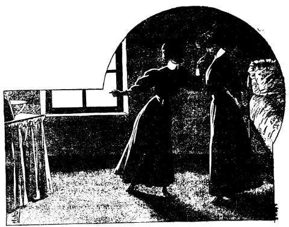
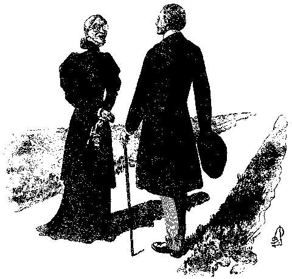

## L’autre Lilian

— Oh ! tu as beau marquer de l’impatience, je ne t’en garderai pas
  rancune. Cœur souffrant n’a pas bon caractère… Ainsi, Lilian, sois
  méchante tout à ton aise.

— Que veux-tu dire, Grace ?

— Demande à ton miroir pourquoi tu as rougi.

Et Grace, une espiègle petite personne de seize ans, mignonne, rondelette,
la figure fraîche et rieuse auréolée de cheveux bruns bouclés, s’abandonna
aux contorsions d’un rire qui sonnait cristallin dans la chambrette.

Sa compagne lui tourne le dos avec humeur.

D’une taille un peu au-dessus de la moyenne, celle—ci est gracieuse, élégante
et fine. Son visage est d’une beauté adorable, avec ses grands yeux à
l’iris d’or et ses épais cheveux d’un blond cendré.

Il y a dans toute sa personne quelque chose de grave et de mélancolique. À
cette heure, elle est rougissante, et ses paupières semblent retenir avec
peine les larmes prêtes à s’échapper.

Ainsi que la joyeuse Grace, elle porte l’uniforme de la pension Deffling :
la simple robe bleue avec le col et les poignets blancs.

— Ah ! fait-elle à mi-voix, Grace, tu es cruelle. Si tu songeais à te
  moquer, pourquoi ne m’as-tu pas laissée seule dans ma chambre de
  pensionnaire, où du moins je puis songer à ma tristesse, sans provoquer
  les questions de nos répétitrices et de nos camarades ?

La phrase coupe l’hilarité de l’interpellée.

D’un bond, Grace est auprès de son amie ; elle lui jette les bras autour du
cou, l’étreint, fait sonner sur ses joues des baisers sonores.

Et cependant elle parle vite, vite, avec une petite voix douce comme un
gazouillis d’oiseau.

— Pardonne-moi. Tu es ridicule de te désoler. Je voulais te distraire. Et
  puis non, là, ce n’est pas cela… Je voulais te forcer à la confidence
  que tu refuses…

— Moi ?

— Oh ! ne dis pas le contraire… Je ne suis pas un _prodige_ comme toi…
  Certainement non, je n’en suis pas un. Miss Deffling se charge de me le
  répéter à satiété.

Et d’un ton burlesque, imitant la directrice du pensionnat, elle continue :

— Miss Grace Paterson, je m’étonne que l’amitié de Miss Lilian Allan n’ait
  pas une influence plus bienfaisante sur vous. Prenez-la pour modèle,
  Miss Grace, prenez-la pour modèle.

Revenant à sa voix naturelle, l’espiègle créature poursuivit :

— Te prendre pour modèle, je veux bien ; seulement c’est un conseil
  absurde, un conseil de vieille fille qui doit priser en cachette… Est-ce
  qu’il suffit de prendre Raphaël, Van Dyck, Quentin Matsis ou Hutchinson
  comme modèle, pour devenir un grand artiste…! Seulement je t’aime, ma
  Lilian, je t’aime de tout mon cœur. Voilà pourquoi j’ai reconnu que ton
  cœur n’était pas à moi ; pourquoi je t’ai taquinée, afin que tu m’avoues
  tout.

— Je n’ai rien à avouer, chère folle.

— Ta, ta, ta, si tu te figures que tu vas m’en imposer.

— Oh ! je ne me permettrais pas de douter de ta perspicacité.

— Et tu fais bien, car je sais tout… Oui, ma belle Lilian, tout, tout, ce qui
  s’appelle tout. Si tu ne veux pas me le raconter, je me chargerai du
  récit… Tu n’auras à la fin qu’à ajouter ton : pour copie conforme… Et tu
  aimeras bien ta confidente, ce que je souhaite par-dessus tout, car une
  confidente, tous les classiques le disent, c’est ce qu’il y a de plus
  précieux pour une personne atteinte d’un tendre sentiment.

La rougeur de miss Allan augmenta. Elle chercha à se dégager de l’étreinte
de son amie.

— Tu es en proie à un rêve, commença-t-elle…

Mais Grace ne lâcha point prise, et entraînant son amie, elle la fit asseoir
sur une banquette cannée, placée devant la petite table de travail, chargée
de livres et de cahiers.

— Là, chérie, prends un siège, comme dit Auguste dans _Cinna_, et sur
  toute _chose_… laisse-moi tranquillement te détailler ton mal en _prose_.
  La rime est bonne, le vers serait un peu long au goût de Corneille, mais
  comme c’est un auteur du Vieux Monde, cela m’est égal.

En dépit de sa tristesse réelle, Lilian ne put s’empêcher de sourire.

— Donc, reprit la mutine Grace, je commence.

— À quoi bon ? soupira son interlocutrice.

— À te démontrer que je suis ton amie véritable, puisque je lis dans ton
  esprit et que je souhaite partager avec toi ta tristesse.

— De quelle tristesse parles-tu, ma chère folle ?

— Si tu m’interromps toujours, je n’arriverai jamais à placer les résultats
  de mon enquête… ; oui, Mademoiselle, de mon enquête. Soyez respectueuse,
  je me suis faite le détective de votre âme, afin de vous démontrer ma
  tendresse. Mais assez de paroles inutiles, c’est du _chewing gum avant
  dîner_, inutile [^1].

Elle prit les mains de Lilian et mirant son regard dans celui de son amie :

— Pauvre chère chose aimée, fit-elle d’un ton caressant. La folle Grace
  est bien affectionnée pour la sérieuse Lilian. Aussi cette dernière va
  l’écouter sagement… Que risque-t-elle après tout ? De ne plus se
  débattre toute seule avec sa pensée.

Puis vivement :

— Mais pas d’émotion. Cela est tout a fait inconvenable pour des jeunes
  filles, qui ne doivent connaître que l’étude et le rire. Grande pensée
  de Miss Deffling, que je lui restitue honnêtement. Donc, il y a environ
  deux mois, ton frère vint te voir, ma chérie. C’était une visite
  d’adieu. Il se rendait en Europe dans un but dont il parlait
  mystérieusement. Est-ce bien cela ?

Lilian essaya de plaisanter :

— Ton enquête était facile. Je t’ai confié mes inquiétudes.

— Attends, attends, chaque chose viendra en son temps. Au milieu des
  explications plutôt obscures de ce frère, deux phrases m’ont frappée
  surtout. L’absence de Master Allan avait _pour but de préparer une lutte
  de géants qui modifierait ta situation._

— Hélas !

— Non pas hélas !… Une lutte suppose toujours un changement de situation dans
  le sens de l’amélioration ; par suite il faut s’en réjouir.

— Je ne puis pas… ; le ton, l’air de Jud m’ont fait peur.

— Effet du mystère. Toutes les fois que l’on parle mystérieusement, on
  obtient un résultat analogue. Si tu savais ce qu’est la lutte en
  question, peut-être en rirais-tu!

Lilian secoua la tête.

— Je suis certaine que non.

— Et pourquoi, s’il te plaît?

— Parce que j’ai conscience, la conscience vague d’avoir couru bien des
  dangers avec Jud. Quels dangers, je ne saurais le définir, car jamais il
  ne m’a donné une explication, mais je ne me souviens pas d’avoir vu dans
  son regard pareille tristesse.

— Es-tu donc si sûre de bien lire dans ses yeux ?

— Oh oui ! s’écria Lilian qui baissa aussitôt la tête, comme honteuse de cet
  élan.

— Cela est possible, murmura sa compagne d’un ton malicieux. Moi-même, je ne
  suis pas éloignée de penser qu’en ce qui concerne le professeur de
  West-Point, tu es plus clairvoyante qu’une sœur.

Toute la personne de Miss Lilian fut secouée par un frisson.

Une rougeur ardente couvrit son visage, et d’une voix tremblante, elle
balbutia :

— Que prétends-tu exprimer ainsi ?

Doucement, Grace attira la tète de son amie sur son épaule, et baisant ses
paupières baissées :

— J’exprime le résultat de la seconde phrase qui te frappa dans ta dernière
  entrevue avec Master Allan.

Et la jeune fille interrogeant d’un accent défaillant :

— Quelle phrase, je ne me souviens plus ?

— Je me la rappelle, moi. La voici. Il te dit : Soyez prudente, Lilian. Le 
  danger rôde autour de vous. Quoiqu’il arrive, croyez que j’ai agi du mieux
  que je l’ai pu, et n’accusez jamais celui que _vous avez appelé votre
  frère_.

Des larmes coulaient sur les joues de Lilian. Grace les tarit de deux baisers.

— Ne pleure pas, vilaine, puisque je suis la consolatrice.

Puis vivement :

— Ceci prononcé, Master Allan te quitta brusquement, comme s’il avait
  regretté de s’être laissé entraîner à des paroles trop explicites.

— Oui, oui, et depuis ce jour… 

— Depuis ce jour, ma chère Lilian se demande si celui qu’_elle a appelé
  son frère_, est bien son frère.

— Eh ! Qui à ma place n’aurait cette pensée ?

— Tout le monde l’aurait, ma Lilian, mais peut-être tout le monde n’y
  aurait-il pas trouvé à la fois joie et douleur.

La jeune fille fixa sur son amie un regard éperdu.

— Ma chère Lilian, je t’en prie, ne me considère pas ainsi… Je te jure
  que si je me suis inquiétée de te voir songeuse, absorbée ; si j’ai noté
  certaines exclamations, certains gestes de toi, c’est que je sentais en
  toi une souffrance.

Et l’enlaçant, se faisant douce comme une mère apaisant son enfant, la
gentille créature acheva :

— Il est beau, courageux, instruit. Tu crois qu’il t’a protégée contre des
  dangers, et avec cela il n’est pas ton frère… Alors, tu l’aimes, ma Lilian,
  comme si tu étais assurée de cela, et tu es triste parce que le doute
  subsiste en ton esprit.

À cette brusque conclusion, Lilian cacha son visage sur l’épaule de son
amie, et dans un sanglot, elle murmura :

— Oh ! tais-toi ! tais-toi !

Mais Grace l’arrêta :

— Et pourquoi ? Puisqu’il n’est pas ton frère, qui trouverait à redire à ton
  affection ?

— Malheureuse ! c’est une supposition, une simple supposition.

— Non, chérie, c’est une certitude.

— Comment ?

La jeune fille s’était dressée brusquement, interrogeant son amie d’un regard
aigu.

— Comment, répéta-t-elle, comment oses-tu affirmer cela ?

Grace la contraignit à se rasseoir.

— Mais, ma chérie, j’affirme cela, parce que je n’ai jamais pensé que tu
  fusses la sœur de Master Allan.

— Tu n’as jamais…

Lilian s’interrompit, incapable dans son trouble de prononcer une syllabe
de plus.

Et son amie reprit :

— Mais non, ma Lilian, jamais… Si peu que des frères et sœurs se ressemblent,
  ils ont certains caractères communs, certains détails indiquant une même
  race. Mon père, tu le sais, est sculpteur, et toute jeune il m’a enseigné
  à voir. Eh bien, Allan et toi, non seulement vous n’avez aucun point de
  ressemblance, mais vous avez des caractéristiques contradictoires qui
  indiquent des races différentes.

Lilian eut un geste de doute. Alors Grace s’échauffa :

— Ce que je te dis, chérie, n’est pas une chose douteuse, c’est une vérité
  aussi certaine que deux et deux font quatre… Mon père serait là qu’il te
  dirait les mêmes choses… La forme de la tête, la structure générale,
  dénotent chez toi la race celte, avec quelques touches ibéres…, tandis
  que Master Allan…

— Eh bien ? interrogea son interlocutrice, intéressée malgré elle.

— Master Allan, lui, a comme prédominance, les caractères ethniques du saxon,
  affinés en quelque sorte par ceux d’une race rouge supérieure.

— Qu’entends-tu par la race rouge ?

— La race indienne, ma Lilian.

— Lui, allons donc !

— Il n’y a pas d’allons donc, chère chose ; quand mon père viendra me voir,
  veux-tu que, sans lui rien dévoiler, je le prie de donner son avis ? Je
  t’affirme qu’il te dira les mêmes choses, bien mieux que moi encore, car
  il sait voir plus nettement.

Lilian ne répondit pas.

— En tout cas, reprit la pétulante Grace, désormais nous serons deux pour
  songer à tout cela. Et puis, et puis, vois-tu, si j’étais à ta place…

— Que ferais-tu ?

— J’attendrais bien paisiblement que Master Allan daignât revenir de voyage,
  et alors… 

— Alors ?

— La première fois que je le reverrais…

— Tu l’interrogerais, ah ! tu as raison…

Mais Grace appliqua sa main potelée sur les lèvres de son amie.

— Veux-tu bien te taire ? L’interroger…! Mais, pauvre chérie, s’il ne s’est
  pas encore expliqué, c’est qu’il existe des motifs pour lesquels il
  croit devoir garder le silence.

— En ce cas, je ne saurai rien.

— Tu te trompes, ma belle Lilian… Tu es si sincère, si bonne, que tu oublies
  la ruse, cet appoint qui réussit souvent là où la force échouerait.

— Je ne saisis pas.

— Je m’en aperçois. Donc, je serais Miss Lilian, que je recevrais très 
  gentiment Master Allan, je lui demanderais des nouvelles de son voyage,
  chose toute naturelle, et je suis certaine, et tout à fait certaine que
  je l’embarrasserais tellement…

— Toi, une gamine, embarrasser Allan !

La fillette se prit à rire, et sans se formaliser de l’épithète :

— Oui, moi une gamine, je me charge d’embarrasser quiconque essayera de me
  répondre sans parler clairement. Il n’y a point de présomption dans mon
  cas, mais simplement la conviction de l’infériorité de celui qui veut
  converser à coup de demi-vérités.

Un bruit sourd parvint aux oreilles des jeunes filles. 

Comme mue par un ressort, Lilian se dressa toute droite.

— Qu’as-tu? questionna sa compagne… C’est le marteau du portail.

Mais son amie ne l’écoutait plus. Elle s’était approchée de la fenêtre et
regardait au dehors.

À travers les vitres, elle apercevait la longue façade de la pension, avec
ses ailes en retour, encadrant de trois côtés la cour sablée, le quatrième
étant formé par le parc qui s’étendait entre les bâtiments et le portail de
l’avenue Kendall.
 
Dans l’allée d’honneur, un homme paraissait, marchant avec l’empressement
farouche de l’assaut.

Elle eut un cri :

— Lui !

Qui attira son amie auprès d’elle.

— Eh bien, susurra la petite Grace, il ne pouvait venir plus à propos… Si tu
  m’en croyais, chérie, avant une heure tu serais fixée.

Et Lilian, la considérant d’un air indécis :

— Oh! cela n’exige pas des efforts surhumains. Veux-tu que je te dise ce que
  je ferais, moi ? Tiens, Miss Deffling l’arrête…, on a le temps… Veux-tu ?

Avec un sourire navré, son interlocutrice murmura :

— À quoi bon ?

Mais sans doute Grace vit en cette formule dubitative un acquiescement
suffisant, car elle se pencha à l’oreille de son amie et se prit à chuchoter.

Maigre, sèche d’allure et de formes, Miss Deffling était néanmoins une très
honorable personne, ayant tout le respect d’elle-même inhérent à sa fonction
de Directrice d’école ; _directrice d’âmes de jeunes brebis_, disait-elle,
et tout le respect désirable pour les autres, sous la seule condition que
les termes de la pension fussent payés régulièrement.

Sous ce rapport, Jud Allan avait droit à son entière estime.

Aussi, quand elle l’avait aperçu dans l’allée centrale, dite allée des
visiteurs, avait-elle quitté précipitamment son cabinet-bureau, sis au rez-
de-chaussée de rétablissement, afin de lui présenter ses civilités.

Sans doute, en son état d’esprit, le jeune homme se fût bien passé des
politesses acidulées de la Directrice, mais comme il lui était impossible de
s’y soustraire, il les subit durant cinq bonnes minutes.

Jugeant alors avoir suffisamment souffert pour les convenances, il demanda :

— Pourrai-je voir ma sœur Lilian ?

— Mais certainement. La chère enfant est dans sa chambre, elle travaille
comme toujours. C’est véritablement une élève exceptionnelle. Dans ma
longue carrière, je ne vois qu’un _sujet_ digne de lui être comparé… C’était
la jeune Ida Clifford, de Cliffordhouse, vous savez de qui je parle ; son
excellente éducation la fit remarquer du marquis de Montealbin… Elle est
marquise.

Allan arrêta le flux des souvenirs de son interlocutrice en redisant :

— Ma sœur Lilian…

— Je vais la faire appeler.

— Permettez-moi de vous dispenser de cette peine. Après ma longue absence,
  j’ai à causer longuement avec elle, et la tranquillité de sa chambre me
  parait convenir…

— Comme il vous plaira, vous êtes le meilleur juge. Et personne ne saurait
  trouver mauvais qu’un frère désire entretenir sa sœur en particulier.

Sur ce, Miss Deffling accompagna le visiteur jusqu’au seuil de son cabinet
où elle pénétra dignement, le laissant libre de gagner la chambre occupée
par Lilian.

Alors le professeur de West-Point s’essuya le front que mouillaient des
gouttelettes de sueur, puis, d’un pas décidé, il gravit l’escalier accédant
au premier étage, et s’engagea dans le couloir desservant les chambres des
pensionnaires.

Bientôt il s’arrêtait devant une porte, sur laquelle une carte, fixée par des
pointes à dessin, portait le nom de Lilian Allan.

Il prêta l’oreille. Aucun bruit ne parvint jusqu’à lui. Il eut un sourire
douloureux, et murmura :

— Oui, oui… Elle travaille. Celle qui fut élevée par Jud sera digne de son
  rang… L’homme aura tenu le serment du gamin !

Et il frappa doucement. Une voix douce, comme assourdie, prononça :

— Entrez !

On eût dit que tout l’être du jeune homme se raidissait dans une suprême
résistance, mais cela n’eut que la durée de l’éclair.

Allan ouvrit la porte, pénétra dans la chambre, et, repoussa le battant
derrière lui, tandis que d’un accent, où l’on sentait les palpitations de
son cœur, il disait :

— Bonjour, Lilian!

Mais il demeura stupéfait. Un organe, qui n’était pas celui de sa sœur, lui
avait répondu :

— Je vous salue, Maître Allan !

Grace Paterson était devant lui, souriante, avec une crânerie inaccoutumée
dans le regard.

— On m’avait dit que je trouverais ma sœur chez elle, commença-t-il
quelque peu surpris de l’absence de la jeune fille…

— On a pu vous le dire, répliqua paisiblement son interlocutrice, car elle
  était ici, il n’y a encore qu’un instant.

— Ah ! elle va revenir.

— Je ne le pense pas.

Et Allan ayant un soubresaut, la fillette continua gravement :

— Elle vous a aperçu causant avec Miss Deflling, et elle s’est retirée
  aussitôt.

— Elle m’a vu et elle s’est retirée ! Vraiment je ne conçois pas le sens de
  cela…, à moins que ce ne soit un jeu, auquel le caractère de Lilian ne m’a
  point habitué.

— Ce n’est pas un jeu.

Encore qu’elle se contraignit à la gravité, la mutine Grace semblait préte
à succomber à un accès d’hilarité. Les efforts qu’elle faisait pour se
contenir amenaient à ses joues une coloration plus vive.

— Pas un jeu !

Allan répéta ces trois syllabes comme un homme qui renonce à déchiffrer un
rébus.

— Non, pas un jeu, Master Allan, mais un sentiment très délicat de sa
respectabilité.

Et le professeur la considérant d’un air ébahi, elle reprit
imperturbablement :

— Sans doute ! Lilian ne croit pas pouvoir recevoir en solitude un gentleman
  qui n’est pas sont frère.

Prêcher le faux pour savoir le vrai. Eternel piège où tombent les esprits
les plus maîtres d’eux-mêmes.

Allan eut un cri :

— Qui le lui a dit ?

— Mais vous-même qui venez de vous trahir ; avant, elle n’avait qu’un doute.

Et Grace partit d’un de ces rires sans fin dont elle était coutumière.

Pourtant sa gaîté se glaça en voyant son interlocuteur devenir très pâle,
en l’entendant balbutier avec une détresse profonde :

— Ah ! Mademoiselle, vous avez cru faire une plaisanterie… Peut-être
avez-vous appelé le malheur sur Lilian !

Mais obstinée, elle secoua sa jolie tête, et cependant avec une nuance
d’embarras :

— Non, j’ai fait le bonheur de Lilian.

Et en hâte, comme quelqu’un qui craint une interruption :

— Elle est dans ma chambre, elle entend… Elle souffrait du doute ; elle
  m’a permis l’expérience… À présent je dirai tout, même ce qu’elle me
  défendrait de dire… Et vous verrez le bonheur au bout de tout cela. Et
  vous ne m’accuserez plus…

Soudain la porte s’ouvrit brusquement. Lilian parut sur le seuil, mais une
Lilian transfigurée, un rayonnement dans les yeux.

— Laisse, Grace, laisse, tu te trompes sur mon courage. C’est moi qui dois
parler maintenant…

Et venant à Allan, stupéfait, pétrifié, elle continua :

— Jud, vous avez été pour moi le père, le frère dévoué, inlassablement
  dévoué. Je vous ai vu toujours bon, toujours tendre… Tout ce qu’il y
  avait d’affection en moi est allé à vous naturellement, sans effort… Je
  ne sais personne d’aussi noble, d’aussi digne que vous. Béni soit le
  ciel. Vous n’êtes pas mon frère… Je puis vous dire : Mon âme est a vous,
  Allan.

Les deux jeunes filles poussèrent un cri de frayeur.

Le professeur de West-Point s’était reculé, une expression d’épouvante sur
visage.

Sa main avait cherché le dossier d’une chaise comme pour se soutenir.

Toute sa personne disait une souffrance si aiguë, que ses interlocutrices
estèrent sans voix, sans pensée.

Mais tel un héros blessé qui domine la douleur et poursuit sa marche à
l’ennemi, le professeur se redressa.

— Miss Lilian, et vous, Miss Grace, dit-il.

— Miss, s’écrièrent les amies, pourquoi nous parler ainsi qu’un inférieur
doit seul le faire [^2] ?

— Parce qu’il convient que je m’exprime ainsi.

Et ses interlocutrices demeurant muettes devant cette affirmation.

— Je dois vous adresser une prière. Oubliez l’aveu que vous avez surpris.

— L’oublier, gémit Lilian, le pourrais-je ?

— Il le faut, Miss Lilian, ou si l’oubli vous paraît trop difficile, que vos
  lèvres ne le confient à personne. À vous, Miss Grace, je fais la même
  requête. J’ajoute, et certain de votre amitié pour votre compagne, je
  pense que cela suffira : un mot pourrait causer ma mort, ce qui n’a
  point d’importance, mais aussi celle de Miss Lilian et l’anéantissement
  d’une œuvre de justice.

Elles le considéraient ainsi que l’on regarde en rêve.

Et lui, triste et doux, continuait comme poussé par l’inéluctable fatalité :

— J’étais venu pour vous demander, Miss Lilian, le désir d’un frère étant
  suffisant à vous décider à l’obéissance… Mais je ne suis plus votre
  frère, et je dois vous supplier ainsi qu’un serviteur.

— Un ami, rectifia la jeune fille.

I1 eut un sourire navré :

— Ami, peut-être, si un ami de ce genre est assez discret pour ne point
  imposer de fréquentes entrevues.

Puis arrêtant les protestations sur les lèvres de son interlocutrice :

— Le temps s’écoule. Chaque minute contient une semence de douleur… Je parle
  devant vous, Miss Grace, parce que je vous sais décidée, amie de votre
  compagne. Vous garderez le secret, et vous la conduirez dans le chemin
  de la raison.

Il passa la main sur son front. On eût dit qu’il essayait de chasser une
souflrance, puis il reprit :

— Miss Lilian, je vous prie respectueusement d’assister aujourd’hui à la
  séance du Sénat.

— À la séance du Sénat, se récrièrent les amies à l’énoncé de cette
  proposition qui paraissait sans aucun lien avec les paroles précédentes.

— Oui, Miss, je préviendrai Miss Deffling, pour laquelle je dois, — il appuya
  sur ce verbe, — jusqu’à nouvel ordre rester votre frère comme pour tout
  le monde ; je la préviendrai, dis-je, que _j’autorise cette sortie_.

Sa voix sonna déchirante sur ces dernières syllabes.

— J’accompagnerai Lilian, fit délibérément Grace. Mon père, qui actuellement
  assiste à une exposition dans le Sud, m’a autorisée à sortir avec elle, si
  vous y consentez.

Allan s’inclina gravement.

— Vous la soutiendrez, Miss, car elle entendra au Sénat des choses qui
  peut-être lui causeront une émotion.

— Mais quelles choses ?

— Permettez-moi de garder le silence. Des voix plus autorisées que la mienne,
  des voix qui sont les premières dans l’État, diront les mots qui doivent
  mettre miss Lilian sur le chemin de la vérité.

Et, avec une énergie qui troubla ses interlocutrices, il ajouta :

— Mais je vous en conjure, Misses, quoi que vous entendiez, quelque surprise
  qui résulte pour vous de la discussion sénatoriale, réprimez toute
  exclamation, tout geste, tout regard même qui puisse attirer l’attention
  sur vous.

D’une voix basse, il conclut :

— Les ennemis qui ont fait de vous, Miss Lilian, la misérable compagne de
  Jud Allan, seront près de vous, autour de vous, partout. Ils vont vous
  apprendre qui vous êtes, et ils vous tueraient pour l’avoir appris,
  comme ils ont tué votre père.

Grace écoutait de tout son être.

La rieuse enfant ne semblait pas effrayée. Non, on eût cru plutôt qu’elle
était ravie de se voir mêlée à une aventure dramatique, romanesque, telle
que l’annonçaient les demi-confidences du professeur de l’école militaire de
West-Point.

Quant à Lilian, elle avait reconquis tout son calme.

Ses grands yeux ne quittaient point ceux de Jud.

Et au fond de ses prunelles d’or, se lisait une reconnaissance infinie.

— Me suis-je bien fait comprendre ? questionna le jeune homme.

— Sans aucun doute, commença la pétulante Grace…

Mais Lilian lui coupa la parole.

— Fort bien, dit-elle d’un ton tranquille. Je saurai, cet après-midi, qui je
  suis, quelle aventure sinistre a fait de moi la sœur d’un homme de cœur
  qui s’est institué mon défenseur.

— Ne parlons pas de cela, murmura Allan, cela n’est point à prendre en
  considération.

— Je vous demande pardon, Jud… Cela est à considérer, quoi que vous en
  pensiez, car je dois vous assurer qu’il m’est indifférent d’être ou de
  ne pas être ce que je parais, si je suis condamnée à ignorer ce que vous
  êtes.

Comme il esquissait un geste de dénégation, elle reprit avec plus de force :

— Ce que vous êtes au point de vue social, car autrement je sais que vous
  êtes le meilleur, le plus brave, le plus noble des hommes et des amis.

Elle lui tendait la main. Il ne la prit pas.

Alors, elle vint à lui, et d’une voix tremblante, où perçait néanmoins
une indomptable volonté :

— Vous avez tenu à me donner de la « miss », alors que je me considère
  comme votre obligée, eh bien, je veux savoir qui _vous êtes_, Jud Allan,
  car seule je sais qui _vous fûtes_, et seule je dois juger entre vos
  scrupules et mon cœur.

Il secouait la tête, son émotion l’empêchant de proférer un son. Elle eut un
triste sourire :

— Alors, je resterai ignorante, et de vous, et de moi.

— Que voulez-vous dire ?

— Que je ne me rendrai pas au Sénat.

— Je vous supplie, Miss.

— Inutile. J’obéirai si vous obéissez, je vous l’affirme sur mon honneur,
  sur l’honneur de celle qui fut votre sœur Lilian !

Il n’y avait pas à s’y méprendre. La décision de la jeune fille était
irrévocable. Jud le comprit. Il courba la tête, et tristement :

— La noble Lilian veut, en connaissance de cause, mépriser Jud Allan. Qu’il
  soit fait selon son désir. Périsse Allan pour que l’œuvre de sa vie
  s’accomplisse ! Miss, aujourd’hui même vous saurez l’histoire de Jud.

— Pourquoi pas de suite ?

— Le récit est long et les heures à notre disposition brèves. Après la séance
  du Sénat, descendez dans les jardins du Capitole, je vous y rejoindrai
  et vous remettrai ce que vous souhaitez.

— Vous le promettez sincèrement, Jud Allan ?

— Vous ai-je jamais menti, Miss ?

Elle le regarda un instant avec une émotion inexprimable. Puis elle murmura :

— J’irai au Sénat, Jud. Vos paroles me font supposer qu’il me faudra du
  courage…

— Oui, fit-il tout bas, beaucoup de courage.

— Eh bien, donnez-moi un baiser de frère et je me sentirai forte.

Il voulut résister. Elle présenta son front à ses lèvres, et dans un
souffle :

— Si je vous méprise après avoir lu votre histoire, Jud, ce baiser sera le
dernier…

Il appuya ses lèvres sur son front pur, comme dominé par l’angélique
créature.

------

La demeure du Président de la grande république américaine, appelée La
Maison Blanche (White House) ou Executive Mansion, se dresse dans la partie
Nord-Ouest de la ville.

C’est un bâtiment en pierres blanchies (d’où son nom), long de 52 mètres sur
26 de largeur, dont la façade principale regarde le jardin Lafayette et dont
les trois autres ont vue sur le magnifique parc dénommé Executive Grounds.

Construite en 1792 par James Hoban, habitée pour la première fois par le
président Adams en 1800, brûlée par les Anglais en 1814, réédifiée en 1818,
la Maison Blanche fut encore remaniée et agrandie durant les années 1901 à
1903.

Elle se subdivise en deux parties : publique et privée.

La première comporte la galerie des _Présidentes_, ornée de portraits des
compagnes des premiers magistrats de la République;  l’East Room (ou salle
de l’Est), les salles de Réception (Reception Rooms) où sont les portraits
des _Présidents_. Même en peinture, la pudibonderie américaine semble
s’exercer ici, en séparant les images des ladies et des gentlemen.

Le reste de l’édifice constitue la résidence privée du premier magistrat des
Etats-Unis ; les bureaux, chambres des séances du Conseil, etc., étant
relégués dans une annexe à 1’Ouest.

C’est dans le _private_ que Jud Allan pénétra.

À une allure rapide, le jeune homme avait quitté l’institution Deffling et,
par la rue K. Nord-Est, le square de la Bibliothèque Publique de Mont Vernon
et l’avenue de New-York, il avait gagné la voie séparant le jardin Lafayette
de la Maison Blanche.

Il était évidemment connu du personnel, car nul ne l’arrêta quand il entra
dans le jardin réservé de l’habitation présidentielle, puis dans le 1ogis.

Et, chose peu ordinaire, il lui suffit de demander à l’un des domestiques du
service privé du Président : — M. Loosevelt peut-il me recevoir ? pour être
introduit presque aussitôt dans le cabinet du grand politique américain.

M. Loosevelt était d’une stature au-dessus de la moyenne. Ses épaules larges,
ses mouvements souples décelaient l’homme adonné aux sports, tandis que son
visage énergique et ouvert expliquait en quelque sorte la mentalité du
président.

C’était 1’Américain dans toute sa puissance réelle, fils d’un pays neuf, dont
la cérébralité ne traînait point l’embarras atavique de la tradition. Dans
ses rapports avec ses concitoyens, comme dans ses échanges d’observations
avec les gouvernements étrangers, M. Loosevelt parlait, non le langage
diplomatique, mais le langage humain.

Dernièrement encore, sa correspondance avec M. Lerenaud, le chef de la
Sûreté à Paris, avait donné la mesure de son indépendance en matière de
relations internationales.

M. Loosevelt tendit la main à Allan.

— Bonjour, comment va ?

Allan serra la main tendue.

— Au mieux. Vous même aussi, je pense.

Puis il s’assit sans cérémonie auprès de son interlocuteur.

— J’ai su que Frey Jemkins est arrivé hier à Baltimore, reprit le Président.

— Et ce matin à Washington.

— Ah ! Eh bien ?

Les deux hommes échangèrent un regard. Après quoi, Jud murmura :

— Il est accompagné de plusieurs personnes d’Europe, notamment d’une
  charmante jeune fille qui, là-bas, répondait au nom de Linérès de
  Armencita. 

— Vous m’avez informé de cela.

— Cela est exact. Je vous ai dit également qu’il affirmerait que cette
  personne est sa cousine disparue jadis, Lilian Pariset.

— Je le reconnais.

— Avant mon départ pour Paris, je vous déclarai ceci : Je crois que Frey
  Jemkins va agir de cette façon. S’il le fait, il se sera trahi lui-même.
  Car il sait que celle-là n’est point Lilian.

— Et je vous ai écouté, parce que je crois que vous êtes le plus parfait
  gentleman.

— Je vous remercie.

— J’ai ajouté, continua simplement le Président, j’ai ajouté : Vous n’aurez
  point inutilement fait appel à ma loyauté, à ma justice.

Allan s’inclina avec respect.

— J’étais certain que vous n’auriez point oublié. Je vous suis cependant
  reconnaissant de me l’affirmer.

Un sourire distendit les lèvres de M. Loosevelt. En homme d’honneur, il
était sensible aux paroles de son interlocuteur. Et d’un ton amical :

— Alors, que désirez-vous aujourd’hui ?

— Me permettez-vous de résumer notre entretien d’il y a deux mois ?

Sans hésiter, le Président répondit :

— Je vous en prie. Il ne saurait me déplaire d’entendre ce que je suis prêt
  à répéter.

Un éclair joyeux brilla dans les yeux du jeune homme.

— Je suis à vous, à la vie à la mort, fit-il d’un accent ému… Vous sentez
  que cela est vrai, je n’ai donc pas à insister. Je viens au fait.

Quand je vous eus conté l’histoire de la fortune des Pariset, nous avons
échangé les répliques suivantes. Je vous dis :

— Si Jemkins présente Linérès comme sa cousine Lilian, il commettra sa
  première faute. Car Linérès ne peut pas être Lilian.

— Pour une raison péremptoire, continua M. Loosevelt, pour la raison que
  vous-même avez sauvé cette Lilian et l’avez élevée.

— Oui, oui, c’est bien cela, et ma reconnaissance vous fut acquise, car vous
  n’avez pas hésité à me croire sur parole.

— La parole d’un gentleman tel que vous ne saurait être mise en doute.
  Seulement, laissez-moi aussi rappeler le passé. Je vous déclarai que ma
  certitude morale ne servirait de rien devant un tribunal. C’est une
  certitude légale qui est nécessaire pour engager des poursuites, ou même
  une simple enquête sur vos allégations.

Allan inclina la tête.

— Je me souviens.

Et lentement :

— Je vous ai d’ailleurs répondu qu’une enquête directe, même justifiée,
  serait dangereuse ; que ce serait faire le jeu de Jemkins et mettre en
  péril Lilian.

— C’est encore vrai.

— Je conclus en vous disant : Ce que j’espère de vous, c’est une enquête
  _à côté_, telle que Frey se trompe sur son but réel ; c’estl’intrusion
  de la justice dans ses affaires, sans qu’il soupçonne qu’on le veuille
  démasquer. C’est là ce que je sollicitais de vous.

— Et c’est ce que je vous promis, sous la seule condition que vous me
  fourniriez le point initial de l’enquète.

D’un mouvement inconscient, Allan saisit la main de son interlocuteur, qui
répondit vigoureusement à son étreinte.

La voix du jeune homme tremblait légèrement quand il continua :

— Je vous apporte ce point initial, puisque telle est votre expression.

Le visage de M. Loosevelt exprima une joie sincère.

— Vraiment, j’en suis tout à fait content. Et ce point ?

— Ne m’interrogez pas, marquez-moi une fois encore la confiance qui m’a donné
  le courage.

— Je ne saurais vous la retirer, quand même je le voudrais.

— Tout à l’heure, vous assisterez à la séance du Sénat ?

— Sans aucun doute. Vous savez que je me fais un devoir de n’y point manquer.

— Eh bien, il se produira un incident qui vous permettra d’entourer Frey
  Jemkins de policiers, sous couleur de le protéger.

— De le protéger ? répéta l’homme d’État avec une évidente surprise.

— Oui, de le protéger. Il ne pourra, de la sorte, supposer que cette
  protection est l’avant-coureur d’une accusation.

— Mais ne m’expliquerez-vous pas… ? grommela M. Loosevelt dont la curiosité
  sembla surexcitée.

— Je vous en prie, ne me pressez pas. Vous verrez, vous entendrez.

— Soit ! Je me résigne, mais une recommandation, soyez prudent.

— Je le serai.

— Car, ajouta affectueusement le Président, je serais faché qu’il vous
  arrivât malheur à vous et à cette jeune fille. D’autre part, il importe
  à la sûreté de l’Etat de faire toute la lumière.

Il secoua la main du professeur.

— Enfin, si je n’ai pas le droit de vous soutenir ouvertement, en
  l’absence de preuves matérielles, je souhaite de cœur le succès du
  gentleman, du complet gentleman que vous êtes.

Un instant, Jud Allan demeura devant le chef de la République Américaine.
Une émotion profonde lui rendait impossible d’exprimer la gratitude dont le
remplissait la sympathie de M. Loosevelt.

Ses doigts se crispèrent nerveusement sur ceux de l’homme qui, si noblement,
si sincèrement, s’associait à ses douleurs.

Puis d’une voix sourde, comme enrouée par l’excès de ses sentiments :

— Au Sénat donc, dit-il, et soyez remercié.
  
M. Loosevelt murmura :

— Au Sénat, c’est entendu.

Jusqu’au seuil, il accompagna le jeune homme, dont la main frémissait
dans sa main loyale.

Un dernier salut et Allan s’éloigna.

Il traversa les jardins de la Maison Blanche, passa devant le square
Lafayette, contourna les spacieux monuments affectés aux trois ministères
de l’Extérieur, de la Guerre et de la Marine (State, War, Navy departments),
et gagna le quartier qui avoisine la partie la plus haute de
Reclaimed-flats, au delà du canal de Washington et des Flushing-Lakes qui
lui font suite.

Là, au milieu d’une rue étroite, il disparut dans une maison portant sur
sa façade une singulière peinture à la détrempe, laquelle représentait
une sorte de faisceau de jeunes garçons et de jeunes filles attachés en
botte par un cordeau.

Que signifiait cette allégorie ?

Quelques minutes plus tard la porte se rouvrit.

Deux personnes parurent sur le seuil.

L’une était Tril, le petit stewart auquel le professeur avait parlé sur le
quai du canal Washington.

L’autre semblait un vieillard courbé par l’âge, au visage émacié, sillonné
de rides, et dont le chapeau de feutre laissait passer la longue chevelure
d’un blanc gris.

Au moment de s’éloigner, il se penche vers 1e gamin et lui adresse cette
question :

— Tout marchera bien… Tu m’en réponds ?

— J’en réponds, Roi !

Le vieillard a un geste mécontent. Vite le gamin s’excuse :

— Oh ! Vous m’avez défendu de dire : roi, en public. Mais ici, qui pourrait
  entendre ?

— C’est égal, redoublons de précautions.

— Je vous le promets. Au demeurant, Top et Fall vous attendent dans
  Executive Grounds.

— Bien, ils te guideront dans les bâtiments du Capitole.

— Et j’aurai les habits, comme vous me l’avez ordonné.

— C’est indispensable. Le vieillard que je suis en ce moment doit pouvoir
  disparaître sans laisser de traces.

Un signe de reconnaissance sans doute est échangé entre les deux causeurs,
et Allan, que nul ne reconnaîtrait, reprend le chemin des jardins de
l’Exécutif.

----

[^1]: Beaucoup d’Américains ont l’habitude, après le repas, de mâcher une
      substance analogue à la gomme à claquer de nos écoliers. C’est le
      _chewing gum_. Ils prétendent activer ainsi la salivation et
      faciliter par suite la digestion.

[^2]: Alors qu’en français il serait incorrect de ne pas faire précéder le
      nom d’une jeune fille du mot _Mademoiselle_, en anglais le mot _Miss_
      n’est employé que par les serviteurs, fournisseurs ou autres. Si
      l’on n’est pas assez familier pour user du prénom tout court, on le
      supprime purement et simplement dans le discours. On dit alors :
      bonjour, vous allez bien, etc.
