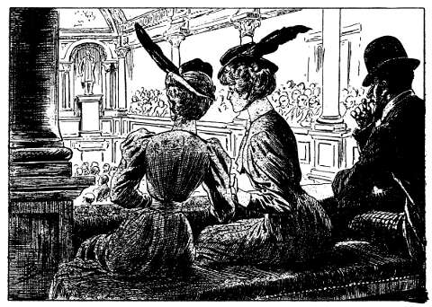
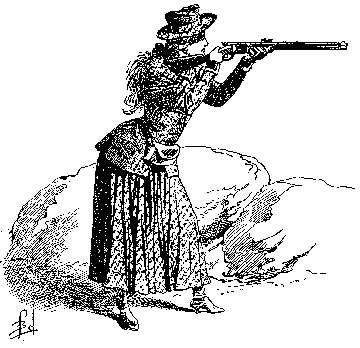

## La voix mystérieuse

— Le bill sur les trusts est inacceptable !

— Je demande le pardon. Il faut soutenir la motion du Président !

— Non, vous dis-je.

— Je prétends que si.

Ces répliques frappent les oreilles de Lilian et de sa fidèle amie Grace
Paterson, au moment où elles prennent place dans l’une des tribunes de la
salle des séances du Sénat (Senate Chamber).

Charmantes dans leur uniforme bleu et blanc de l’institution Deffling,
elles promènent autour d’elles des regards curieux, vaguement inquiets.

C’est qu’elles pénètrent pour la première fois dans le sanctuaire où
s’élaborent les lois qui régissent la grande république transatlantique.

Et puis leur arrivée ! Un boy portant la casquette du _Senate_ les
attendait devant les portes de bronze aux bas-reliefs de Crawford.

Le gamin les a guidées. Il leur a fait monter l’escalier accédant aux
tribunes, leur a désigné leurs places, puis il s’est éclipsé, refusant le
pourboire qu’elles offraient.

Maintenant elles examinent la salle.

Au-dessous d’elles sont les quatre-vingt-dix sièges des sénateurs alignés
sur le plancher. Presque tous sont occupés.

Leur faisant face, est le bureau du Speaker (Président) avec, à sa droite,
la table sur laquelle on dépose à l’ouverture de la séance le _mace_
(sceptre présidentiel).

Les sénateurs discutent avec animation, mais la séance est momentanément
levée, et les boys de service, que les représentants appellent par un
claquement de mains, circulent entre les sièges, portant des
rafraîchissements, des dépêches, des correspondances [^1].

Cela occupa un instant l’attention des jeunes filles.

Puis leurs yeux se fixent sur les différents points de la salle, sur le
plafond orné qui domine de 11 mètres le plancher, sur les niches murales
où semblent sourire les bustes d’anciens Vice-Présidents. Le bourdonnement
des conversations ne les troublent plus à présent. Elles interrogent du
regard les tribunes placées vis-à-vis d’elles.

Elles sont occupées par la clientèle habituelle : journalistes, gentlemen
ou dames appartenant aux clubs d’élection, quelques rares curieux.

Toutefois, Grace murmure en étouffant un rire indiscret :

— Regarde donc, là, en face. Ce bon vieillard et cet individu à face jaune
  de Japonais.

— Je les vois.

— Eh bien, tu ne les trouves pas comiques. Le vieux semble dormir, et le
  Japonais le regarde. Ni l’un ni l’autre ne se préoccupent de la scène
  qu’ils ont sous les yeux.

— Des habitués probablement. Tout le monde n’est pas aussi novice que nous
  en politique.

Mais le Speaker, un instant descendu de son bureau, y reprend place,
indiquant ainsi qu’il va rouvrir la séance.

À ce moment Lilian et Grace sont distraites par l’arrivée de nouveaux
personnages.

Ce sont trois personnes pénétrant dans la tribune presque à côté d’elles.

Un homme jeune, élégant, distingué, qui conduit une dame d’un certain âge
et une jeune personne exquisemént jolie.

Mais, avec la fantaisie de son esprit mobile, Grace murmure :

— Oh ! oh ! Voilà un sénateur qui doit représenter les hercules de
  l’Union.

Et Lilian, suivant la direction de ses regards, aperçoit un homme aux
formes athlétiques, qui gagne péniblement son siège de sénateur.

Oh ! ce personnage est très connu. Toutes les mains se tendent vers lui au
passage. Il les serre avec des mouvements amicaux de la tête.

— Vraiment, reprend Grace, voilà un bel échantillon des saxons de l’ouest.

Elle s’interrompt :

— Tiens, il connaît nos voisins.

En effet, le sénateur, parvenu à sa place, s’est tourné vers la tribune et
a adressé un salut souriant aux personnes remarquées un instant plus tôt
par les pensionnaires.

Mais le Speaker tapote le bureau de son _mace_. Le silence s’établit
aussitôt, et lentement le président de l’assemblée prononce :

— La parole est à l’honorable Frey Jemkins.

Le robuste sénateur qui a attiré l’attention de Grace ne s’est point
assis.

Il salue à la ronde, dominant l’assemblée de sa haute stature, puis d’une
voix sonore :

— Je regrette d’interrompre un instant les travaux du Sénat ; mais j’ai un
  grand intérêt à prendre la parole pour une question personnelle.

De toutes parts, on répond :

— Parlez, Jemkins, parlez.

Et le marquis de Chazelet, assis entre Linérès et Madame de Armencita
dans la tribune, murmure assez haut pour que ses paroles arrivent
distinctement aux élèves de Miss Deffling :

— Vous voyez, Linérès, votre cousin est _persona grata_ en cette enceinte.
  Vous en sortirez reconnue comme Lilian Pariset, et plus rien ne
  retardera notre mariage.

Lilian Pariset. Nom qui provoque chez la compagne de Grace un trouble
inexplicable.

Lilian ! Elle aussi s’appelle ainsi… Mais que prouve cela ? A-t-elle
jamais cru qu’elle fût seule à porter ce nom ?

Frey Jemkins parle cependant :

— Depuis de longues semaines, j’ai paru déserter les fécondes discussions
  de l’honorable assemblée. J’ai _paru_ seulement, insiste-t-il, mais je
  crois de mon devoir de m’en excuser auprès de mes respectés collègues et
  de leur fournir mes explications.

— Inutile ! Inutile ! interrompt-on de toutes parts. On vous connaît,
  Jemkins.

Il secoue sa tête puissante, lève la main pour réclamer le silence.

— Je trouve utile, moi… Ma fortune, mon bonheur en affaires, font que le
  public a le droit, pour moi plus que pour tout autre, de scruter les
  motifs de mes actes. Or, je ne veux point être taxé de négligence
  coupable, car je pense que plus les richesses nous conduisent haut, plus
  elles créent de devoirs, notamment le devoir de l’exemple.

— Hip ! Hip ! bien pensé ! clament les sénateurs, tandis que les tribunes
  applaudissent.

— Il s’exprime bien, mon futur cousin, plaisante le marquis.

Mais sa raillerie n’a point d’écho.

— Donc, continue Frey Jemkins, j’explique pourquoi, comme homme et comme
  parent, je fus forcé de m’absenter.

Il prend un temps, puis désignant Linérès rougissante à ce geste imprévu :

— Voici mon motif… Cette jeune personne de dix-huit ans. Regardez-la, et
  dites si la raison n’est pas suffisante !

Et comme la jeune fille confuse se rejette en arrière, il l’interpelle
affectueusement :

— Non, non, chère petite chose, ne vous mettez pas en fuite pour cela.
  Vous êtes la propre fille de ma cousine Lily Pariset, presque ma sœur de
  tendresse, à qui vous fûtes enlevée, il y a seize années, par des
  bandits inconnus.

Il s’adresse à l’assemblée :

— Oui, Gentlemen, depuis seize ans, je mets en mouvement toutes les
  agences du monde pour la retrouver, pour rendre le bonheur à sa mère, si
  cruellement frappée par la mort de son époux et la disparition de son
  enfant.

Il esquisse le geste d’essuyer une larme absente :

— Vous comprenez, module-t-il d’un organe attendri. Des renseignements
  circonstanciés, relatant des coïncidences qui ne permettaient pas de
  croire à un caprice du hasard ; au surplus, jugez-en… cette enfant, sans
  doute jetée à la mer par ses ravisseurs, a été recueillie, le jour même
  du crime, sur la côte de la mer Vermeille, en face des trois pics de las
  Virgines, c’est-à-dire à quelques kilomètres de la demeure des victimes,
  par la comtesse de Armencita, alors en mission pour le compte du
  gouvernement espagnol.

Cette dame, achève-t-il d’un ton persuasif, dès le lendemain, fit sa
déclaration au consulat de Guaymas, port mexicain voisin, puis elle
emmena l’enfant en Europe et l’y éleva. Dernièrement, la mère adoptive et
la jeune fille allèrent à Paris, l’attention se porta sur elles. Une
agence avec laquelle j’étais depuis longtemps en rapports, me fit part de
ces diverses particularités… et je suis parti, oubliant tout ce qui
n’était pas la fillette si douloureusement regrettée.

— All right (très bien) !

— Be quite well, Jemkins, you are a right man ! (Soyez tranquille,
  Jemkins, vous êtes un brave homme !)

Ces interjections se croisèrent dans la salle.

Sénateurs, curieux, gens de service, acclamaient le milliardaire qui avait
si simplement exprimé le souci de toute sa vie.

Et Chazelet, serrant la main de Linérès dans les siennes, murmurait ravi,
transporté :

— Que pourrait-on répondre à cela ?

Quand soudain, comme une réplique à cette question du jeune homme,
une voix singulière, aigrelette et puissante, domina le tumulte des
approbations.

— Quel signe, Frey Jemkins, vous a fait reconnaître avec certitude
l’enfant enlevé à deux ans dans cette charmante jeune fille, qui ne
saurait en rien rappeler le babys ?

Qui a parlé ? La voix a semblé partir des rangs des sénateurs.

D’un œil, où un éclair de colère a brillé, Jemkins passe en revue ses
collègues. Il cherche à découvrir l’interrupteur. Tous ont une attitude
étonnée qui écarte le soupçon.

Il lève ses regards vers les tribunes. Il voit Linérès, mortellement pâle,
soutenue par le marquis de Chazelet.

Un instant, il considère deux jeunes filles au costume mêlé de bleu et de
blanc, assises dans le même _box_ que sa cousine.

L’une est aussi blême que Linérès elle-même.

L’autre, au visage rieur, est penchée vers celle-ci et semble lui parler
vivement à voix basse.

Mais un voisin de l’orateur le rappelle à lui-même :

— Répondez, Jemkins. Le diable soit du questionneur… Nous souhaitons tous
  qu’il soit confondu.

— Oui, oui, mettez le curieux dans votre poche, Jemkins.

Ces encouragements rendent à l’interpellé toute sa présence d’esprit. À
plus tard la recherche de la mauvaise volonté qui vient de se manifester.
Pour l’heure, il s’agit de convaincre le Sénat, d’enlever la motion qu’il
veut surprendre.

Et ramenant le sourire sur ses lèvres contractées :

— Je suis ravi de l’interruption.

— Tant mieux, riposte la voix mystérieuse.

Bizarre ! Cette fois elle semble sortir de la chaire même du Speaker,
lequel, stupéfait, inquiet, regarde autour de lui d’un air déconcerté.

Certains sourient à cette vue ; d’autres considèrent Frey Jemkins sur les
traits de qui la surprise et la colère se peignent tour à tour.

Puis il y a un long silence, où passe un chuchotement que 1’on jugerait
être une plainte.

L’un des voisins de Linérès a murmuré à l’audition de l’organe
mystérieux :

— Par ma foi ! C’est le diable !

Et la jeune fille a sursauté, sentant comme un grand coup au cœur.

— Le diable ! a-t-elle gémi douloureusement… Est-ce qu’ici encore je vais
  être la fiancée du diable ?

Toutes les souffrances morales endurées à Paris se sont réveillées à ces
mots malencontreux. Et Chazelet s’efforce vainement de la rassurer.

Mais Frey Jemkins, lui, est beau joueur.

— J’ignore, dit-il, qui me fait cette guerre d’embuscade, mais mon jeu est
  tellement loyal que je ne crains aucune curiosité.

Et il entre dans les détails du sauvetage de Linérès. Il rapproche dates,
les faits. Son récit forme un plaidoyer serré qui impressionne
favorablement l’assemblée.

Linérès se rassure. Le marquis sent renaître sa confiance. Frey continue
ses explications.

Mais ni Lilian, ni Grace ne comprennent pourquoi Jud Allan les a fait
venir au Sénat. En quoi tout cela peut-il intéresser Lilian ? C’est ce
qu’elle susurre à l’oreille de son amie.

— Tu devines, toi, Grace ?

— Pas le moins du monde.

Avec un geste oratoire qui semble défier l’invisible ennemi, Jemkins
clame :

— Et toutes ces preuves de date, de lieu, qu’un esprit malintentionné
pourrait à la rigueur qualifier de coïncidences, sont corroborées par une
preuve matérielle, indiscutable celle-là.

Un frémissement parcourt l’auditoire. On devine que l’orateur va porter un
coup décisif au contradicteur inconnu.

— Pariset, le père de la douce fille que je vous désignais tout à l’heure,
  descendait d’un soldat français, demeuré au Mexique après la guerre
  folle entreprise pour imposer l’empereur Maximilien aux populations
  de ce pays.

Ce soldat avait été élu _cacique_, c’est-à-dire chef des Indiens Mayos
habitant la presqu’île de Californie.

De ce fait, lui et ses descendants étaient _caciques_, telle est la
coutume des Hommes Rouges.

Et en signe de cette dignité, chaque nouveau-né de la famille est confié
au _tatoueur_ de la tribu qui lui imprime, sur la face interne du bras
gauche, le tatouage des mayos ; celle que je présente comme ma cousine
porte ce signe : la fleur de l’aloès chiriquite.

Un léger cri passe dans l’air. C’est Lilian qui n’a pu le retenir. 
Brusquement elle vient d’entrevoir le pourquoi de sa présence au Sénat. 

Souvent elle s’est étonnée d’un tatouage qu’elle porte au bras, une fleur
étrange que les traités de Botanique lui ont fait reconnaître pour celle
de l’aloès mexicain chiriquite.

Elle a interrogé Jud Allan qui a feint l’ignorance.

— Oui, oui, il lui déguisait la vérité sur ce point, comme en ce qui
touchait leur parenté.

Tous les yeux convergent vers la jeune fille. Linérès, Chazelet, la
considérèrent comme tous les assistants.

Un éclair traverse son esprit. La recommandation d’Allan s’y retrace en
traits de feu.

— Quoi que vous entendiez, pas un geste, pas un cri, pas un regard qui
puisse appeler l’attention sur vous.

Heureusement Grace est là, Grace qui ne peut deviner la cause de l’émoi de
son amie, Grace qui se souvient, elle aussi, de l’avis du professeur de
West-Point.

Et avec la présence d’esprit inhérente à son caractère insouciant, elle se
dresse, masque son amie aux regards, prononçant assez haut pour être
entendue de tous :

— Oh ! chère belle, vous vous êtes piquée… Quelle idée aussi de porter ces
  épingles sur vous !

Puis, un nouvel incident rappelle les regards de l’assistance ailleurs.

L’invisible contradicteur de Frey Jemkins se fait entendre. On croirait
que son organe descend de la coupole.

— Miss Linérès a le tatouage, Jemkins, c’est vrai.

— Ah ! tu le reconnais, gronde le milliardaire affolé comme le taureau
harcelé par un essaim de guêpes.

Mais l’invisible riposte :

— Certes, cela est indiscutable. Seulement, tu sais comme moi-même que ce
  dessin n’a pas été tracé par le sorcier de la tribu des Mayos.

— Prouve-le donc.

— Cela est aisé. Que le Sénat veuille décider la comparution de cet homme
et il dira : La jeune fille n’a point été marquée cacique par moi. La
tribu ne lui doit pas obéissance.

Oh ! maintenant Lilian écoute de tout son être.

Il lui semble qu’un voile se lève devant ses yeux… Le signe, le signe dont
le sens lui échappait, elle le possède… Est-elle celle qui fut marquée par
le sorcier mayo ?

Et cependant Frey, mis hors de lui par l’inexplicable intervention, hurle
et tempête.

— Tonnerre et sang ! Ma respectabilité sera-t-elle le jouet d’un lâche
  adversaire ?

— Ta respectabilité est démasquée, brave garçon. 

À ces mots, qui semblent prononcés sur son épaule même. Jemkins bondit
effaré.

— De par le diable, toi qui sembles un de ses adeptes, ose donc te
  montrer.

Et la voix si proche que le milliardaire, en une sorte d’hallucination des
sens, croit sentir le souffle de l’interlocuteur ennemi dans ses cheveux,
déclare :

— L’heure n’est point venue. Mais je supplie le Sénat de ne point répondre
  à l’orateur.

— Ne point me répondre ! tonitrue Jemkins.

— Tais-toi. Si tu as raison, que t’importe ? Les tribunaux ne te
  donneront-ils pas gain de cause ? Mais une réplique de cette honorable
  assemblée figurerait au procès-verbal et constituerait une pièce quasi
  officielle de nature à influencer les fonctionnaires et magistrats,
  chargés d’assurer l’envoi en possession de l’héritière de Pariset
  assassiné.

Le milliardaire écumant, voulant discuter encore, l’invisible prononce
rudement :

— Garde le silence. Crains que le crime impuni ne monte à tes lèvres.

— C’est une stupeur dans la salle. On ne respire plus.

— Eh bien, moi, marquis Pierre de Chazelet, s’écrie un organe généreux,
  moi, je suis prêt à donner mon nom, sans tache et sans honte, à celle
  que l’on accuse…

C’est Pierre. Il s’est levé brusquement. Il apparaît à tous, beau de son
exaltation, qui lui a fait prendre la parole en faveur de Linérès, pâle,
tremblante, prête à défaillir, appuyant son front sur l’accoudoir de la
tribune.

Lilian elle-même est saisie de pitié pour cette jeune fille, en qui
cependant tout lui indique une ennemie.

Et comme pour approuver ce sentiment, la voix mystérieuse s’élève des
rangs des sénateurs.

Elle est douce maintenant, et tendre, et caressante.

— Nul ne l’accuse… La señorita Linérès est une victime… Le marquis de
Chazelet est une victime.

Mais le Speaker frappe son bureau du _mace_ qu’il tient à la main.

— Nous allons mettre aux voix la motion présentée à l’assemblée par
l’honorable Frey Jemkins.

— Avec inscription au procès-verbal de la discussion, fait railleusement
  la voix, cela est de droit.

Frey livide, le visage décomposé par la fureur, tend les poings dans le
vide, menace vaine à l’adresse de l’insaisissable adversaire, et d’un
accent enroué par l’excès de son irritation :

— Je ne puis m’oposer à l’inscription au procès-verbal, mais ceci pouvant
  être invoqué plus tard oontre les droits de ma petite cousine, je
  demande au Sénat de vouloir bien considérer ce qui vient de se passer
  comme une discussion particulière, _hors séance, non mentionnable au
  procès-verbal_, et de passer à l’ordre du jour.

Et la motion adoptée à mains levées, Frey Jemkins se laisse retomber sur
son siège, épouvanté par l’inexplicable qui vient de l’effleurer de son
aile, tandis que Chazelet et la comtesse de Armencita entraînent, hors de
la salle, Linérès en larmes, laquelle répète, au milieu de sanglots :

— Notre mariage reculé… reculé pour toujours peut-être… Ah ! la fiancée du
  diable ! la fiancée du diable !

Les sénateurs, à présent, avaient repris la délibération un instant
interrompue.

Lilian et Grace écoutaient sans entendre, regardaient sans voir.

L’œil vague, le visage immobile, on les sentait absorbées par l’étrangeté
de ce qui s’était passé devant elles.

Soudain, un doigt se posa sur le bras de Lilian.

Elle tressauta.

Il n’y avait pas de quoi. Le boy, qui l’avait reçue à son arrivée, était
debout auprès d’elle.

— Miss, dit-il à voix basse… C’est dans le jardin, près de la palmeraie
que celui qui vous a envoyée vous rejoindra tout à l’heure.

— Faut-il m’y rendre de suite ?

— Je le pense, Miss.

— Bien.

Lilian adresse un signe à Grace. Machinalement elle jette un dernier
regard circulaire sur la salle.

Elle constate, sans y attacher d’importance, que le vieillard et le
Japonais, remarqués par elle dans la tribune lui faisant vis-à-vis ont
disparu.

Puis elle regagne le couloir, l’escalier, les jardins avec Grace
Paterson qui, une fois à l’air libre, donne carrière à son exubérance
naturelle et s’écrit :

— Eh bien, chérie, que dis-tu de tout cela ? Cette voix qui se promène…
Et puis, et puis, ce que je n’ai pas compris du tout. Pourquoi as-tu
crié ?

-----

Aussitôt que Frey Jemkins eut constaté lui-même son échec, en réclamant
de l’assemblée l’ordre du jour pur et simple, le vieillard dont la
somnolence avait un instant fixé l’attention de Lilian, parut se
réveiller.

Il se frotta les yeux, s’étira avec la prudente décence d’un homme bien
élevé qui désire ne point attirer les regards de ses semblables, puis
prenant son chapeau déposé auprès de lui, il gagna la sortie de la
tribune.

Son voisin, le Japonais, n’avait même pas paru remarquer ce manège.

Pourtant, à peine le vieil homme eut-il disparu, qu’il se leva à son tour
et se précipita dans le couloir.

Là, il eut un geste de satisfaction.

À vingt pas, il apercevait la silhouette du vieillard qui, sans hâte, se
dirigeait vers l’escalier accédant des tribunes au rez-de-chaussée.

Le Japonais le suivit, étouffant le bruit de ses pas, avec ce je ne sais
quoi de félin qui caractérise l’homme désireux de voir sans être vu.

Ainsi, tous deux parvinrent dans le vestibule.

Mais en ce point, au lieu de franchir la porte dominant le perron qui
descend au jardin du Capitole, le vieillard s’engagea dans le large
corridor, sur lequel s’ouvrent les bureaux des comités (Senate Committee
Rooms) déserts en ce moment.

Qu’allait-il chercher de ce côté ?

Sans doute, l’espion attaché à ses pas se fit cette question, car un
sourire crispa sa face safranée, et il serra de près le mur, se
dissimulant autant que possible derrière les piédestaux dressés de
distance en distance et supportant les bustes marmoréens d’orateurs
politiques célèbres.

Soudain, il s’arrêta net, se recroquevillant près de l’un de ces abris.

Sur le seuil d’un bureau, un boy avait paru, avait fait un signe
incompréhensible pour le guetteur, et le vieillard pénétrant dans la
salle, la porte à double battant s’était refermée.

Dix minutes apràs, elle se rouvrit avec un léger grincement.

Le boy reparut, inspecta 1a galerie d’un regard rapide, puis se
retournant vers l’intérieur, prononça distinctement :

— Personne !

Un homme s’élance aussitôt dans 1e couloir.

— Maître, murmure le boy, ces ladies vous attendent à la palmeraie.

— Merci.

Et le personnage s’éloigne.

— C’est bien lui, grommelle le Japonais… Comment a-t-il pu porter sa voix
partout au Sénat ? Bah ! cela est trop fort pour moi. À Rouge-Fleur de
l’expliquer !

Celui dont il parle est Jud Allan qui, ayant repris son apparence
ordinaire, se dirige rapidement vers la sortie.

— À la palmeraie, grommelle encore l’espion… Je sais où le retrouver.

Le boy est rentré dans la salle où s’est opérée la transformation de Jud
Allan.

Sur la pointe des pieds, le Japonais quitte sa cachette.

Il parvient à hauteur de la porte demeurée ouverte. Alors, il se donne un
air dégagé et passe avec 1’allure paisible d’un flâneur.

Précaution inutile. Le gamin lui tourne le dos, ce qui permet au guetteur
d’observer à quelle besogne il s’occupe.

Ce dernier ricane :

— Ah ! oui, le déguisement du vieillard… Un paquet que l’on emportera et
plus de traces… Plus de traces, si Rouge-Fleur ne m’avait mis sur la
piste.

Il se dirige à son tour vers la large baie surmontant le perron qui
accède au parc du Capitole.

Un instant, il inspecte les environs de ses yeux vifs.

Allan est à cent mètres déjà ; il va avec la tranquillité de l’homme qui
ne se croit point épié.

Mais une autre personne attire l’attention de l’espion.

C’est une jeune femme, élégante et jolie, qui se promène tout près du
perron et semble absorbée par la contemplation des arbustes bordant
l’allée.

— Rouge-Fleur, module le Japonais.

Un dernier regard vers Allan. Le professeur est hors de vue. Alors le
guetteur descend précipitamment, court à la promeneuse, avec les signes
du plus profond respect.

— Eh bien ? fait-elle de sa voix musicale.

Il veut raconter ce qu’il a vu au Sénat. Elle l’interrompt.

— Inutile, j’ai entendu.

— Ah !

L’exclamation trahit la surprise de son interlocuteur.

— Alors, dit-il d’un ton boudeur, que voulez-vous que je vous raconte ?

— As-tu découvert le possesseur de la voix mystérieuse ?

— Oui.

Elle a un geste satisfait :

— Qui ?

— Le vieillard placé dans la tribune auprès de moi. Puisque vous avez
  entendu, vous avez pu le voir.

— Ce bonhomme ridé… Mais ce n’était pas celui que je pensais alors. Le
  professeur est plus grand, plus…

— C’était lui cependant.

Maintenant l’homme à face jaune rit, enchanté d’avoir à apprendre quelque
chose à celle qui l’interroge.

— Lui… Tu te trompes, Saki. Il est impossible qu’une créature se
  métamorphose à ce point.

— Je ne me trompe pas. Je l’ai suivi jusqu’au bureau du rez-de-chaussée,
  où il a repris sa forme naturelle.

— Étrange ! Il faudra savoir son procédé… Mais ceci à plus tard. À
  présent ?

— Il va rejoindre les jeunes filles à la palmeraie.

— Bien, je me charge d’elles. Tu es libre… Seulement que l’on ne perde
  pas de vue l’hôtel de New-Villard…

— Qu’habite le professeur ?

— Oui, va. Je suis contente de toi. Tu es un fils aimé du Japon !

On croirait que l’espion va se prosterner, tant sa face exprime de joie à
ces simples paroles, tant il s’incline devant la jeune femme.

Mais il se redresse et s’élance d’un pas élastique dans les méandres du
parc.

Rouge-Fleur est demeurée à la même place.

— Elles retourneront à Kendall-Green, cela est certain ; mais l’attaque
  d’aujourd’hui indique que le temps presse… Il faut que, ce soir même,
  j’aie tous les atouts en main.

Et avec un sourire :

— Oh ! bonne mère Marahi, comme tu m’as bien renseignée ! Rouge-Fleur se
  souviendra de la femme rouge qui aura assuré le triomphe des fils
  d’Asie.

Et elle reprit sa promenade, gracieuse, insouciante comme si rien ne la
préoccupait, s’amusant des regards que lui décochaient les gentlemen
croisant sa route, lesquels, intéressés par son type et son allure
exotiques, se retournaient sur son passage.

-----

Cependant Allan gagnait la palmeraie, dont les jardiniers du Capilote
sont justement fiers.

Là, sur deux chaises de jardin, Lilian et Grace attendaient, causant à
demi-voix, avec des gestes inconscients d’impatienœ. Elles se levèrent
précipitamment à sa vue.

Et Lilian, en hâte, traihissant ainsi la pensée qui l’obsède :

— La fleur, la fleur de l’aloès chiriquite, Jud… Que signifie ce
  tatouage que, moi aussi, je porte au bras ?

Elle lui a pris les mains, mais il se dégage doucement.

— Miss Lilian, souvenez-vous de la promesse de votre serviteur.

— Serviteur, répèta-t-elle mutine… Pourquoi prendre sans cesse ce titre
  impossible ?

— Parce que seul il convient. Mais laissons cela, je vous en prie. Ce
  matin, je vous ai dit : après la séance au Sénat, Miss, je vous
  remettrai le journal de notre existence… Vous y verrez que Jud Allan ne
  saurait être plus que votre serviteur.

Il lui tendit quelques feuillets de papier couverts d’une écriture finale
et serrée.

— Voici ce journal, Miss.

— Oh ! il ne changera rien à mes sentiments, Allan, je vous en préviens !

Elle s’arrêta. Il avait un sourire si désespéré qu’elle eut peur ; mais
il coupa les phrases prêtes à jaillir sur ses lèvres.

— Lisez d’abord, lisez.

Et s’adressant à Grace Paterson qui, muette et médusée, assistait à cet
entretien incompréhensible pour elle :

— Miss Grace, c’est une prière que vous entendez. Retournez chez Miss
  Deffling avec votre amie. Aidez-la à comprendre la voix de la raison…
  Vous avez plus qu’elle l’expérience de la société, de ses préjugés, et
  aussi de ses appréciations justes.

Il s’arrêta un instant comme si l’haleine lui manquait. Mais il domina
son émotion et acheva avec une douce fermeté :

— Apprenez-lui comment pense 1e monde ; hélas ! je ne pouvais, moi, lui
donner cette science si nécessaire de la vie sociale. Apprenez-lui ce que
l’on doit à certaines situations, ce que l’on se doit à soi-même… Qu’une
obstination d’enfant ne ternisse pas un dévoué…

— Ternir, balbutia Lilian stupéfiée par le mot inattendu.

— Ternir, oui. Miss Grace comprendra, et au besoin, M. Paterson, lors de
  son retour, ne vous refusera pas ses conseils. C’est un homme droit, un
  homme d’un grand sens, écoutez-le, Miss Lilian.

Et comme elle se taisait, glacée par le ton du jeune homme, ayant
l’impression d’une chute vertigineuse dans un abîme, il reprit d’un
accent suppliant :

— Retournez à la pension, Misses, je vais vous mettre en voiture.

Tout en parlant, le groupe était parvenu à la large rue qui sépare le
parc du Capitole du Jardin Botanique.

Allan fit signe à un cocher qui vint ranger sa voiture contre le
trottoir.

Et, Lilian lui prenant les mains, lui montrant ses yeux pleins de larmes,
il murmura vite :

— Une dernière recommandation. Après avoir lu, brûlez les papiers. Ils
  contiennent un secret de mort. Nul ne doit soupçonner que vous le
  connaissez… Et cependant, il faut que vous sachiez…, pour extirper de
  votre âme un sentiment indigne de vous.

La laissant brisée, sans force devant cette terrible conclusion, il
s’éloigna rapidement dans la direction de la Maryland Avenue.

Le hansom emportait les deux jeunes filles, pelotonnées sur les coussins.

— Voyons, fit tendrement Grace après un instant, voyons, Lilian. Tu ne
  vas pas conserver ce visage terrifié.

— Ah ! je sens qu’autour de moi s’agite un mystère dont j’ai peur.

— Bah ! on se fait souvent des idées. Peut-être qu’après avoir lu ces
  papiers de M. Allan, tu te trouveras bien folle de t’être inquiétée
  ainsi.

— Tais-toi… Écoute… J’ai hâte de savoir, et je voudrais ne lire jamais
  le secret… Ah ! Tu ne connais pas Allan ! Il n’a jamais craint, il n’a
  jamais tremblé que pour moi. Et je devinais ses craintes, car il les
  cachait à la petite sœur qu’elles eussent pu effrayer. Et depuis ce
  matin, son attitude, ses discours me remplissent de douleur et
  d’épouvante. Pour qu’il frissonne, pour qu’il palisse, pour que sa
  voix tremble, il faut qu’une fatalité surhumaine s’étende sur nous.

— Tu parles de sa force d’âme, de son courage… Avez-vous donc connu des
  dangers ?

— Je le crois.

La pétulante miss Paterson tressauta :

— Comment, tu le crois, tu n’en es pas sûre ?

— Hélas non !

Et d’une voix hésitante, comme si elle cherchait à condenser d’imprécis
souvenirs, Lilian parla :

— Jamais je ne t’ai dit un mot de ces choses d’autrefois…

— Tu as manqué de confiance en ta meilleure amie, ma belle Lilian, tout
  simplement.

Mais la jeune fille secoua la tête.

— Non pas en toi, mais en moi-même.

— Voilà qui est fort !

— Écoute-moi sans m’interrompre, Toi, tu as une famille, ton existence a
  été claire, simple, droite. Moi, d’aussi loin que je me souvienne, il y
  a de l’obscurité dans ma vie.

— De l’obscurité, redit Grace plus impressionnée qu’elle ne voulait le
  laisser paraître ?

— Oui… J’aime Jud Allan, et rien au monde ne m’empêchera de l’aimer… Mais
  sais-tu pourquoi cette affection est née, comment elle a grandi,
  comment elle est mon existence même… ? C’est parce que je suis certaine
  qu’il a dévoué sa vie à me protéger, à me défendre…

— Contre qui ? Contre quoi ?

Lilian étendit désespérément les bras.

— Je ne le sais pas… C’est l’ombre qui plane sur moi, qui fait que j’ai
  vécu dans un brouillard.

Gravement, Grace hocha sa tête mutine.

— Je reconnais qu’il n’avait point l’air folâtre… Enfin, impossible de
  lire dans cette voiture, la nuit tombe… Causons, abrégeons la route…
  J’y gagnerai de connaître un coin de la pensée de ma Lilian, qui
  m’était totalement fermé jusqu’à ce moment.

Puis caressante, elle susurra affectueusement :

— Conte-moi tes souvenirs… D’abord quand tu étais toute petite.

— Je ne me souviens pas… Je crois vaguement me rappeler de longs voyages,
  avec des chevaux, à travers des pays brûlés par le soleil.

— Le Mexique peut-être.

— Pourquoi le Mexique ?

— À cause de ce que nous avons entendu au Sénat… la Californie, les
  indiens mayos…, le tatouage dont tu es ornée…

Lilian eut un haussement d’épaules.

— Cela est confus, trop confus… Et puis quelle apparence…! Non… Ma
  première impression nette date du moment où je devais avoir huit ans
  environ.

— Je t’écoute, ma chérie.

— Nous étions à Cincinnati, la ville marchande.

— Tu es certaine de cela ?

— Certaine. Nous sommes restés longtemps dans cette cité. Allan avait
  loué le premier étage d’une maison dont le rez-de-chaussée était occupé
  par la propriétaire, une grosse femme, veuve, du nom de Tamirath !
  Tout cela est très précis.

— Va toujours.

— Cette femme me gardait durant la journée, car Allan ne paraissait pas.
  J’ai compris depuis qu’il donnait des leçons d’escrime et de boxe dans
  un gymnase, afin de gagner notre vie.

— Ah !

— Le soir, il rentrait. Je m’endormais en le voyant assis, sous la lampe,
  avec des livres, des cahiers… Parfois, à mon réveil, il m’apparaissait
  dans la même position. Il travaillait, il voulait s’instruire, il
  passait des examens.

— Des examens ?

— Oui, Grace.

— Mais sais-tu que cela est tout à fait estimable ?

Ces mots amenèrent un sourire sur les traits de Lilian.

— Oh ! Allan n’est point un homme ordinaire, va… Mais attends, j’arrive à
  la chose terrible… Un soir, il rentra à la maison. Il semblait bouleversé,
  les vêtements en désordre, et le bras enveloppé de bandages sanglants.

— Oh ! que me dis-tu là ?

— La vérité. Il vint à moi, toute interdite de le voir en cet état ; il
  me regarda fixement, les yeux dans les yeux… Et moi, je sentais un
  trouble m’envahir, il me semblait que je tombais doucement dans un
  sommeil hypnotique invincible… Mais brusquement, il détourna son regard
  de moi, je l’entendis murmurer : « Non, pas elle, pas elle ; il ne faut
  pas que sa volonté s’accoutume à être l’esclave de la mienne ! »
 

— Oh! s’exclama Grace, cela est tout à fait impressionnant… Et tu ne
  rêvais pas ?

Lilian affirma avec énergie :

— Non, cela est resté gravé dans mon esprit… Je restais plongée dans une
  sorte d’engourdissement et je voyais, j’entendais ce qui se passait
  autour de moi… Jud appela mistress Tamirath.

La veuve accourut aussitôt avec son empressement habituel.

Et Jud fixe son regard sur elle, et elle s’endort presque aussitôt.

Singulier sommeil, où elle parle, où elle répond aux questions que lui
adresse Allan.

Les gestes seuls sont bien restés en ma mémoire. Les mots se sont
effacés, sauf quelques-uns. Peut-être étais-je trop jeune pour les
comprendre : Gildow… mort… le Crâne… la police !

Que signifiait cela ? Mystère… Je m’endormis !…

Quand je m’éveillai, nous avions quitté Cincinnati. Le chemin de fer nous
emportait à travers un pays inconnu.

Jud Allan cachait mal son inquiétude.

Aux stations, il observait les voyageurs montant ou descendant du train.

Mais rien ne sembla donner raison à ses appréhensions inavouées ; sans
encombre nous arrivâmes dans une grande ville où la température était
beaucoup plus élevée qu’à Cincinnati. Je voyais des palmiers dans les
jardins, des arbres que je ne connaissais pas et qui cependant ne
m’étaient pas étrangers.

Peut-être en avais-je vu durant la première période de ma vie.

Jud me mit en pension, en dehors de la ville, au bord d’une rivière.

J’appris, au bout de quelque temps, que ce cours d’eau était un des
nombreux bras de l’immense delta du Mississipi, et que je me trouvais
dans la banlieue de la Nouvelle-Orléans.

Je ne voyais plus Jud que le dimanche. Parfois même, quinze jours se
passaient sans qu’il parût.

Trois ans s’écoulèrent ainsi.

— Trois ans, soupira Grace ! Pauvre chère, combien cela dût te sembler
long !

— Non… Je travaillais beaucoup, parce que lorsque j’avais de bonnes
  notes, Jud se montrait heureux. Son visage, toujours soucieux,
  s’éclairait, et il me disait : Travaille, travaille, petite sœur. Je
  veux que ma sœur soit toujours supérieure à la situation, quelle
  qu’elle soit, que l’avenir lui tient en réserve.

Peu à peu, l’aventure de Cincinnati s’effaçait de mon souvenir, quand
brusquement, un nouvel incident jeta dans mon cerveau le germe des
réflexions dont je te présente les résultats.

— Un nouvel incident… Presse-toi. Nous serons arrivées à la pension avant
  que tu aies fini.

— Voici donc, ma douce curieuse. Nous étions à la veille de Christmas.
  J’attendais Jud avec impatience, car il m’avait promis de me prendre
  avec lui pendant les vacances.

Le voici enfin. Il m’emmène avec mon petit bagage d’écolière.

La maîtresse de la pension m’embrasse avec effusion ; elle a une larme
qui tremblotte au bord de sa paupière, mais elle ne dit rien qui puisse
m’expliquer cette émotion.

Une voiture nous attend dehors.

On part. Seulement, c’est bizarre, nous ne nous dirigeons pas vers la
Nouvelle-Orléans. Je connais bien le chemin et je m’étonne.

Jud me répond avec embarras que des raisons impérieuses l’obligent à se
rendre avec moi bien loin de la Nouvelle-Orléans.

— Alors, dis-je, je ne retournerai plus à la pension ?

— Non. On t’attend dans une autre, petite sœur.

Et puis, il ajoute :

— Dans la région que nous habiterons désormais, il est mal porté de se
tutoyer, même entre proches parents. Prenez dès ce moment l’habitude de
me dire vous.

— Oh ! s’écria Grace, je comprends ; il savait n’être pas ton frère, lui.
  Et il se servait de ce prétexte pour substituer au tutoiement la forme
  de conversation la plus convenable.

— Sur le moment, je ne me rendis pas compte de cela, continua Lilian.
  Après tout, je n’avais guère que onze ans. L’idée de Jud me parut
  amusante et j’en fis un jeu.

Les enfants d’ailleurs adorent les déplacements qui satisfont leur désir
de nouveauté.

Nous atteignîmes une gare. Nous montâmes dans un train.

Toute la nuit, nous roulâmes en chemin de fer. À plusieurs reprises, nous
changeâmes de convois, à des stations de bifurcation sans doute.

Et puis non, ce n’était pas cela. Depuis, je crois avoir deviné la
véritable cause de ces transbordements que l’étude de la carte ne
justifie pas.

Jud Allan avait peur d’un danger pour moi. Il agissait comme l’être
poursuivi, traqué, qui cherche à croiser ses traces.

C’est en Floride que ce voyage bizarre prit fin.

— En Floride ?

— Oui, ma bonne Grace, en Floride. J’y devais rester jusque vers ma
  dix-septième année.

— Moment où tu entras chez Miss Deffling ?

— Précisément.

— Vous avez encore dû quitter la Floride par suite du danger que, comme
  toi, je devine sans le connaître.

Lilian sourit à son interlocutrice.

— Non, je ne pense pas. Je vécus de onze à dix-sept ans, dans une
  ravissante hacienda, transformée en maison d’éducation. J’aurais été
  heureuse, si j’avais vu Jud plus souvent ; mais il ne venait qu’à de
  rares intervalles.

N’importe, présent ou absent, il était toujours là, dans mon esprit et
dans mon cœur.

Je travaillais pour lui.

Pour lui, j’appris tout avec acharnement, littérature, mathématiques,
musique, aquarelle, et aussi des choses qui sont moins recherchées par
les demoiselles. Je devins une écuyère consommée, je tirai à la carabine.

Un jour que je m’étonnais de ces dernières leçons, la directrice me ferma
la bouche par ces mots :

— Tel est le désir de votre frère.

Jud voulait cela, donc cela était bien, donc cela devait me plaire. Je
n’avais plus rien à apprendre de mes professeurs. Sans doute, Jud Allan
attendait ce moment, car il arriva brusquement.

Durant deux jours, il résida à l’hacienda, m’entraînant en de longues
courses où il me mit à même de prouver mes connaissances morales et
physiques.

L’examen le satisfit probablment, car après la seconde journée, il me
dit :

— Demain, nous partions ensemble.

— Oh ! m’écriai-je, je vais donc vivre près de vous.

— Non, Lilian. Mais vous entrerez dans votre dernière pension. Ne me
questionnez pas. Dites-vous que je veux votre bonheur de toute mon âme,
et accordez-moi le crédit d’un peu de patience.

— Une huitaine plus tard, j’étais élève de Miss Deffling.

Au moment où la jeune fille prononçait ces paroles, la voiture s’arrêta.

La clarté d’un globe électrique permit aux voyageuses de constater
quelles se trouvaient devant le portail de l’institution.

Elles sautèrent à terre, réglèrent le cocher, et battirent du marteau la
lourde porte qui s’ouvrit pour leur livrer passage.

Leur souper expédié, les deux amies ne s’attardèrent pas aux papotages de
leurs camarades.

Elles gagnèrent rapidement la chambre de Lilian et sassirent devant la
table de travail.

D’une main tremblante, la protégée d’Allan tira les feuillets mystérieux
de son corsage, où elle les avait glissés.

Elle voulut lire. Impossible. Les lettres dansaient devant ses yeux.

— Eh bien, liras-tu ? chuchota la curieuse Grace, impatientée par le
  silence prolongé de son amie.

Puis, se faisant câline, elle proposa doucement :

— Veux-tu que je sois ta lectrice ?

Pour toute réponse, son interlocutrice lui présenta les feuillets.

D’une voix claire, bien qu’abaissée, Miss Paterson commença la lecture de
ce qui suit.

-----

[^1]: Cette description est absolument exacte. Si l’on ajoute qu’il
      n’existe point de tribune, que les sénateurs parlent de leur place,
      on se rendra compte de la différence complète entre une assemblée de
      France et une assemblée américaine.
