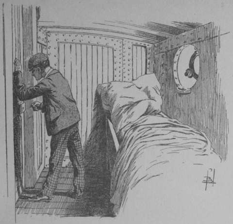

## Le serment du chevalier vagabond

Ici, Grace fit entendre une exclamation de surprise :

— Une note singulière.

— Une note ? balbutia Lilian.

— Vois… En petite ronde, je lis ceci : « _Jud Allan ignore que ces
  feuillets furent glissés à la place de ceux où, trop modeste, il
  s’évertuait à voiler son dévouement. C’est par ordre de celle qui
  l’aima avant sa naissance, de celle qui, invisible, l’a aidé à
  conquérir la foi des lads (gamins) que ceci a été fait. Miss Lilian
  peut être assurée que, pas un instant, on ne s’est écarté de la
  vérité ».

— Après, après ? interrogea avidement la jeune fille.

Grace secoua la tête :

— C’est tout.

— Mais qui est celle qui l’aima avant sa naissance ? Quels sont les lads
  qui ont foi en lui ?

— Je n’en sais rien, ma chérie ; mais je suis satisfaite de
  l’explication. Il m’aurait déplu qu’il se vantat d’un dévouement que
  j’admire.

— Ah ! jamais il ne se fût vanté autant que je l’estime… Je voudrais
  comprendre, voilà tout.

— Je comprends qu’un autre a substitué ces pages à celles que Jud Allan
  avait préparées.

— Quel autre ?

— Tu es trop curieuse, ma belle Lilian. Au point où nous en sommes, un
  mystère de plus n’est pas pour nous déconcerter… Au surplus, neuf
  heures vont sonner… Plus de paroles inutiles, je continue.

Et sans s’inquiéter de l’air désappointé de sa compagne, l’aimable Grace
se replongea dans la lecture du manuscrit.

Jud était seul, prisonnier par l’ordre du « Crâne », de ce chef étrange
qu’il ne connaissait pas. Il s’irrita contre lui‑même.

— Stupide Jud, gronda‑t‑il. Comment as‑tu supposé que l’on aurait tant de
  confiance en toi ? Certes, tu n’es pas maladroit ; des canailles ont pu
  voir en toi une recrue appréciable ; mais avant d’être le confident, il
  faut faire ses preuves…

Il eut un sourire :

— Il est vrai que je n’aurais guère pu agir autrement.

Puis avec énergie :

— Seulement, je suis dans la nasse, il importe d’en sortir. Je me suis
  promis de défendre la petite victime ; je ne consentirai désormais à
  me serrer la main, que si j’ai conscience d’avoir tenté l’impossible.

Sur ces mots, il regarda autour de lui. La cabine prenait jour par un
étroit hublot, ouverture ronde tout à fait insuffisante pour livrer
passage à l’enfant si mince qu’il fût.

— Bon, murmura‑t‑il, il faut d’abord sortir d’ici.

Puis, par réflexion :

— Oui, mais une fois dehors, que ferai‑je ?

Il s’approcha du hublot, l’ouvrit et regarda au dehors.

La nuit des régions intertropicales n’est point sombre. Il semble que les
choses restituent à l’atmosphère une partie des rayons qui les ont
pénétrées durant le jour.

Une clarté bleuâtre régnait sur les eaux, rendant perceptible la côte rocheuse.

— Bigre ! Le rivage est au moins à un mille marin (1852 mètres). Bah ! si
  j’étais dans l’eau, j’en viendrais à bout… et puis, et puis, il n’y a
  pas à discuter, mes amis les bandits ne pousseront pas l’obligeance
  jusqu’à m’offrir une embarcation.

Ce fut tout.

Le gamin avait désormais son idée.

Un clou retiré sans bruit de la cloison, il l’introduisit dans la
serrure.

Il tâtonna un instant ; le déclic du pène l’avertit qu’il avait réussi.

— À la bonne heure, fit‑il gaiement. Je me demandais pourquoi si souvent
  j’ai dû vivre côte à côte avec des voleurs. Voici la réponse. C’était
  pour apprendre à ouvrir les portes fermées.

Avec d’infinies précautions, il se glissa dans le couloir de la cabine.
Personne ! aucun factionnaire.

Les marins, restés à bord, n’avaient évidemment pas jugé opportun de
surveiller le prisonnier.

Ils avaient toute confiance dans la solidité de la porte en chêne, que,
si cavalièrement, Jud venait de forcer.

À pas de loup, l’enfant gagna l’escalier accédant au pont.

Une à une il gravit les marches.

Mais en arrivant sur la dernière, il se rejeta brusquement dans l’ombre.

Un groupe de marins lui barrait le passage.

Ils ne se doutaient point que le prisonnier fût si près d’eux. Tous
écoutaient un de leurs camarades qui leur contait une histoire de bord.

— Ah ! fit le gamin avec désespoir, s’ils restent là une heure, il sera
  trop tard !

Et rangeant son frein, il attendit.

Il faut croire que le destin avait marqué la voie de l’enfant, car
soudain l’organe rude du capitaine se fit entendre :

— Tout le monde à l’avant, _les crochets à squales_ à la mer.

La pêche du squale ou requin est une distraction dont les gens de mer
sont friands.

En toute hâte, les matelots coururent vers l’endroit indiqué.

Mais un nouvel obstacle, plus terrible que les hommes, se dressait en
face de Jud Allan.

Un instant, il demeura immobile, puis il eut un grand geste de
résolution.

— Tant pis…, j’ai mon couteau… Et puis, pour ce que la vie est amusante.

Il sortait du panneau tout en parlant. L’arrière du navire lui apparu
désert.

Ainsi qu’une ombre, il se glissa jusqu’auprès des palans supportant l’un
des canots. Une corde déroulée baignait son extrémité dans les flots.

Elle avait servi aux compagnons d’expedition du _Crâne_ à embarquer dans
la chaloupe venue de terre, et les marins n’avaient point jugé utile de
la remonter sur le pont.

À l’avant, on entendait les cris des matelots, amorçant les crochets
destinés à la pêche du squale.

Jud s’accrocha au filin du palan, se laissa glisser dans l’eau.

Peut‑être, avant d’y plonger, interrogea‑t‑il la surface des flots avec
une vague inquiétude, mais ses mouvements n’en furent pas ralentis.

L’onde se referma sur lui. L’enfant nageait entre deux eaux.

Sa tête, point noir déja presque invisible du pont, émergea à quelque
distance, puis disparut de nouveau.

Il répéta à plusieurs reprises la même manœuvre.

Enfin, se jugeant assez éloigné de sa prison flottante, il commença à
tirer régulièrement sa coupe.

Il oubliait les requins. Les voraces carnassiers marins devaient être
absorbés par les appât que les hommes du bord mettaient à leur
disposition.

Aussi nageait‑il avec calme, sans se presser, ménager de ses forces.

Tous les deux ou trois cents mètres, il se reposait un moment en faisant
la planche. Après quoi il repartait.

À l’estime, il avait parcouru la moitié de la distance qui le séparait de
la côte, quand un frisson le secoua tout entier.

À quelques brasses de lui, il venait de distinguer un objet triangulaire,
ressemblant à une petite voile latine, qui courait à la surface des eaux.

— L’aileron dorsal d’un requin, se dit‑il avec angoisse.

Mais malgré l’imminence du danger, son sang‑froid ne l’abandonna pas.

Le requin voit mal, si mal que parfois un petit poisson, dénommé
_remora_, le guide, remplissant les fonctions du caniche pour l’aveugle.

Mais, par contre, il a l’ouïe très développée.

Le moindre bruit insolite attire son attention, détermine la direction de
sa course. Il nage au son avec une certitude absolue.

Jud s’allongea sur l’eau, se laissant flotter ainsi qu’un corps mort.

Malheureusement, dans cette position, il ne lui était plus possible de
surveiller les mouvements du squale. D’une seconde à l’autre, il pouvait
être happé par la gueule formidable de l’ennemi.

Deux, trois minutes passèrent ainsi, minutes d’épouvante et d’horreur.

Enfin, la tension de ses nerfs devint telle, qu’au risque d’attirer le
requin le gamin voulut voir. Il reprit la position du nageur, non sans
avoir glissé entre ses dents son couteau ouvert.

L’aileron avait disparu.

Le squale s’était éloigné, sans avoir éventé la proie si proche de lui.

Jud poussa un soupir de satisfaction profonde. On a beau être brave,
avoir fait le sacrifice de sa vie, la pensée d’être dépecé par un monstre
marin ne saurait être accueillie comme une perspective agréable.

Mais l’heure ne permettait pas les longues auto‑congratulations. Le gamin
recommença à nager vers la terre.

Maintenant il était assez rapproché pour discerner nettement la côte où
il voulait aborder.

Elle semblait formée de falaises verticales tombant à pic dans la mer. En
face de Jud, deux petites baies se creusaient dans la muraille rocheuse.

L’une totalement couverte par les eaux et entourée d’une muraille
perpendiculaire de rochers ; l’autre gardant à découvert une étroite
plage de sable, aboutissant à une faille de la falaise, où se déroulait
sans doute une sente permettant d’escalader la masse granitique.

Pour atterrir, cette dernière crique semblait la seule favorable.

Seulement, elle était interdite au courageux petit bonhomme, par ce fait
que la chaloupe des bandits y avait abordé, et que son équipage campait
sur la grève, pour attendre plus commodément le retour des sinistres
passagers au service du Crâne.

La constatation n’avait rien de réjouissant.

Un instant, Jud cessa de progresser, se bornant à se maintenir à flot. Il
réfléchissait.

La côte se montrait rébarbative, et le seul point abordable était gardé.

— Tant pis, fit‑il enfin, je vais explorer la crique voisine. Parfois les
  rochers semblent impraticables à distance, et de près, on reconnaît
  l’escalade possible… D’ailleurs, conclut‑il, je n’ai pas d’autre parti
  à prendre.

Mais un regard, jeté encore sur ses ennemis, lui arracha une exclamation.

— Sapristi, j’ai fait du chemin sans remuer les bras… Je dérive, et vite
  même… Je suis tombé dans un courant qui à l’air de me conduire justement là
  où je ne veux pas aller.

Vigoureusement, il se prit à battre l’eau pour couper le courant. Mais
après quelques minutes d’efforts surhumains, il dut s’arrêter pour
souffler.

— Terrible, murmura‑t‑il, il faudrait une chaloupe pour lutter… Maudit
  courant, il va me jeter dans les bras des matelots.

En effet, il était emporté sans pouvoir résister vers l’endroit où
l’embarcation des bandits se montrait engravée dans le sable du rivage.

Dans un quart d’heure à peine, il y serait amené. Les matelots le
verraient, le prendraient. Son expédition se terminerait lamentablement.

À cette minute douloureuse, ce ne fut point sur lui qu’il s’apitoya, bien
que son sort ne fût point douteux. Il soupira :

— Pauvre petite mignonne !

Il songeait seulement à l’infortuné bébé, que la fatalité cruelle allait
priver de son unique défenseur !

Mais l’imminence du danger ranima son courage. Il tendit tout son être
dans la volonté de s’écarter de la ligne dangereuse. Ses bras, ses
jambes se détendirent comme des ressorts d’acier.

Soudain, une sensation agréable le pénétra tout entier.

— Bizarre ! On dirait que le courant me pousse moins fort !

Il demeura sur place pour contrôler cette impression, née peut‑être de
son désir d’échapper à l’étreinte de l’eau.

Non, il ne se trompait pas. Le courant devenait imperceptible. On eût dit
qu’il s’arrêtait ; les houles elles‑mêmes s’apaisaient.

Cette dernière observation fut un trait de lumière pour le gamin.

— Je comprends, se confia‑t‑il ; la marée est pleine, la mer devient
  étale ; le courant venant du large cesse en même temps.

Puis, par réflexion :

— Il faut donc que, dans une dizaine de minutes, je sois accroché à la
  falaise, car alors le courant se manifestera en sens inverse ; il ne
  serait pas plus avantageux pour ma protégée que je sois entraîné en
  pleine mer.

Et il se remit à nager.

À présent, il avance rapidement sur une mer devenue momentanément
d’huile, selon l’expression maritime. La certitude de disposer de
quelques brèves minutes le fait se presser. Dans les moments de hâte, on
néglige les menues précautions comme autant de causes de retard.

Le résultat de cette imprudence inévitable est que sa présence est
signalée par l’un des marins de l’équipage de la chaloupe.

Jud va atteindre le cap rocheux qui sépare la déchirure de la falaise, où
il pense se réfugier, de la plage occupée par ces hommes, quand une voix
rude parvient jusqu’à lui.

— Voyez donc, garçons, qu’est‑ce qui nage là‑bas ?

— Bon, un marsouin probablement, riposte un organe non moins rauque. Il
  n’y a que des marsouins pour remuer l’eau comme cela.

— Peut‑être vrai. Seulement m’est avis que l’on en serait plus sûr si on
  y allait voir… Après tout, cela nous distraire tout en nous
  dégourdissant les bras.

Jud sent son cœur sauter éperdument dans sa poitrine. L’embarcation va se
mettre à sa poursuite. Il sera pris dans l’anfractuosité rocheuse comme
un lapin en son terrier.

Et des bruits menaçants arrivent à ses oreilles. C’est celui de lourds
souliers frappant le fond de bois du canot ; celui des avirons armés sur
les tolets.

Un effort désespéré le porte en avant. Il dépasse la pointe de granit.
Ses persécuteurs ne peuvent plus le voir.

Mais qu’importe ! Ils approchent. Eux aussi vont doubler le cap
escarpé ;  le son rythmé des rames frappant l’eau l’avertit de leurs
mouvements.

Et il promène autour de lui un regard éperdu, cherchant vainement un
trou, une fissure, où il se puisse dissimuler.

Durant quelques secondes il connaît toutes les tortures du désespoir.

Profonde d’une trentaine de mètres, large de dix, la coupure, où il est
enfermé, s’entoure de falaises verticales, hautes de cent pieds au moins.

Et dans l’obscurité, plus profonde en cet espace resserré, il semble que
les flancs du rocher sont polis ; les aspérités se fondent, sont
absorbées par les ténèbres.

Le bruit des rames devient plus distinct. L’ennemi va se montrer.

Est‑ce que vraiment l’effort du gamin est destiné à demeurer inutile?

Est‑ce qu’il va succomber, entraînant avec lui, dans la mort, la mignonne
inconnue à qui il s’est dévoué ? Cette pensée le galvanise. Il s’enfonce
dans le fjord sombre.

— Ah !

C’est un soupir d’espérance. La paroi n’est point aussi régulière qu’elle
le paraissait.

Voici un point où l’on pourrait peut‑être se hisser, en risquant de se
rompre les reins, cela est vrai…; mais aux heures tragiques on saisit la
chance qui se présente, si faible, si aléatoire qu’elle soit.

Jud se cramponne au rocher. Il rampe, se hisse, utilisant comme points
d’appui les moindres aspérités de la falaise.

Pourvu qu’il ait le temps d’atteindre un renflement rocheux qu’il
discerne à quelques mètres au‑dessus de sa tête !

Dans son désir de rester libre, il réalise des prodiges d’équilibre. Il
réussit dans son invraisemblable ascension.

Il s’est glissé sur la protubérance remarquée. C’est un bloc rocheux
s’avançant sur la façade de la falaise. Il est juste assez long, assez
large, pour que le petit puisse s’y allonger ; mais il constitue la
cachette inespérée.

De la surface des eaux, on ne peut plus apercevoir le frêle héros que la
roche compatissante abrite contre les yeux des hommes.

Il était temps. La chaloupe se montrait à l’orifice de la baie.

Les matelots ont allumé une torche, dont la lueur rougeâtre éclaire
sinistrement l’étroit chenal, jetant des teintes sanglantes sur les rocs
et sur les eaux. Ils font le tour de la crique, ramant avec lenteur,
échangeant des plaisanteries.

— Ausint sentait que la chance tournait aux cartes, alors il a vu le
  marsouin qui interrompt la partie.

— Non, j’ai vu, bien vu l’animal disparaître dans cette rue d’eau
  (expression californienne).

— Eh bien, où est‑il?

— Où il a pu aller… Un poisson n’est pas une breloque, il est plus
  difficile à mettre sous les yeux des curieux.

Jud ne perd pas une parole. Il frissonne à la pensée qu’un faux
mouvement peut le faire découvrir. Enfin, il respire. Le patron du canot
s’écrie :

— Austin offrira un gin général… Cela lui apprendra à nous mettre à la
  _mare_ sans nécessité.

Ce à quoi l’interpellé riposta par des jurons.

Mais la barque regagne l’entrée de la crique, elle contourne le cap qui
la sépare de la minuscule plage où elle se tenait tout à l’heure. Elle
n’est plus en vue. Jud n’a point été découvert. Le gamin, champion
suscité par la Providence, pourra continuer son œuvre de salut.

— Il s’agit maintenant de me tirer d’ici.

Certes, il a échappé aux regards des hommes, mais sa tâche est loin
d’être terminée. Ses forces le conduiront‑elles jusqu’au bout ? C’est ce
qu’il se demande avec angoisse, en sentant ses membres raidis.
L’immobilité, à laquelle il a été condamné durant quelques minutes, l’a
brisé. Ses vêtements mouillés se sont collés à son corps, amenant le
refroidissement qui ankylose et paralyse. 

Mais dans ce corps de gamin existe une volonté de fer. Il se relève, et
sur l’étroite corniche, suspendu à mi‑hauteur de la falaise, au risque
d’être précipité dans les flots, il se contraint à des mouvements
d’assouplissement.

Bientôt la chaleur revient à ses membres engourdis ; le sang circule plus
rapide en ses veines, son corps recouvre son élasticité.

— En route !

Jud reprend la lutte contre le rocher. S’accrochant de‑ci, de‑là,
manquant vingt fois d’être précipité, il rampe sur la paroi, s’agrippe à
des protubérances presque invisibles… Hors d’haleine, ruisselant de
sueur, il atteint le sommet.

Le promontoire se termine par une étroite plateforme triangulaire, que
tapissent des mousses et des ajoncs brûlés par le soleil.

De ce point, Jud domine la petite plage où campe l’équipage de la
chaloupe. Mais s’il voit ses adversaires, ceux‑ci pourraient également
l’apercevoir.

Alors, sans souci des piqûres, il se couche parmi les ajoncs ; il rampe
sans bruit jusqu’à l’endroit où le plateau élargi lui permet de reprendre
la position verticale sans crainte de se trahir.

Il a le corps couvert de ces piqûres agaçantes causées par les ardillons
des ajoncs ; mais il n’en a cure. Une seule pensée le tient : rejoindre
le sentier qui relie la plage au sommet, et là, retrouver les traces de
ceux qu’il veut atteindre à tout prix.

— C’est ici.

Oui, le sentier se coule entre deux rochers, dessinant ses sinuosités
blanchâtres sur le ton sombre de l’escarpement.

Les plantes sont foulées par le passage de plusieurs hommes.

La piste est claire. Un citadin, ignorant du désert, ne la perdrait
point. Pour Jud, qui a toujours vécu en plein air, la suivre n’est qu’un
jeu.

Bientôt, une colline sablonneuse se présente. Le gamin l’escalade, comme
l’ont gravie, une heure plus tôt, ceux qu’il cherche.

Au sommet, il a une exclamation de surprise. À la bande de terrains
incultes bordant le rivage, succèdent brusquement des cultures.

Ce sont de hauts palmiers, dont les panaches en rosaces s’étalent, ainsi
que de verdoyants parasols, au‑dessus d’arbres fruitiers d’origine
européenne, lesquels, grâce à eux, supportent sans être grillés les
ardeurs du soleil mexicain.

Plus loin, des « prairies » entourées de barrières rustiques, où des
troupeaux : bœufs, moutons, chèvres, porcs, vivent pêle‑mêle avec des
ânes et des chevaux.

Pendant près de deux heures, Jud marche dans le sentier que bordent les
clôtures.

Il se presse, la sueur ruisselle sur son corps. Une lassitude toujours
grandissante le fait haleter. Comme il se coucherait volontiers dans les
hautes herbes ! Comme il se laisserait aller au sommeil réparateur.

Il respire avec peine. Son crâne s’emplit de bourdonnements. Mais il va
toujours. Il veut mener jusqu’au bout la chasse folle qu’il a commencée.

Et soudain, il tressaille.

La sente s’enfonce entre des plantes étranges qui, dans la nuit, prennent
l’apparence d’araignées géantes, couchées sur le dos, leurs pattes
charnues en l’air.

Quels sont ces monstres hauts de trois à quatre mètres ? Des aloès
épineux, ces énormes aloès dont le suc fermenté constitue la boisson
nationale mexicaine, le _pulque_. Et du fourré, qui évoque un souvenir
des légendes, sort un murmure de voix.

Le gamin s’arrête, il écoute :

— Qui parle ainsi dans les ténèbres ? Si ce sont les misérables que je
cherche, il faut qu’ils soient bien certains de n’être pas dérangés.

Le petit s’aplatit sur le sol. Il se glisse entre les pieds massifs des
aloès. Parfois, l’épine qui termine les feuilles griffe sa chair au
passage. Alors il serre les dents, étouffe l’exclamation que la douleur
jette sur ses lèvres. Les voix se rapprochent. Plusieurs hommes causent
sans se gêner. Et Jud demeure immobile, étreint à la fois par la joie
d’avoir rejoint ses adversaires, par l’épouvante de se sentir trop faible
pour vaincre.

Un chemin d’exploitation croise en ce point la sente que l’enfant a
parcourue dans les traces des bandits. Au point d’intersection, une sorte
de carrefour circulaire a été ménagé parmi les aloès.

Dans ce cercle dénudé, Jud reconnaît les hommes avec lesquels il a fait
le voyage de San‑Francisco à la baie de Sébastian Vizcaïno.

Voici l’Américain Tom, l’Irlandais Jetty, Kan‑So le Chinois, Zirini
l’Italien.

Voici Van Foorberg, Van Reek, coquins venus d’Allemagne et de Belgique,
Elisalt le Basque et l’Espagnol Todero.

Ils sontrangés en demi‑cercle. Ils discutent avec animation ; de leurs
discours Jud comprend qu’ils attendent quelqu’un. Quelques mots encore,
le _quelqu’un_ se précise. C’est le chef, le _Crâne_.

Mais le silence s’établit tout à coup. Les huit bandits semblent
métamorphosés en statues.

Qu’est‑ce ? Un nouveau personnage vient d’entrer dans la clairière.

— C’est lui, devine l’enfant qui le considère de tous ses yeux.

Le Crâne est de haute taille. Ses épaules larges, ses membres musculeux
disent la force peu commune. Le port altier de sa tête indique l’orgueil
et l’audace. Seulement, son visage demeure invisible. Un masque noir
cache ses traits.

L’homme élève la voix :

— Garçons, au moment d’agir, je veux, selon la coutume de notre
  association vous expliquer sans détours le but de notre réunion sur les
  terres de l’hacienda de Agua Frida.

 
— Agua Frida, murmure Jud gravant ce nom dans son esprit.

— Comme toujours, continue l’homme masqué, ceux qui n’approuveraient pas
  l’opération, seront libres de se retirer.

Un murmure s’élève. Les bandits ricanent. Mais tout s’apaise sur un signe
du chef.

— Comprenez‑moi bien, reprend celui‑ci… Deux obstacles doivent
  disparaître, deux, vous entendez…, pour que ma chère cousine Lily cesse
  de souffrir, pour qu’elle soit seule maîtresse de ce domaine de
  quarante mille kilomètres carrés [^1‑13‑1].

— Hip ! Hip ! Hurrah pour le domaine de Lily !

Le Crâne hoche la tête. Il doit sourire sous le masque. Il poursuit :

— Le señor Pariset, à qui j’ai accordé naguère la main de cette chère
  Lily, que j’aime ainsi qu’une fille ; Pariset, dis‑je, s’est tout
  d’abord montré digne de ma confiance. Lily était heureuse, la naissance
  de sa fillette, la petite Lilian, tout semblait promettre un bonheur
  durable.

Tandis que les bandits saluaient ces paroles de rires étouffés, Jud,
d’une voix légère comme un souffle, répétait les noms prononcés :

— Pariset ! Lily ! Lilian !

— Pariset ! Lily ! Lilian !

Ces mots jaillirent aussi des lèvres de la compagne de Grace Paterson.

Mais gravement celle‑ci mit un doigt sur sa bouche rose.

— Silence ! Lilian… Il faut tout savoir ! Silence et courage.

Et son amie, dominée par son accent, demeurant muette, elle reprit sa
lecture.

— Pariset, continua le Crâne d’un ton pathétique, est devenu subitement
  fou. Il croit à un complot formé contre ses richesses et sa vie,
  confondant avec ses ennemis imaginaires sa femme, ma douce et vertueuse
  cousine. L’insensé en est venu à prendre en haine jusqu’à cette petite
  Lilian qui faisait son bonheur.

— Bon, sifflota Kan‑So, j’ai eu assez de mal à attacher ce grelot, et à
  accumuler les fausses preuves que l’imbécile a acceptées pour vraies.

— Tenez vos langues, garçons, ordonna rudement le chef. Celui qui se
  vante d’une affaire bien menée, se prépare des déceptions dans
  l’avenir.

Jud écoutait, stupéfié par l’horreur.

— Donc, plaisanta le Crâne après une courte pause, l’affaire est bien
  menée. Nos amis du haut Commerce de Frisco, avec lesquels nous avons
  mis Pariset en rapports lors de ses derniers voyages, le considèrent
  comme fou et _dangereux pour ma chère Lily_, ‑ il accentua ces mots
  avec une indicible ironie. ‑ J’ajoute même que, si je suis dans ce
  pays, c’est à l’insistance de mes collègues du tribunal de commerce de
  San‑Francisco que je le dois… Ils m’ont poussé à venir à l’improviste,
  à m’assurer que Lily n’est pas en danger… La chose faite, je rentre
  là‑bas, j’affecte une inquiétude profonde… Et, d’ici à quelques
  semaines, quand on m’amène Lily, rendue _innocente_ par notre
  _infusion de chanvre_, personne ne doute que Pariset, dans un accès de
  démence aiguë, ne se soit tué et ait donné la mort à sa petite Lilian.
  Impossible que le soupçon même nous effleure.

— Bon, grommela Von Foorberg, je déclare que tout cela a été conduit de
  main de maître. Le Crâne, du reste, nous a habitués à sa façon
  d’opérer, et si nous, les anciens de la prairie, nous lui obéissons,
  c’est parce que nous avons la confiance la plus grande en sa
  supériorité. Mais ceci dit, je voudrais placer une objection.

— Parle, Von Foorberg, consentit le chef sans aucune marque d’impatience.

— Eh bien, il me paraît évident que Pariset sera seul réputé coupable de
  sa mort et de celle de la petite Lilian. Alors, à quoi bon nous charger
  de cette enfant pour la confier à la pleine mer, au lieu de l’étrangler
  ici tout simplement, en abandonnant son cadavre auprès de celui du
  fou ?

— Allons, allons, railla le chef, vous êtes décidément des criminels
  naïfs, garçons. Non seulement je prétends n’être pas soupçonné, mais
  encore forcer l’admiration sentimentale de mes concitoyens. L’enfant
  disparaît sans laisser de traces, n’est‑ce pas ? Je puis supposer
  qu’elle vit encore. Je mets en mouvement les agences de renseignements,
  les détectives du monde entier pour tâcher de la retrouver. Et
  l’univers s’entretient de mon affection fraternelle pour ma cousine
  Lily. On trouve naturel qu’elle habite chez moi. On m’_admire_ de
  n’économiser ni temps, ni argent, pour lui rendre sa fille, dont la
  présence peut‑être déterminerait son retour à la raison.

Un silence flatteur suivit la déclaration du terrible chef de bande.

Le meurtrier qui vole l’admiration de ses contemporains est exceptionnel,
et la tourbe vulgaire des bandits s’incline devant ces êtres en qui ils
reconnaissent la toute‑puissance pour le mal.

Maintenant, Jud avait peur de cet homme. Il se sentait vaincu par avance.
Qui donc ajouterait foi à l’affirmation d’un petit vagabond, évadé de la
prison d’Alb‑Point ?

Mais cette faiblesse ne dura pas. De nouveau il prêta l’oreille au
discours du chef.

— Nous sommes d’accord, déclamait celui‑ci. Personne n’a plus rien à
objecter. Parfait ! Alors, écoutez comment va s’accomplir l’opération et
quels en seront les résultats.

Pariset, que j’ai fait avertir, est parti ce matin de l’hacienda de Agua
Frida, en annonçant bien haut un voyage à Frisco. Il croit que Lily,
terrorisée par ses colères continuelles, tremblant pour la vie de son
enfant, va profiter de son absence pour confier Lilian à des mains amies.
Fou de colère et de haine, il va revenir par ce chemin traversant la
clairière où nous nous trouvons.

Lily est seule à l’hacienda avec sa servante Trina… Celle‑ci me remettra
l’enfant comme à un ami sûr.

— Mais elle parlera, fit une voix.

— Non… Elle ne parlera jamais.

Le ton dont ces paroles furent prononcées fit frissonner Jud.

— Le père tombe ici… On trouve la servante égorgée là‑bas, l’enfant a
  disparu… C’est le fou qui a fait tout le mal.

Il promena sur ses auditeurs un regard triomphant, puis la voix
abaissée :

— Maintenant, passons aux résultats de l’affaire.

Je garde ma cousine à San Francisco. Mes affaires, chaque jour plus
importantes, ne me permettent pas de m’occuper moi‑même de l’exploitation
d’Agua Frida. Et cependant je veux que le domaine de Lily continue à
prospérer. Si elle revient à la raison, je souhaite qu’elle soit contente
du cousin dont la fatalité a fait son tuteur. Je constitue un conseil
d’administration, composé de mes correspondants les plus actifs, les plus
honnêtes… Vous enfin !

Un éclat de rire accueillit la plaisanterie du chef.

— Vous administrez Agua Frida, chacun à tour de rôle vivant à l’hacienda.
Ainsi sous le couvert de l’affection, de la défense des intérêts de la
veuve et de l’orpheline, nous avons ici, à poste fixe, un agent
centralisant le produit de nos opérations, et cela, dans un endroit
baigné par le Pacifique et la mer Vermeille, où nos navires aborderont
sans avoir à se préoccuper des douanes, où aucune police ne saurait
pénétrer.

Sa voix s’enflait par degrés. L’effrayant aventurier se gonflait
d’orgueil satisfait.

— L’heure est venue, garçons, de mettre le monde en coupe réglée, de
  réaliser enfin ce but vers lequel notre association n’a cessé de
  marcher, depuis qu’elle fut constituée dans les prairies du Far‑West.
  Toi, Elisalt, et toi, Todero, vous serez les chefs de nos opérations
  internationales pour l’Espagne et la France. Toi, Von Foorberg, je te
  donne l’Allemagne, l’Autriche et les pays scandinaves. L’Angleterre et
  ses colonies, l’Italie, la péninsule des Balkans seront le lot de
  Zirini.

Je garde les autres pour les deux Amériques, et le cas échéant, l’Asie et
l’insulaire Océanie.

Jud frissonnait aux accents de cette voix sonore, dominatrice. On eût cru
entendre l’un de ces conquérants barbares des âges des grandes invasions,
distribuant à ses leudes [^1‑13‑2] les fiefs arrachés aux vaincus.

Le gamin se sentait humilié de sa faiblesse, de sa petitesse devant ce
géant du mal.

— Y a‑t‑il quelque observation que l’on désire me présenter encore ?

Les huit bandits répondirent d’une seule voix :

— Non, c’est bien vu !

— Alors, reprit le Crâne, entrons en action.

Et d’un ton impossible à rendre, mélangé d’ironie et de cruauté :

— Je vais chercher l’enfant, apprendre le silence à la servante Trina ;
  vous, guettez l’homme ; s’il paraît, réduisez‑le à l’impuissance ; mais
  surtout qu’il ne lui soit fait aucun mal.

Jud comprit que les misérables allaient se cacher parmi les aloès.

Tremblant d’être découvert, il se glissa lui‑même au milieu des énormes
plantes. D’instinct, il se porta à vingt pas de là, le long du chemin
d’exploitation traversant la clairière.

Il était à peine à son nouveau poste, quand le Crâne passa devant lui.
L’assassin allait à son œuvre de mort.

Cette pensée rendit au petit toute son énergie. Il se redressa, et se
coulant sous les feuilles charnues, insensible aux piqûres brûlantes des
épines, il suivit à quelques mètres de distance l’homme dont il s’était
improvisé l’ennemi.

Il voulait voir, savoir…, et puis, au petit bonheur… Il se montrerait
s’il le fallait. Il périrait pour Lilian, ce bébé encore inconnu. Il
songeait :

— Quel est cet homme ? À San‑Francisco, le Tribunal du Commerce est
  composé d’amis à lui. M^me^ Pariset, Lily comme il la nomme, est sa
  cousine… Et ce personnage occupant une situation honorable, enviée,
  entretient à sa solde une troupe de bandits. Quel peut être cet
  individu ?

Cependant, le Crâne et le gamin avaient parcouru sept à huit cents
mètres. La _pulqueria_ (plantation d’aloès à pulque) s’interrompit
brusquement.

Jud s’arrêta à l’abri de l’un des derniers végétaux et regarda en avant.

Des pelouses avec des corbeilles de fleurs, des bouquets de palmiers,
indiquaient un peu d’agrément. À faible distance, des bâtiments blancs,
aux toitures de tuiles vernissées qui brillaient sous les rayons de la
lune, attirèrent son attention.

— L’hacienda, murmura‑t‑il.

Un sifflement aux modulations particulières se vrille dans l’air. À dix
pas, le Crâne s’est arrêté. Masqué par une touffe d’arbres, il ne saurait
être aperçu de l’hacienda.

Mais qu’est‑ce donc ? La‑bas, dans la façade blanche de l’habitation, un 
rectangle noir vient d’apparaître.

— Une porte a été ouverte, se confie le petit, la gorge serrée par
  l’angoisse.

Il ne se trompe pas. Sur le seuil se montre une forme blanche. La forme
blanche vient vers l’endroit où attend le Crâne. Jud discerne la
silhouette d’une femme.

Son cœur se tord éperdument dans sa poitrine, car la femme porte un
fardeau dont le jeune guetteur devine la nature. C’est le bébé, c’est
Lilian.

Un instant ses yeux se troublent embués par l’émotion. Quand il regarde
de nouveau, la femme est debout en face du chef masqué. Il l’interroge
d’une voix brève, autoritaire. Elle répond, doucereuse et hypocrite.

— Trina, tu as l’enfant ?

— La voici, chef. Comme tu l’as ordonné, j’ai mis trois gouttes de
  laudanum dans son laitage.

— Bien. Elle dormira jusqu’au matin et ne nous fatiguera pas de ses cris.
  Et la señora Lily ?

— Elle dort en souriant. On dirait que les saints anges bercent son
  repos.

— Les peones, les serviteurs ?

— Rentrés à leurs habitations à la chute du jour, ainsi qu’à l’ordinaire.
  Aucun n’aura l’idée d’en sortir. Une généreuse distribution de pulque
  et de mezcal (eau‑de‑vie) les y retiendra jusqu’à l’aube.

— Allons, Trina, tu es une fille intelligente et adroite… On aura soin de
  ta fortune.

Elle s’incline profondément.

— Oh ! Master Frey sait récompenser les dévouements…

Sa phrase s’achève dans un râle sourd.

Celui qu’elle vient de nommer a profité de son mouvement respectueux. Il
a tiré le machete passé à sa ceinture. L’arme s’est abattue rapide sur le
crâne de la misérable femme, brisant les os, atteignant la cervelle.

Avant que le coprs de Trina ait roulé à terre, son meurtrier lui a
arraché l’enfant qu’elle tenait en ses bras. Puis il regarde le cadavre
qui s’écroule sur le sable du chemin, et il ricane :

— Trop imprudente, ma mie. Pour les miens, je dois être seulement le
  Crâne… Pourquoi m’appeler Frey sans nécessité ?

Celui dont, en dépit du masque, le gamin connaît à présent deux noms :
Le Crâne,  Frey, reprend le chemin qu’il a parcouru tout à l’heure.

Sous son bras, tel un paquet vulgaire, il emporte l’enfant endormie par
le laudanum.

Et Jud, invinciblement attiré par ce fouillis d’étoffes blanches qui lui
cachent la frêle mignonne pour laquelle il risque son existence, se
replonge dans la pulqueria.

Voici la clairière.

L’autre partie du drame a commencé à s’accomplir en cet endroit. Les
bandits sont réunis autour d’un homme garrotté, réduit à l’impuissance.

— Ah ! Ah ! Vous avez travaillé, garçons, s’écrie le Crâne d’une voix
  joviale.

— Et sans bruit, j’ose le dire, riposte le chinois Kan‑Se, dont la face
  maigre et jaune se plisse en un hideux sourire.

— Il a résisté ?

— Non. La surprise a été complète. Quand il a eu conscience de l’attaque,
  il était déjà ficelé.

Alors, le Crâne se baisse, dépose l’enfant au pied d’un aloès, puis
s’avance lentement vers le prisonnier, dont les yeux se fixent sur lui avec
une stupeur épouvantée.

— Oui, oui, c’est moi, mon brave Pariset, dit‑il. C’est moi, dont tu
  crierais le nom aux échos, si mes dignes associés n’avaient pris soin
  de te baillonner.

En effet, le prisonnier ne saurait répliquer. Il s’agite vainement, se
tord en une inutile tentative pour briser ses liens. La gaieté sinistre
de son interlocuteur s’accentue.

— Seulement, Pariset manque de réflexion… Il nous fait, à Lily et à moi,
  l’injure la plus grave qui puisse atteindre une femme et un gentleman…
  Et il croit que l’on emploiera, pour le réduire à l’impuissance, des
  cordes qui se rompront au premier effort.

Les bandits soulignent de rires grossiers et cruels la terrible ironie
de leur chef.

— Je venge Lily que tu as offensée, reprend ce dernier… Ta vie seule peut
  payer l’injure. Je vais la prendre.

Et il se penche vers le captif, hors d’état de s’opposer à son
mouvement ; de la pochette, fixée à la ceinture du malheureux, il tire un
revolver, l’examine :

— Il est chargé. C’est admirable. L’une des cartouches que toi‑même a
  glissées dans le barillet, te trouera le front… Eh ! Eh ! Je ne suis
  pas cruel. Une balle, une détonation, ce sera fini.

Puis lentement et de plus en plus ironique :

— Tu le vois, même si tu pouvais parler, la moindre récrimination serait
  de ta part une inconvenance, car je suis bon et puisque tu crois à une
  vie future je t’accorde dix minutes pour préparer ton départ vers
  l’éternité.

Pariset est livide. Il essaie de parler, mais le bâillon ne laisse passer
que des sons inarticulés.

Il y a dans les regards de l’homme qui va mourir, de la haine, de
l’épouvante, et aussi une surprise affolante… Ce dernier sentiment même
doit dominer… Quoi, le parent de sa femme, l’homme qui fut son ami, est
celui par la main duquel il va périr !

— Et la petite chose ? interroge Foorberg.

Le chef masqué désigne le paquet qu’il a posé à terre :

— Quelques gouttes de laudanum. Elle dormira jusqu’au retour au bateau.

— Parfait !

— Et là, je verrai ce que l’on peut faire du gamin que Tom et Jetty m’ont
  si vivement recommandé.

Nul ne s’occupe plus de l’enfant. Une discussion s’est élevée parmi les
meurtriers au sujet de Jud. Jetty et Tom le louent. Foorberg et Van Reek
le critiquent.

Ah ! S’il pouvait voler l’enfant !

Il se souvient des pâturages traversés par lui avant d’atteindre la
pulqueria. Il y avait là des chevaux en liberté… S’il arrivait là, s’il
bondissait sur le dos d’un des animaux… Ce serait le salut peut‑être.

Un coup d’œil à ses adversaires. La discussion s’est animée… Les bandits
ont oublié tout pour discuter sur l’opportunité d’adjoindre à la troupe
le gamin qu’ils ne supposent pas si près d’eux.

C’est le moment d’agir. Jud se glisse près de l’enfant. Il l’attire à
lui. Il le tient. Un trouble inconnu l’étreint lorsqu’il presse dans ses
bras la petite créature. Oh ! Il faut réussir. Il ne veut pas mourir,
puisque sa mort entraînerait celle de Lilian.

Avec le bébé endormi, il disparaît parmi les aloès… Il va, se pressant…
Les voix des bandits, affaiblies par l’éloignement, lui indiquent qu’il
peut renoncer aux précautions qui ralentissent sa marche.

Il se dresse sur ses pieds, il court, il vole.

Ah ! Voici les palissades… Là‑bas, un cheval de robe sombre le regarde
venir. Sans doute l’animal a déjà senti le poids d’un cavalier, car il ne
s’enfuit pas comme ses compagnons de pâturage, quand le gamin escalade la
barrière.

Et Jud sifflote doucement, il s’approche du coursier, il le flatte, puis
soudain, il détache sa ceinture, simple tresse de soie, la glisse dans la
bouche du cheval étonné, et d’un bond se trouve à califourchon sur le dos
du quadrupède.

Celui‑ci veut se débarrasser du cavalier. Mais le gamin lui scie la
bouche avec sa cordelette, il lui enfonce ses talons dans les flancs. 

L’animal a un hennissement de douleur, et furieux, affolé, il s’emballe
en un galop éperdu.

Soudain une détonation lointaine résonne.

Jud frissonne, serre plus étroitement la petite Lilian. Il a compris… Ce
coup de revolver a tué le père de l’enfant. Et il talonne sa monture,
dont la vitesse semble s’accroître encore.

Cela dure longtemps. Le cheval haletant, dont le poitrail se couvre
d’écume essaie ralentir. Jud le pousse sans cesse, sans pitié.

Dans une dernière foulée l’on parcourt encore quelques kilomètres. Les
flancs du cheval surmené fument. Ses naseaux, démesurément ouverts,
laissent passer un souffle rauque.

Brusquement il bute, s’abat sur le sol, précipitant en avant son
cavalier.

Instinctivement Jud essaie de protéger le cher fardeau qu’il étreint…
Mais sa tête porte sur un corps dur, racine ou pierre ; une douleur
violente lui fait perdre connaissance, et il demeure inerte, immobile,
comme mort, avec l’enfant endormie que ses bras enserrent toujours.

Jud cependant n’avait point perdu la vie.

Et la preuve en est qu’il rouvrit les yeux, après un laps de temps qui, à
son estime, n’avait du être que de quelques minutes.

Il se souleva sur son séant et demeura stupéfait. Il se trouvait dans une
grotte qu’emplissait une clarté violette, pénétrant à travers des lianes
fleuries qui retombaient devant une ouverture, servant évidemment
d’entrée.

Lui‑même était étendu sur une natte, fixée par ses angles à des piquets
assez élevés pour l’isoler du sol.

Puis il se sent faible. Le mouvement qu’il vient de faire pour s’asseoir
sur sa couchette, l’a brisé. Tout lui parait tourner autour de lui, et il
se renverse lentement en arrière.

Quelques instants, il reste ainsi ; après quoi de nouveau ses paupières
se soulèvent.

Il distingue des instruments étranges : sarbacanes, arcs détendus, puis
des calebasses coupées en forme de bols. Cela lui rappelle les wigwams
(cabanes) des Indios bravos, qui lui ont parfois accordé l’hospitalité au
cours de ses tournées acrobatiques.

Au centre de la grotte, entre des pierres dressées, des branchages
flambent, faisant chantonner une marmite d’où s’échappent des vapeurs
aromatiques.

— Lilian ? fait‑il à haute voix.

— Le Wacondah (Grand Esprit des Indiens) a‑t‑il permis que l’intelligence
  renaisse en mon jeune frère blanc ?

Un organe guttural a prononcé cette question.

Jud cherche autour de lui. Enfin il aperçoit son interlocutrice. C’est
une Indienne. Elle a peut‑être trente ans ; mais la douleur a marqué ses
traits et parmi les tresses noires de sa chevelure, une mèche toute
blanche trace un sillon d’argent.

Avec sa tunique aux ornements multicolores, la plume d’aigle fichée dans
ses cheveux, cette femme donne l’impression d’une majesté surhumaine.
Elle tient un baby entre ses bras.

— Lilian ! répète‑t‑il.

La face grave de l’Indienne s’éclaire. Elle se rapproche, présente
l’enfant au blessé :

— Voici celle que tu cherches ; celle que j’ai ramassée auprès de toi, à
  demi‑mort.

— Où sommes‑nous ?

— En sûreté. Hors de l’atteinte de tes ennemis. Ils ne peuvent rien
  contre toi. À présent, tais‑toi…, dors… ; laisse Marahi achever de
  vaincre les maléfices de la mort.

Ses yeux noirs se fixent sur ceux du gamin. Elle n’a point répondu
clairement à la question. Il ignore en quel endroit il se trouve.
Cependant toute inquiétude disparaît chez lui.

L’enfant que porte l’Indienne le considère de son regard innocent, puis
lui sourit.

Ce sourire, le premier que Lilian adresse à son sauveur, se reflète sur
les traits amaigris de Jud, et celui‑ci, fermant doucement les paupières,
s’endort de ce sommeil profond et réparateur de la convalescence.

Quelques jours s’écoulent encore, partagés entre de longs sommeils et de
courtes veilles. Les forces de Jud reprennent progressivement.

Enfin, l’Indienne le juge assez fort pour supporter les explications
qu’il désire.

Elle lui dit comment, auprès de son cheval expiré, elle l’a trouvé dans
la savane, inanimé, presque mort lui‑même. L’enfant était sortie du
pesant sommeil de l’opium. Ses cris avaient attiré Marahi. Et Jud
regarde tendrement la mignonne, murmurant :

— À son tour, elle m’a sauvé !

Marahi continue son récit. Jud portait une blessure à la tête. Son front
était ouvert. Pour le panser, elle a dû couper les cheveux du blessé. Il
semble que cette action lui ait fait découvrir une chose inattendue, dont
elle a été profondément troublée. Mais elle poursuit, laissant à son
auditeur l’impression qu’un état d’âme de son interlocutrice ne lui fut
point révélé.

Le petit est atteint d’une fièvre cérébrale. Dans le délire, il parle, il
combat, il se défend. Des mots, toujours les mêmes, reviennent sans cesse
à ses lèvres.

— Le Crâne ! Assassins ! Lily ! Lilian, me voici !

Puis un peone de l’hacienda de Agua Frida est arrivé au campement. Il
raconte une scène horrible.

Pariset devenu fou, tuant la servante Trina, se tuant lui‑même, et
l’enfant, la petite Lilian disparue. On la cherche partout, sur l’ordre
du généreux Frey Jemkins, le grand négociant de San‑Francisco, le cousin
dévoué de la veuve, arrivé trop tard pour prévenir l’épouvantable drame.

Marahi connaît Frey sans aucun doute, car elle a caché au peone la
présence de Jud et de Lilian.

Des Indiens de la tribu ont emporté le malade délirant jusqu’au rivage de
la mer Vermeille. Ils l’ont déposé dans une pirogue où la femme rouge a
pris place avec la petite Lilian.

Ainsi on a traversé le long golfe resserré entre la presqu’île
Californienne et la côte de l’État de Sonora.

C’est dans une caverne de cette immense province, à la population
clairsemée, où les Indiens errent encore libres et indépendants, que le
gamin, arraché à la mort par les soins de Marahi, reprend conscience de
la vie.

Et quand, avec les forces, revient la pensée du devoir qu’il s’est
imposé : protéger la petite Lilian, la remettre en possession de sa mère,
de ses biens, Marahi marque une terreur incompréhensible :

— Ne lutte pas contre le Crâne…, tu serais brisé.

Il résiste, se cabre contre ces conseils de prudence, dont il ne
soupçonne pas les motifs réels. Alors, elle ajoute ces mots, qui, souvent
depuis, ont hanté le cerveau de Jud Allan :

— Oui, oui, tu es vif, impatient comme il convient à ceux de ta race ;
  mais je ne permettrai pas que tu entraînes dans l’abîme celle que tu as
  miraculeusement sauvée. Pars pour San‑Francisco ; observe…; tu
  reviendras ensuite. Si tu crois encore au succès, je ne m’opposerai
  plus à tes desseins. Va, brave enfant, la pauvre Indienne souhaite ton
  bonheur.

En effet, guidé par des hommes rouges, Jud gagne la frontière des
États‑Unis. Ils se rend San‑Francisco.

Là, il comprend que sa voix ne sera pas entendue si elle s’élève contre
Frey Jemkins. Qui donc ajoutera foi à ses récits? Qui consentira à croire
que le directeur du gigantesque bazar _All Frisco’s Hall_, l’une des
importantes maisons de la grande cité américaine, que le juge au Tribunal
de Commerce, que le candidat aux élections sénatoriales, n’est qu’un
vulgaire chef de bandits ?

On répondra que Frey Jemkins fut le chef de la police à cheval qui traqua
et fit disparaître les _mauvais garçons_ de la prairie, qu’ainsi il
délivra Pariset prisonnier des malandrins, d’où l’amitié des deux hommes
et le mariage de l’hacendero mexicain avec Miss Lily Jemkins.

Le moyen d’admettre que ce brave Jemkins eût assassiné son cousin alors
que, en ce moment même, la population chantait les louanges de
l’excellent parent, recueillant chez lui sa cousine démente, incapable de
comprendre ses bontés, restant inerte et stupide de son dramatique
veuvage.

Et puis, le riche directeur du All Frisco’s Hall ne promettait‑il pas des
sommes énormes aux agents libres ou détectives assermentés, qui
retrouveraient la trace de la petite Lilian, dont la disparition
demeurait un mystère ?

Bien plus, à la suite d’une rapide enquête menée dans le pays du crime,
est‑ce que Jemkins n’avait pas relevé la présence d’un jeune vaurien, du
nom de Jud, récemment évadé de la prison d’Alb‑Point.

Ce jeune drôle était‑il mêlé à la tragédie ? On ne le savait. Mais comme
l’avait dit le négociant :

— Quand un louvard (jeune loup) est signalé dans un district, il est bon
  de s’inquiéter de son repaire.

Et il avait promis une prime supplémentaire à quiconque arrêterait le jeune
garçon.

Ses mesures étaient bien prises. À la moindre tentative de lutte, Jud
serait reconnu et il avait assez mauvaise opinion de la justice des
hommes pour être certain qu’on l’emprisonnerait avant toute explication.
La douloureuse vérité de la lutte du pot de terre contre le pot de fer
s’implanta en son esprit.

Sans avoir encore appris le latin, Jud se rencontra avec les sages de la
Rome antique.

— _Primum vivere_, disaient ces doctes philosophes.

— Il faut vivre d’abord, se dit le gamin…

Or, pour vivre, pour échapper à la nuée de policiers que la générosité de
Frey Jemkins avait mis en mouvement, il importait de se blottir dans une
retraite impénétrable.

Aussi, quittant San‑Francisco, Jud regagna la Sonora. L’Indienne Marahi
sembla ravie de la façon dont il envisageait les choses.

— Nos montagnes de Sonora sont abris sûr pour des fugitifs, lui dit‑elle.
  Reste avec ta petite compagne parmi mes frères rouges. Ceux‑là ne te
  trahiront pas.

Et comme il murmurait rageusement :

— Triste sort pour celle qui eût dû être une héritière enviée !

Marahi répliqua d’un ton étrange, presque prophétique, dont il se sentit
singulièrement troublé :

— Le chasseur malheureux songe que le lendemain sera peut‑être plus
  fortuné.

Bref, Jud reste dans la tribu qui lui a donné asile. Marahi est retournée
parmi les siens. De loin en loin, elle traverse la mer Vermeille. Elle
vient rendre visite au gamin, à sa petite protégée. On dirait que cette
femme au visage impénétrable, à la parole mesurée, ressent pour ces deux
abandonnés une tendresse inexplicable.

Cependant les années s’écoulent. Les sorciers de la tribu s’attachent à
apprendre au gamin tout ce qu’ils savent eux‑mêmes.

Jud est devenu un habile suiveur de pistes, un chasseur adroit. Il sait
dissimuler sa marche, imiter les mille bruits du désert. Il connaît les
incantations magiques et aussi les pratiques du magnétisme, de la
suggestion, grâce auxquelles de bizarres guérisseurs rendent la santé aux
guerriers, aux femmes, aux enfants.

Plus instruit, Jud s’apercevrait avec surprise que ces Indiens appliquent
les principes d’une science hypnotique, analogue à celle des brahmes
Hindous. Il se demanderait si, comme le prétendent certains savants, la
dite science n’a pas été importée en Amérique par des navigateurs d’Asie,
découvreurs du Nouveau Monde deux mille ans avant Christophe Colomb.

Lilian va avoir huit ans.

Son pseudo‑frère la voudrait instruire. Ce n’est point seulement le corps
de la fillette qui doit grandir et vivre, mais aussi son esprit.

Qu’elle reprenne son rang, par suite d’un concours de circonstances
heureuses ; il ne veut pas qu’elle se sente inférieure à la situation.
Jud la souhaite en état de briller parmi les premières, dans quelque
monde qu’elle soit destinées à vivre.

Et Marahi, à qui il confie ses hésitations, durant une des visites de
l’Indienne, Marahi l’approuve : 

— Cela est juste ! Cela est droit ! Pars donc parmi les hommes au visage
  pâle. Mais sois prudent, mon fils. Prends garde à l’ennemi qui ne
  désarmera jamais. L’ennemi, c’est Frey Jemkins, c’est l’assassin que
  ses acolytes nommaient le Crâne.

Un dernier voyage à San‑Francisco montre au jeune homme, ‑ il a dix‑neuf
ans maintenant, ‑ son ennemi plus puissant que jamais.

Frey Jemkins est sénateur ; Frey Jemkins commence à être une force avec
laquelle les trusts entrent en composition.

Autour de lui gravitent, sinistres satellites, les hommes qui naguère
assistèrent au crime de l’hacienda de Agua Frida.

Jetty est le principal propriétaire des mines du Colorado ; Van Reek
figure parmi les administrateurs du trust des chemins de fer ; Kan‑So,
Chinois naturalisé Américain, domine l’industrie métallurgique, et Tom,
qui maintenant soigne sa mise, préside l’association des pétroliers.

Lily, elle, est toujours démente.

De cette exploration, Jud revient découragé.

Il n’importe. L’espoir de vaincre est éteint en lui. Il fera ce qu’il
considère comme le devoir. L’enfant arrachée aux assassins sera digne de
la fortune qui lui a été ravie.

Les voici tous deux à Cincinnati. Une nouvelle idée a torturé le
malheureux Jud. Il a deviné, dans sa maturité précoce née de la douleur,
que la reconnaissance de la jeunesse est complète seulement quand elle
s’accompagne de respect.

Pour que Lilian le respecte, au jour où elle apprendra peut‑être la
vérité, il ne faut pas qu’elle voie en lui un inférieur dévoué, mais un
égal de savoir, d’intelligence, d’éducation.

Au travail, Jud ! Le jour, tu gagneras le pain des deux isolés ; la nuit,
tu meubleras ton esprit de toutes les connaissances humaines.

Le pain et les examens.

Les deux s’obtiennent au prix du labeur opiniâtre, parmi des dangers sans
cesse renaissants.

Un agent de Frey Jemkins évente la retraite des fugitifs. Jud, dans un
combat sans merci, le tue et fuit Cincinnati.

À la Nouvelle‑Orléans, aventure semblable.

Alors, Jud prend le parti de vivre seul. Lilian est mise en pension en
Floride ; il réside à New‑York, lui, ne paraissant aux yeux de sa
protégée qu’à de rares intervalles.

Maintenant, une souffrance s’est ajoutée à toutes les autres. Il comprend
qu’il aime celle qu’il appelle sa sœur. Il faut qu’elle ait d’autres
protecteurs que lui.

Au concours, il a obtenu le titre de professeur à l’école militaire de
West‑Point… Il peut ainsi aborder M. Loosevelt, lui confier sa triste
histoire.

Sur ces entrefaites, le bruit commence à se répandre discrètement qu’une
agence européenne aurait trouvé une piste sérieuse, que l’on espère voir
aboutir à la pauvre mignonne, naguère disparue à Agua‑Frida.

Frey prépare l’apparition d’une fausse Lilian.

La luttre suprême s’engage. Au sénat, la première escarmouche a eu lieu.

Ici finissaient les pages substituées à celles que Jud avait remplies,
sans doute en termes plus modestes que son historiographe.

Les lignes suivantes étaient de son écriture. Elles contenaient ceci :

> Maintenant, Lilian Pariset, vous connaissez celui qui se para si
  longtemps du nom de frère.

> Il le fit, non par vanité, non pour s’arroger une autorité sur vous,
  mais pour vous défendre, pour faire de vous la jeune fille accomplie
  que vous êtes.

> Il savait bien que, le moment venu, il arracherait comme un masque
  cette fausse fraternité imposée par les circonstances.

> L’heure triste a sonné.

> Il ne reste plus en face de vous, Miss Lilian, qu’un enfant trouvé qui
  s’est élevé quelque peu grâce à vous.

> Vous lui avez enseigné l’affection. Vous lui avez épargné l’amertume de
  l’existence solitaire. Vous lui avez été une famille, un réconfort, un
  devoir.

> Jamais il ne vous sera assez reconnaissant.

> Pardonnez‑lui d’avoir usurpé durant tant d’années ce titre sacré de
  frère, et songez qu’un _chevalier du ruisseau_, tel que lui, ne
  soupçonnait pas les délicatesses que l’éducation développa trop
  tardivement.

> Oubliez une familiarité indigne de vous. Ne voyez plus désormais en Jud
  Allan que ce qu’il est réellement :

> Un serviteur dévoué, pour qui ce fut le bonheur de se consacrer à votre
  salut.

> Jud Allan

Un post‑scriptum suivait, réitérant la double recommandation de brûler
le manuscrit et de ne confier à âme qui vive le secret du passé.

Déjà Grace avait enflammé une allumette. Lilian lui arracha les papiers
des mains, les pressa sur ses lèvres, puis les approcha de la flamme. Une
minute plus tard, il ne restait de la confession de Jud que de légères
cendres noires voletant sur le plancher. Les jeunes filles ne trouvaient
plus rien à se dire. Assises l’une auprès de l’autre, elles demeuraient
sans voix, absorbées dans des pensées qui les troublaient profondément.

La veille, elles n’étaient que deux petites pensionnaires parachevant
leurs études dans l’Institution sélect de Miss Deffling. Maintenant,
elles se considéraient comme des héroïnes de roman.

Ah ! à des degrés différents, bien entendu. Lilian, elle, avait les
honneurs de cette nouvelle classification ; Grace aspirant seulement au
rôle de confidente, dans lequel elle venait de débuter par l’emploi de
lectrice.

Au surplus, la rieuse créature éprouvait une joie frissonnante à se voir
mêlée à des évènements, à quoi son éducation ne la semblait pas
prédestinée.

Le Crâne, les bandits, ce Jud si brave, et par‑dessus tout son amie,
enfant séparée de sa famille, héritière dépouillée de ses richesses, lui
apparaissaient comme des personnages de légende.

Au vrai, elle doutait d’avoir lu une histoire réelle, arrivée.

Lilian ne voyait qu’une chose claire : elle aimait Jud Allan ; elle avait
plus que le droit, elle avait le devoir de l’aimer.

Les feuillets à présent consumés lui avaient révélé quelle tendresse
inquiète, incessante, dévouée, s’était sans trêve interposée entre elle
et ses cruels ennemis.

Elle admirait l’énergie de l’être qui, de chevalier vagabond, s’était
élevé au rang des instructeurs de West‑Point, des familiers de la
Présidence.

Et de douces larmes coulaient de ses yeux, en songeant avec quelle
modestie, quelle délicatesse, Jud seul contre tous, faible en face de la
force, avait assumé la tâche ardue de la protéger, ou le dénouement
brutal de mourir pour elle.

Deux coups discrets résonnèrent sur le bois de la porte.

Avant que les deux amies, tirées brusquement de leur rêverie, fussent
devenues assez maîtresses d’elles‑mêmes pour répondre, le battant tourna
sur ses gonds et une servante parut, tenant à la main une théière aussi
volumineuse qu’un coquemar.

— Margaret, firent les jeunes filles d’une voix blanche.

La servante, âgée de vingt‑cinq ans environ, assez lourde de formes, la
face large mais rosée, avec des yeux un peu niais, jolie néanmoins,
esquissa une révérence soumise.

— C’est l’heure de l’extinction des lumières. Si ces demoiselles veulent
  prendre une tasse de thé avant de se livrer au repos…

Aucune ne répondit. Margaret considéra leur silence comme un
acquiescement, car elle prit une tasse sur une étagère, la remplit de thé
bouillant, disposa deux morceaux de sucre sur la soucoupe, puis se
dirigeant vers la porte :

— Miss Grace Paterson trouvera son infusion d’herbe de Chine (thé) dans
  sa chambre. J’avise respectueusement ces demoiselles que, par règlement
  de l’institution de Miss Deffling, l’obscurité doit régner partout dans
  un quart d’heure.

Et elle sortit.

Toutes à leurs pensées, ni l’une, ni l’autre des pensionnaires n’avait
remarqué la singulière attitude de Margaret, pendant qu’elle s’occupait
ostensiblement de servir la boisson parfumée.

Elle avait tiré de sa poche un papier, l’avait déplié, et avait jeté sur
le plancher une poudre blanche qu’il contenait. Au choc léger produit par
sa chute, la poudre avait instantanément changé de couleur, tournant à
une teinte jaunâtre, analogue à celle du bois.

Grace se leva, prit son amie dans ses bras et la baisa au front.

— Bonsoir, ma belle Lilian, tâchons de dormir.

— Tu me quittes, Grace?

— Il le faut bien. Tu viens d’entendre Margaret. Dans quinze minutes,
  elle éteindra sans pitié pour les pauvres élèves qui désireraient
  veiller. Le plus sage est donc de dormir. Demain il fera jour et nous
  pourrons causer, nos idées un peu clarifiées par le repos.

Un instant après, Grace s’enfermait dans la pièce voisine. Les deux amies
avaient obtenu de n’être séparées que par une mince cloison, ce qui leur
permettait de continuer la conversation à travers ce frêle obstacle.

Mais si d’ordinaire elles usaient de cette facilité, ce soir, elles
demeurèrent silencieuse. Grace se mit au lit en jetant un dernier bonsoir
à sa voisine :

— Dors bien, Lilian.

On ne lui répondit pas, ce qui incita la rieuse à ajouter :

— Bon ! Elle est déjà dans le pays des rêves… Rien d’étonnant à cela, car
  vraiment, depuis ce matin, c’est à se demander si nous n’avons pas
  rêvé.

Quand Margaret repassa dans le couloir pour s’assurer que toute lumière
avait disparu, les chambres, occupées par Grace et Lilian, étaient
plongées dans l’obscurité. L’absence de tout bruit semblait indiquer que
les jeunes filles reposaient.

Et cependant Grace n’avait pas trouvé le sommeil. Son imagination
travaillait en dépit de sa volonté. Elle se remémorait le terrible récit
que contenaient naguère les feuillets remis par Jud à Lilian.

En dépit de la clarté de certains faits, d’autres demeuraient mystérieux.

Que signifie la substitution d’une certaine quantité de feuilles,
substitution que le professeur ignorait certainement, car miss Paterson
le connaissait assez pour comprendre qu’il n’eût point consenti à laisser
parler de lui en termes aussi favorables ?

Alors, quel est l’ami qui a tenu à faire connaître la vérité ?

La curiosité faisait bouillonner son cerveau. Plus elle pensait aux
incidents de la journée, plus elle découvrait de points obscurs qu’elle
eût souhaité élucider sur l’heure.

Onze heures, minuit sonnèrent, amenant chaque fois une petite colère.

— Je veux dormir, grondait la gentille créature, tandis que l’horloge
  jetait dans l’espace ses avertissements sonores.

Mais Morphée est un dieu capricieux. Il distille ses pavots sur ceux à
qui la veille serait nécessaire ; il les écarte de ceux qui appellent
leur soporifiques secours.

Une heure !

Grace se retourne violemment sur sa couchette de pensionnaire. Cela
devient ridicule à la fin de passer une nuit blanche pour découvrir
l’explication cherchée. Est‑ce qu’il n’est pas plus raisonnable
d’attendre la première visite de Jud Allan ?

Lilian l’interrogera alors… Il répondra forcement… On saura sans peine ce
que l’on s’évertue vainement à deviner… Mais brusquement, Grace cessa de
discuter avec elle‑même. Un bruit insolite vient d’attirer son attention.

On croirait que l’on marche dans le couloir. Oh ! avec des précautions
énormes ; seulement le plancher craque parfois. Le long de la cloison, il
se produit des frôlements légers.

Qui donc erre ainsi dans la maison silencieuse ? Ce n’est point une
ronde. Les _veilleurs_ ont le pas plus lourd ; ils prennent moins de
précautions. Non, non, ce sont des personnes qui cherchent à dissimuler
leur marche.

Si c’étaient des voleurs !

L’idée lui vient tout naturellement. Toute la soirée n’a‑t‑elle pas vécu
dans un rêve de brigandage ? Grace Paterson se lève, passe un peignoir,
chausse des mules légères.

Un déclic l’avertit que les mystérieux Visiteurs viennent d’ouvrir la
porte de son amie. Alors son affection chasse toute prudence.

— Lilian ! Lilian ! J’accours.

Son appel s’achève en un gémissement étouffé. Deux ombres ont fait
irruption dans la pièce. Une étoffe a été jetée sur sa tête,
l’encapuchonnant, dégageant l’odeur fade du chloroforme. Elle veut se
débarrasser…, geste inutile. Des mains nerveuses la saisissent,
l’immobilisent.

Déjà le stupéfiant agit sur la jeune fille. Son crâne s’emplit de
bourdonnements. Et presque anesthésiée, elle perçoit confusément ces
mots :

— Un coup de couteau nous débarrasserait de ce témoin gênant, fait une
  voix d’homme rauque et dure.

C’est un organe féminin qui répond :

— Non, pas de sang. ll importe avant tout de ne laisser aucune trace
  compromettante.

— Qu’en ferons‑nous en ce cas? Elle nous gênera.

— Allons, allons, mon brave ami, ne vous irritez pas. Cette fillette
  remplira les fonctions de confidente ; fonction utile, car on
  surprend seulement les secrets des personnes qui les confient.

Puis il semble à Grace que les voix s’assourdissent, s’éteignent. Elle
chancelle ; elle perd connaissance. Elle est étreinte par l’invincible
insensibilité que produit le chloroforme.

Alors ceux qui l’ont saisie enlèvent l’étoffe dont sa tête est entourée.
Si elle pouvait voir, elle constaterait qu’elle est au milieu de
plusieurs personne. Des hommes, dont certains portent le costume des
camionneurs, et deux femmes, la chinoise Rouge‑Fleur, et la servante
Margaret.

Une lanterne sourde éclaire la scène. À sa lueur, tous, tous pénètrent dans
la chambre de Lilian.

Une haute mnane d’osier est appuyée au bord du lit de la jeune fille. La
Chinoise et Margaret soulèvent doucement Lilian et la font glisser dans
la manne, dont elles rabattent le couvercle. Elle dort également,
Lilian ! Elle n’a pas un mouvement. On la croirait morte.

Rouge‑Fleur paraît satisfaite. Elle tend la main vers la servante qui
avance la sienne. Un tintement d’or se fait entendre.

Sur un appel, les camionneurs entrent à leur tour. Deux d’entre eux
chargent la manne sur leurs épaules. D’autres portent Grace. Les portes
sont refermées, et le cortège se met en marche avec d’infines
précautions.

Ce même‑soir, Jemkins, très taciturne depuis l’aventure du Sénat, s’était
enfermé dans son cabinet de travail, pièce spacieuse aux tentures
sombres.

Un lourd bureau, des fauteuils Empire aux cuivres dorés au mercure. Sur
les murs, des tableaux contenant la liste des trusts, des grosses
affaires américaines, avec, en face de chaque raison sociale, un
_crevé_ laissant apercevoir des cartons de couleurs diverses.

C’est là une sorte de langage convenu entre Frey Jemkins et le secrétaire
chargé de tenir à jour lesdits tableaux.

Les couleurs indiquent la situation du papier dans chaque entreprise,  et
aussi la situation des relations du milliardaire avec l’administration.

Derrière le bureau, un tableau de sans‑fil, lequel par l’intermédiaire
d’une antenne ad hoc, fichées sur le toit de l’hôtel, permet à Jemkins de
communiquer directement avec ses agents, sans avoir à passer par les
fourches caudines de la télégraphie officielle.

En France, pareil avantage serait refusé à un particulier ; en Amérique,
tout est permis aux Rois de l’or.

Frey s’approcha de ce dernier tableau et appuya sur quatre manettes. À
faible intervalle, quatre sonneries répondaient à son appel.

Alors, il marcha vers l’angle de la cheminée monumentale qui se dressait
à côté du tableau sans‑fil et appuya sur une des moulures.

Le bureau et le disque planchéié qui le portait se mirent en mouvement
autour d’un invisible pivot à la façon des plaques tournantes de chemins
de fer, démasquant une ouverture semi‑circulaire et les premières marches
d’un escalier semblant s’enfoncer dans les entrailles de la terre.

Jemkins mit le pied sur la marche supérieure et descendit lentement.

Quand sa tête elle‑même eut disparu, la rosace reprit sa place. Sans
doute un second ressort permettait de remettre les choses en l’état.

Au bas de l’escalier, Frey se trouva dans une petite pièce carrée, percée
d’une seule porte se découpant dans le mur à l’opposite des degrés. Une 
ampoule électrique qu’il venait d’actionner éclairait ce réduit.

— Ah ! Ah ! fit‑il entre haut et bas. Ceci, les coquins qui haïssent
  Jemkins, ne le soupçonnent pas. On peut savoir que le _business man_
  que je suis, a acheté tout le _square_ de maisons attenantes à mon
  hôtel et les loue fort cher. Oui, on peut savoir cela, mais qui
  devinera que la spéculation, n’était point ma seule pensée ? Tandis
  que des espions guettent peut‑être son hôtel, à l’angle de Pensylvania
  Avenue et de la rue de la Bibliothèque du Congrès, Jemkins se glisse
  sous terre, et il tiendra conseil, à l’autre extrémité du square, dans
  cette coquette demeure, dont les portes aux marteaux de cuivre
  s’ouvrent sur la Rue N. E n°3 et sur À Street S. E. [^1‑13‑3]

Il ouvre la porte faisant face à l’escalier, par lequel il est descendu
dans le sous‑sol. Une galerie se présente devant lui. Il s’y engage.

De loin en loin un bouton électrique, qu’il actionne au passage,
détermine l’allumage d’ampoules éclairant le chemin mystérieux.

Enfin, il parvient devant une muraille. Il semble que le couloir se
termine en impasse.

Mais Frey pose sa main sur une pierre qu’il connaît bien, car il ne
marque aucune hésitation, et c’est un pan du mur qui pivote sur lui‑même.
Frey à présent pénètre dans une cave.

Des tonneaux, des casiers de fer où s’alignent des bouteilles couchées,
démontrent que le réduit est utilisé. Frey le traverse, ouvre sans peine
une lourde porte aux ferrures rouillées, gravit un escalier de pierre et
parvient dans un vestibule garni de patères de bronze, auxquelles sont
suspendus plusieurs manteaux et chapeaux.

— Quatre, dit‑il, tout mon monde est arrivé.

Il va vers une large baie, dont les doubles battants entr’ouverts
laissent passer un rais de lumière avec un murmure de voix prudemment
assourdies. Il pousse l’un des panneaux qui cède. Un clarté le frappe au
visage. Il est sur le seuil d’un salon. Deux mots saluent son entrée :

— Le Crâne !

Et les quatre personnages, qui discouraient autour d’une table de
précieuse marqueterie, se lèvent avec respect.

Si Jud Allan pouvait les voir, il reconnaîtrait sans peine Jetty, Tom,
Van Reek et Kan‑So.

Les anciens bandits de Agua Frida ont changé d’allure. L’âge a jeté ses
fils gris dans leur chevelure, a épaissi leur torse. La fortune leur a
donné une aisance mondaine dans les mouvements. Leur ancienne tenue de
coureurs de prairie a cédé la place aux vêtements des gentlemen. Tous se
sont créé une _respectabilité_ apparente, qui peut tromper les yeux non
prévenus.

Le Crâne, puisque tel est le nom conservé par Frey Jemkins parmi ses
lieutenants, le Crâne les salue de la tête, serre les mains respectueuses
tendues vers lui, puis, prenant une chaise libre, il s’assied, invite les
assistants à l’imiter.

— Mes garçons, dit‑il, il y a trente ans, les bandits infestaient l’État
  de San‑Fransico, la police se montrait impuissante à réprimer leurs
  rapines. Je me dis : On se distingue plus aisément parmi les faibles
  que parmi les forts, et  j’entrai dans la police à cheval que l’on
  venait de créer.

— All right ! 

— En quelques mois, j’obtenais le titre de chef de la police des terres
  d’or de Californie, chef du corps de _Claim’s Safety_. En trois années,
  j’avais fait disparaître toutes les bandes qui désolaient la contrée.

Et les assistants riant à ces paroles, il acheva :

— Ne riez pas. Vous pensez : Frey Jemkins avait fait disparaître les
  bandes, en les réunissant en une seule dont il prit le commandement.

— Et en nous disant, prononça Jetty : « Mes braves, vous volez ainsi que
  des enfants. Cela ne saurait vous conduire à rien, sauf à
  l’électrocution, ce qui n’est pas un but pour l’homme sensé. Le désir
  d’un véritable _pêcheur dans la fortune des autres_ doit être de
  s’enrichir et de voler, comme le reste, la considération de ses
  concitoyens. »

Frey approuva du geste.

— Bien. Vous m’avez aidé à me débarrasser de Pariset et de sa fille ; moi
  je vous ai donné ce que j’avais promis.

— Personne de nous n’a jamais exprimé le contraire.

— Eh bien, garçons, je vous ai préparé une surprise pour le coup final.
  Voilà pourquoi je vous ai réunis cette nuit.

Tous répondirent avec ensemble :

— Ordonnez, Crâne.

— Vous êtes tous au courant des violents incidents anti‑japonais dont
  l’État de San‑Francisco a été le théâtre.

— Il faudrait être sourd et aveugle pour les ignorer, grommela Jetty. Les
  écoles interdites aux Japonais, leurs boutiques pillées, leurs
  émigrants renvoyés.

— C’est cela même. L’exaspération dans les deux pays grandit toujours, en
  dépit des précautions des gouvernements.

— Bon, c’est la guerre dans un avenir plus ou moins prochain.

— Savez‑vous ce qui recule cette échéance belliqueuse ?

— Ma foi non.

— Eh bien, je vais vous l’apprendre ! Car aussi bien, c’est la base même
  de l’opération fructueuse qui nous occupe.

À ces derniers mots, un frémissement secoua les assistants.

Il les tint un instant sous son regard. Après quoi, il continua d’un ton
dogmatique :

— Les populations japonaises et américaines ont conscience qu’une guerre
  leur coûtera fort cher, et que chacune est dans l’impossibilité de
  remporter des avantages décisifs. En effet, des milliers de lieues
  séparent les deux pays. Comment assurer, à pareille distance, le
  transport par mer de centaines de mille hommes ?

— Impossible, murmurèrent les lieutenants de Frey étonnés par la netteté
  de cette incursion dans le domaine de la politique mondiale, mais
  pressentant que leur chef se préparait à leur exposer une combinaison
  géante.

— Oui, mes chers garçon. Tout au plus des flottes rivales échangeraient
  des obus, useraient leurs navires en raids énormes à travers les
  immensités de l’océan ; après quelques mois de ces exercices, elles
  seraient affaiblies, hors de combat, sans que la suprématie dans le
  Pacifique, but caché mais réel de chaque peuple, fut assurée à l’un ou
  l’autre. Supposez maintenant qu’un adroit enchanteur trouve le moyen de
  rapprocher les bases d’opération des escadres adverses, tout change.
  Les flottes ayant, à peu de distance, les moyens de ravitaillement et
  de réparations, peuvent agir efficacement, sans déperdition inutile de
  forces. Si, en effet, les Américains s’implantaient sur la côte
  chinoise, ils immobiliseraient de ce côté la majeure partie des forces
  japonaises, et leurs vaisseaux de deuxième et troisième ordre, voire
  même les bâtiments de commerce, seraient libres de sillonner le
  Pacifique et d’amener des troupes soit aux îles Hawaï, soit aux
  Philippines, d’où il y aurait moitié moins de difficultés à les jeter
  sur le Japon.

— Très bien !

— Qu’au contraire, des Japonais acquièrent un territoire sur la côte
  américaine, la situation se retourne. C’est eux qui forcent les
  escadres de l’Union à demeurer dans cette région. Et les archipels
  Hawaï, des Philippines, virtuellement séparés des États‑Unis, tombent
  fatalement en leur pouvoir, ce qui, au point de vue de la domination
  maritime de l’Océan Pacifique constitue une victoire de premier ordre.
  Vous comprenez, mes amis, que si je possédais des propriétés en Chine,
  reprit Jemkins, mon patriotisme, ‑ il eut un rire cynique, ‑ me
  pousserait à en favoriser nos compatriotes américains. Seulement, je
  n’en ai pas, et j’en possède au contraire, indirectement il est vrai,
  sur la côte mexicaine, dans cette presqu’île de Californie que vous
  connaissez tous.

Ils opinèrent de la tête.

— La situation étant telle, je dois me résoudre à regret, mais
  d’inéluctable façon, à favoriser les sujets jaunes du Mikado.

L’auditoire marqua un frémissement anxieux. Si perdus que fussent les
bandits, la désinvolture de leur chef leur causait un malaise. Ils
devinaient que l’affaire annoncée était tout simplement une trahison
contre les États‑Unis.

— Vous savez la situation du propriétaire de l’hacienda de Agua Frida. La
  propriété, à titre de colonisation, lui a été reconnue _totale_,
  c’est‑à‑dire que, de même que les anciens chefs féodaux d’Europe, qui
  commandaient les _marches_ ou frontières des États, les Pariset sont
  tenus, en cas de conflit du Mexique avec une autre puissance, de
  coopérer à la défense du sol ; mais en temps de paix, sous la seule
  condition qu’ils acquittent l’impôt voté par les assemblées de Mexico,
  le gouvernement mexicain s’est interdit de s’immiscer dans le mode
  d’exploitation, travaux, aménagements, etc., des terres placées sous la
  dépendance des maîtres de Agua Frida. En réalité, les Pariset,
  détenteurs d’un territoire plus étendu que celui de la Belgique,
  peuvent donc agir, sous la condition de l’impôt, comme de véritables
  souverains indépendants,… que dis‑je, bien plus librement que des
  souverains, car ils ont la liberté de simples citoyens, lesquels ne
  sont tenus à aucune consultation ou approbation des cours étrangères.
  Eh bien, j’ai négocié l’affaire, mes braves garçons. Deux choses
  étaient à éviter :

1. Que le gouvernement japonais _parût_ dans la transaction ;

2. Que j’y _parusse moi‑même_, ce qui aurait, à un moment donné, mis
   à découvert notre association.

Une société civile japonaise, derrière laquelle se voile le gouvernement,
s’est constituée. Elle signera une location à bail de Agua Frida pour une
durée de quatre‑vingt‑dix‑neuf années, au prix à forfait de trois cents
millions.

— Trois cents millions, répétèrent les bandits, oubliant tout à l’énoncé
  de ce chiffre prestigieux !

— Oui, mes dignes amis, trois cents, lesquels seront versés en dix
  échéances, durant l’année qui suivra la signature du bail, et qui, quoi
  qu’il arrive par la suite, demeureront acquis au vendeur.

— Admirable, clama Kan‑So enthousiasmé ! Admirable en vérité.

Frey l’invita au calme d’un geste de la main.

— La dite société japonaise créera un port, fortifiera la côte, comme
  elle l’entendra. Cela nous est indifférent, n’est‑ce pas ?
  Occupons‑nous des trois cents millions, beaucoup plus intéressants pour
  nous.  
  Mes huit lieutenants et moi‑même, soit neuf personnes, les partageront
  par parts égales.

— Hurrah pour le Crâne, rugirent les assistants, électrisés par la
  générosité de leur chef !

— Bien ! Bien ! Je suis satisfait de constater que vous l’êtes, mes amis.
  Ce fut toujours mon plus cher désir… Mais je poursuis : Le partage
  donne à chacun de nous un capital de trente‑trois millions, trois cent
  trente‑trois mille, trois cent trente‑trois francs, ce qui, placé
  seulement à trois pour cent, et il faut être bien maladroit pour ne pas
  obtenir un taux plus avantageux,  assure deux cent mille dollars , ou
  un million de francs de revenu. Avec cela et les quelques économies que
  nous avons pu réaliser dans le passé, on peut agréablement achever sa
  carrière en Europe.

— À Bruxelles, clama Van Reek avec effusion. J’ai toujours regretté mon
  pays natal.

— Je préférerais Paris, fit courtoisement Jemkins, mais les goûts sont
  libres.

— Moi, je passerai au Brésil, susurra Kan‑So ; un homme bien pourvu de
  capitaux peut leur faire rendre vingt pour cent dans ce pays fortuné.

Jetty et Tom gardèrent le silence. Sans doute, ils hésitaient sur le
choix d’une résidence.

Le Crâne accorda quelques instants à l’expression de la joie de ses
complices. Puis, d’un mot, il ramena toute leur attention à lui :

— La seconde partie de l’affaire, dit‑il tranquillement, a été réglée, je
  crois, de façon tout aussi satisfaisante.

Et souriant :

— C’est ici que vous allez comprendre ce qui s’est passé récemment en
  Europe. Vous vous êtes demandé pourquoi je retrouvais ma cousine
  Lilian, pourquoi tous ses prétendants furent victimes d’accidents
  terribles, tous sauf un. Celui‑là, je l’avais choisi pour gendre, parce
  qu’il n’avait en France aucune attache de nature à le retenir, et que
  d’autre part, il n’était pas inféodé aux Japonais, lesquels ont essayé
  de me « rouler » en mettant le capitaine Anoru sur les rangs.

Tous regardaient, stupéfiés de découvrir l’intrigue compliquée qui leur
avait paru indéchiffrable, jusqu’à l’instant où il plaisait à leur chef
de faire la lumière.

— Pourquoi j’ai choisi le marquis de Chazelet, continua Jemkins sans
  paraître jouir de son triomphe. Pour plusieurs raisons. D’abord, il est
  joli garçon, ce qui, avec une présentation romanesque, le devait faire
  bien venir de ma gentille Linérès. Ensuite, parce qu’il a dilapidé son
  bien, et que l’opinion publique a une tendance générale à supposer
  capables de toutes les turpitudes pour reconquérir une situation, ceux
  qui, ayant été riches, sont tombés dans la misère. Enfin et surtout,
  parce que ce joli marquis est un modèle de naïve chevalerie.

— Qu’est‑ce que la chevalerie vient faire là dedans ? grommelèrent les
  assistants.

— Elle nous assure un bouc émissaires, vieux garçons.

— Comment cela ?

— Voici… M. de Chazelet, sans le sou, est gêné par sa chevalerie pour
  accepter la main de ma richissime petite cousine !

— L’idiot, lança Van Reek.

— Or, fit Jemkins sans tenir compte de l’interruption, grâce à ce
  sentiment, que je qualifierai de louable, au moins pour nous, j’ai
  obtenu de ce jeune homme un certain nombre de signatures en blanc sur
  des feuilles officielles qui seront remplies par mes soins. Ce qui doit
  y figurer dans l’esprit de ce délicat fiancé, c’est la renonciation aux
  avantages financiers résultant pour lui de son mariage. Ce qui y
  figurera en réalité, ce seront les formules de la transaction avec la
  Société japonaise propriétaire du bail de Agua Frida.

— Ah ! s’écria Kan‑So, ceci est génial. Le mari de miss Linérès, ou
  Lilian, Pariset, traite avec le Japon. Il en a toute la
  responsabilité ; il est vilipendé, condamné au supplice des traîtres
  s’il est pris.

— Et nous, acheva Jemkins, blancs comme neige quoiqu’abondamment dorés,
  nous vivons plantureusement parmi la considération universelle, plaints
  par les honnêtes gens d’être apparentés de loin avec un si profond
  scélérat.

Frey ne put continuer. Cette fois, l’enthousiasme rompait les digues, ses
compagnons l’acclamaient, trépignaient d’admiration.

— Eh bien, garçons, il existe quelqu’un qui veut nuiner ce plan si
  soigneusement conçu !

Et comme tous le considéraient avec stupeur, immobiles, pétrifiés par
l’angoisse de la cupidité déçue, il prononça négligemment :

— Pour que je puisse utiliser les signatures de Chazelet, il faut non
  seulement qu’il ait épousé ma petite cousine, mais encore que celle‑ci
  ait été reconnue administrativement comme héritière des Pariset.

— Eh bien, cela se fera.

— Je l’espère, tantôt même j’avais pensé obtenir un vote du Sénat qui
  aurait hâté les formalités juridiques.

Les compagnons du milliardaire avaient certainement appris déjà les
incidents de la journée, car tous pâlirent, et Jetty gronda :

—  Diable ! 

Exclamation qui en disait plus long que maint discours.

— _All right !_ continua Jemkins. Je n’ai rien à vous apprendre, à ce que
  je vois. Tant mieux, il y aura économie de temps. Donc, nous avons un
  ennemi inconnu qui s’oppose à l’envoi en possession d’héritage de
  Linérès. Quel est‑il ? Je l’ignore. Rien ne l’a trahi. Pourtant il faut
  le découvrir et le réduire à l’impuissance, sans cela, adieu le
  succès ; adieu la tranquillité au sein des millions.

Puis lentement :

— Comment avez‑vous appris… ?

Tous répondirent en même temps :

— Les journaux du soir ont fait allusion à une voix mystérieuse qui a
  harangué le Sénat, sans que l’on pût deviner quelle bouche l’émettait.

— Bon ! Ils n’ont pas été agressifs contre moi ?

— Pas encore ! 

— Tant mieux… Ils ne le seront pas. En me quittant, vous passerez dans
  les diverses rédactions. Vous discuterez avec chaque directeur le
  silence sur cette affaire…, qui peut influencer le cours des valeurs
  que nous soutenons et jeter la perturbation dans les finances du pays.
  Ajoutez à cela un traité d’annonces avantageux. Patriotisme et intérêt
  mêlés, la presse restera muette.

— Oui, oui. Cela est bien pensé.

— Reste le Sénat, le groupe qui a assisté à la scène. Ceux‑là, il
  convient de les distraire. Kan‑So, c’est à vous que ce discours
  s’adresse. Sous quarante‑huit heures, _l’Oil Bank_ de Pittsburg,
  ‑ la banque du Pétrole comme vous savez ‑ expédiera, à la _Central
  Bank_ de New‑York, dix‑sept cents kilogrammes d’or en barre… C’est la
  production de deux années de nos mines d’or de Agua Frida, avec
  laquelle nous avons acheté, comme trust du pétrole, les derniers stocks
  disponibles de _l’Oil lmited C°_. Il faut, Kan‑So, que vous enleviez
  cet or. L’événement fera du bruit et nous sera excessivement
  profitable, d’abord parce qu’il lancera l’opinion publique sur une
  nouvelle piste ; ensuite, parce que nous rentrerons dans notre or, tout
  en conservant le pétrole qu’il a payé.

Le Chinois s’inclina :

— Demain matin, je roulerai sur les lignes de l’Ohio.

Toutes les physionomies s’étaient épanouies. Jemkins seul demeurait
grave. Il se tourna vers le Belge Van Reek :

— Je vous charge de créer une seconde occupation à cet esprit public, si
  enclin à s’immiscer dans les affaires d’autrui. Donc, Foorberg, notre
  délégué dans l’Europe centrale, m’a avisé que le Consortium des
  marchands de pierres précieuses d’Amsterdam expédie au Syndicat des
  joailliers new‑yorkais un lot de gemmes, évalué à deux ou trois
  millions de dollars. Le lot se compose de sept cent quarante brillants,
  plus un nombre respectable de saphirs, turquoises, rubis, opales, etc…

— Quand dois‑je partir pour New‑York, Crâne ?

— Le plus tôt sera le mieux, car il faut éviter qu’une corrélation
  quelconque puisse être établie, entre l’arrivée d’un personnage de
  votre importance et celle des chargés d’affaires des courtiers de
  diamants hollandais. Or, le bateau allemand, le _Kaiser Wilhem_, qui
  transporte le trésor, m’a été signalé ce matin à l’escale de Cherbourg.
  Il sera à New‑York dans six jours.

— Je m’y rendrai donc dès demain. Prétexte officiel : les expropriations
  de terrains le long d’East River.

Jemkins hocha la tête d’un air approbateur, et secouant la main de son
subordonné :

— Voilà qui est tout à fait bien ; Van Reek, je m’en rapporte à vous.
  Kan‑So pour les barres d’or ; vous, pour les diamants ;… les
  clabaudages publics auront de quoi se donner carrière, et les gens les
  plus obstinés dans leurs souvenirs devront renoncer à exploiter
  l’aventure du Sénat.

Puis lentement, il énuméra :

— Donc, résumons‑nous. Cette nuit même, visite aux journaux et _marché du
  silence_, ajouta‑t‑il cyniquement. Demain, Kan‑So prend le train pour
  les barres d’or ; Van Reek, pour les bijoux. Mais tout ceci n’est
  qu’une riposte. Il importe en outre de découvrir et de réduire à
  l’impuissance celui qui nous a attaqués.

— Oui, oui, approuvèrent tous les assistants.

— C’est pour cela que je vous ai réservés, Jetty et Tom.

Et les deux interpellés l’interrogeant du regard.

— Mettez en campagne tous nos agents, tous nos affiliés. Le personnage
  découvert, l’enlever. Une fois entre mes mains, je vous jure par le
  pied fourchu du diable, que je lui extirperai l’aveu de ses projets.

Les yeux du milliardaire lançaient des regards rouges.

— Séparons‑nous, chers vieux garçons, et de l’activité. Nous travaillons
  à cette heure pour nous assurer une retraite dorée.

On se serra les mains. Un à un, les lieutenants de la terrible
association gagnèrent les portes de la maison et sortirent, comme de bons
bourgeois rentrant à pied après une soirée paisible au coin du feu
familial.

Frey restait seul. Alors un ricanement contracta ses traits ; entre ses
dents, il gronda :

— Imbéciles ! Ils croient que je leur ai confié tout mon secret ! J’ai
  des preuves contre chacun d’eux. Aucun n’a de preuves contre moi. Ils
  disparaîtront tous, comme naguère les fiancés de Linérès ; ce qui
  simplifiera singulièrement le partage des millions japonais.

Ce moment d’exaltation fut bref. Jemkins se ressaisit, ses traits
reprirent une expression plus calme.

Avec soin il tourna les boutons électriques. L’obscurité se fit autour de
lui. Mais les aîtres lui étaient admirablement connus. Malgré l’ombre, il
se dirigea sans hésitation, atteignit la porte accédant à la cave, puis,
par le couloir souterrain, il regagna le cabinet de travail de son hôtel
de Pensylvania‑Avenue.

Un quart d’heure plus tard, il dormait de ce sommeil profond, que les
philosophes ironistes ont qualifié de sommeil du juste.

Or, à peu près à ce moment, un lourd camion recouvert d’une bâche de
toile s’arrêta devant le seuil de la maison, où Frey Jemkins avait
dévoilé ses plans aux sinistres associés de sa carrière aventureuse.

Deux camionneurs, une femme élégante, en descendirent.

— Alors, milady ? interrogèrent les premiers.

— La manne d’osier sera déposée ici.

— Allons‑y.

Et tandis que les hommes déchargeaient la manne, naguère emportée de
l’Institution Deffling, la femme se porta vers l’avant du camion, où deux
autres personnages se tenaient immobiles sur le siège.

— Vous avez bien compris ? leur dit‑elle. Vous vous rendrez au quai du
  Bois.

— Yes. Cela est dans nos cervelles.

— Un canot attend au pier n°13. Vous remettrez la prisionnière endormie
  aux marins.

Sur ce, elle revint à l’arrière du véhicule. La manne était appuyée au
mur de la maison.

L’inconnue s’approchant de la porte de la rue A, introduisit une clef
dans la serrure qui céda aussitôt. Elle entra, suivie par les deux hommes
chargés du panier d’osier.

Et la porte se referma, tandis que le camion s’éloignait de son côté,
roulant pesamment à travers la ville endormie.

[^1‑13‑1]: Un département français a, en moyenne, une superficie de 6.000 kilomètres
           carrés.

[^1‑13‑2]: Sujets du roi, vassaux. Tiré du latin _leudes_ (NDLR, voir [Wikipédia](http://fr.wikipedia.org/wiki/Leude])

[^1‑13‑3]: À Washington, les avenues rayonnant autour du Capitole ont des noms,
           comme Pensylvania avenue. Les autres sont désignées soit par des
           chiffres, soit par des lettres.

