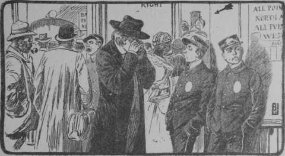
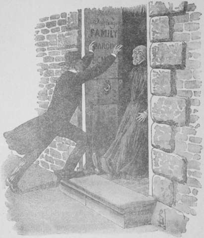
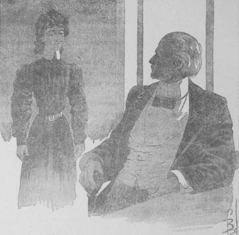

## La roche tarpéienne

Non loin de l’habitation de Frey Jemkins se dresse l’hôtel à voyageurs
New-Villard de Washington.

Malgré son jardin d’hiver renommé, son confortable, son service exceptionnel,
sa cuisine et ses caves réputées, le New-Villard a des prix modérés, au moins
par rapport à ses concurrents américains, et l’on s’y peut procurer une belle
chambre pour la bagatelle de deux dollars cinquante cents (douze francs
cinquante) par jour [^2-01-1].

Jud Allan avait établi son domicile momentané dans ledit hôtel.

Tout comme le marquis de Chazelet, il avait passé une nuit détestable. Mais,
dès cinq heures du matin, il sortit, en vertu de ce raisonnement que l’air
frais et la marche apaiseraient ses nerfs surexcités.

Maintenant il allait au hasard, sans s’inquiéter où le portaient ses pas.

Les choses extérieures lui importaient peu, occupé qu’il était à regarder
en lui-même. 

Qu’y voyait-il ? La douleur de l’enfant trouvé, sans nom, sans famille. Il se
revoyait _chevalier vagabond_, petit Jud, puis fugitif, puis Jud Allan ayant
conquis tout ce qu’un malheureux peut conquérir par le travail : une position
honorable, certes, mais modeste. Professeur à West-Point !

Comme cela était peu en regard de la situation de celle à qui, malgré lui, il
avait donné son cœur ! Lilian, mais c’était une princesse des mille et une
nuits, dotée des trésors d’Aladin.

Et l’éblouissement de cette richesse le rapetissait, le faisait apparaître à
ses propres yeux comme plus humble, comme plus loin d’elle.

Oui, oui, il avait accompli son devoir, en écartant d’un aveu brutal une
rêverie de jeune fille qui commençait à se fixer sur lui. Il se fût méprisé,
s’il avait agi autrement.

Rêvant ainsi, monologuant sans s’apercevoir qu’il chuchote, qu’il esquisse de
grands gestes dont les rares passants s’étonnent, il marche toujours.

Il a remonté l’avenue Pensylvania, s’est jeté dans la rue de la Bibliothèque
du Congrès. Il traverse les jardins du Capitole, passe en détournant la tête
auprès de la palmeraie, où, après la séance du Sénat, Lilian et Grace l’ont
attendu. Sa marche s’accélère. On croirait qu’il se sauve, et de fait, Jud
est un fugitif que poursuit le souvenir.

Oh ! le souvenir de ce qui a été, de ce qui ne sera plus.

Lilian maintenant a lu le manuscrit qu’il lui a confié. Elle sait le pauvre
être qu’il est. Elle sait que son nom même peut lui être contesté !

Et puis une question s’implante dans son cerveau. Comment a-t-elle accueilli
son aveu ?

A cette heure matinale, il ne saurait se présenter à l’Institution Deffling.
Un frère même, – il sourit tristement en se rappelant qu’il est toujours le
frère de Lilian pour tout le monde, sauf pour elle et sa jeune amie, Grace
Paterson, – un frère même ne saurait risquer une visite que l’heure matinale
rendrait peu convenable.

Et cependant le désir de savoir l’étreint, le tenaille. Son pas s’accélère.
Il remonte North Capital street.

Le voici en face de la gare du chemin de fer Baltimore Ohio, tête des lignes
qui desservent, d’une part, la côte Atlantique jusqu’à Baltimore, avec raccord
sur New-York, et d’autre part, les territoires de l’Ouest sur Pittsburg et
l’Ohio.

Il heurte un promeneur, aussi pressé que lui-même.

— Tiens, murmure-t-il, Kan-So, l’un des acolytes de Jemkins… À quoi s’occupe-t-
  il pour se mettre en route de si bonne heure ?

Il achève à peine, qu’à vingt pas de lui, il remarque un second voyageur, qui
marche à pas précipités.

— Van Reek maintenant, se dit-il. Ah ça ! toute la bande part donc en voyage ?

Il hésite une seconde, puis il secoue la tête, comme s’il prenait une
résolution.

— Toutes leurs actions menacent Lilian… toutes… Je veux voir.

Sur ces mots, il s’élance à la suite des deux lieutenants de Jemkins.

A quelques pas d’eux, il pénètre dans la station du railway.

Selon la coutume américaine, Kan-So et Van Reek se sont munis à l’avance de
leurs tickets. Ils passent devant les guichets de distribution, gagnent le
quai principal, d’où se détachent, ainsi que les dents d’un rateau, les quais
affectés aux diverses directions desservies.

Kan-So se dirige vers un train, portant cette indication :

> Pittsburg et Ohio.

Van Reek, lui, sans paraître apercevoir son complice, prend place dans un
convoi à destination d’Atlantic Coast, Baltimore, New-York and Canadian lakes.

— Où vont-ils ? Que préparent-ils ? se demande vainement le jeune homme.

Il ne saurait deviner que le Chinois part en expédition contre les barres d’or
qui seront expédiées, dans quarante-huit heures, de Pittsburg sur New-York ;
que Van Reek va s’installer dans cette dernière ville, pour y voler les
pierres précieuses envoyées d’Amsterdam aux joailliers américains.

Il regarde autour de lui. Adossés à la muraille, il distingue deux gamins à la
livrée des boys de service des Pulmann-Cars (wagons-lits).

Il s’approche d’eux en se frottant les yeux, ainsi qu’un homme qu’une
poussière importune fatigue. Les boys mettent les mains dans leurs poches et
sifflotent. Alors il n’hésite pas. Il va à eux. D’une voix brève, il prononce :

— Le Chinois Kan-So. Train de Pittsburg. Savoir son but. Dépèche chiffrée au
  syndicat.

— _All right_, répond sur le même ton, l’un de ses interlocuteurs.

Et Jud s’adresse à l’autre :

— Train de Baltimore… Van Reek… Mêmes instructions.

Cela a été si rapide que personne certainement n’a pu prêter attention au
conciliabule. Le pseudo-frère de Lilian s’éloigne, se dirigeant vers la
sortie, tandis que les boys se précipitent vers les quais.

Allan franchit les arcades s’ouvrant sur la rue, quand un groupe de
voyageurs retardataires lui barre le passage. Il est quelque peu coudoyé,
bousculé par ces gens craignant sans doute de manquer le train.

Il n’y attache aucune importance. En Amérique, on sait que les affaires
n’attendent pas, et que les _business-men_ n’ont point de temps à perdre en
vaines politesses.

Il hausse les épaules, s’éloigne de la gare, reprenant sa marche vers Kendall
Green.

Et pourtant, s’il avait suivi des yeux les voyageurs manifestant si grande
hâte, leurs mouvements lui eussent causé quelque surprise. Ces personnages ne
gagnèrent point les quais de départ. Ils s’arrêtèrent simplement dans la salle
de distribution, et l’un d’eux, regagnant l’extérieur, longea les bâtiments de
la gare jusqu’à la première rue latérale, à l’angle de laquelle il disparut.

A dix mètres de l’individu, une jeune femme, debout au bord du trottoir,
semblait tout entière à la lecture d’une brochure. Sans hésiter cependant,
l’étrange voyageur s’approcha d’elle.

— C’est fait ! Lady Rouge-Fleur.

Et il passa, sans que la jolie Chinoise eût fait un mouvement.

Seulement, le curieux qui se fût trouvé à côté d’elle aurait entendu cette
phrase énigmatique sortir de ses lèvres :

— Il trouvera l’avis .. Il n’osera plus combattre… Je pourrai l’affirmer à
  Frey Jemkins.

Quelques minutes après, elle se mettait nonchalamment en marche, se dirigeant vers la basse ville.

Cependant Jud Allan atteignait Kendall Green. À la vue des murs, du portail de
l’Institution Deffling, une émotion insurmontable le saisit.

C’est là que Lilian vit ; là qu’elle songe sans doute au récit manuscrit
qu’elle a lu.

Il est sept heures environ. Une cloche, dont le promeneur reconnaît le son,
annonce l’ouverture des classes.

Jud regarde. Il envie les professeurs graves, les écolières capricieuses, qui
s’engouffrent sous le portail de l’Institution.

Il ressasse toutes les choses pénibles qu’il s’est déjà répétées. Lilian le
méprise à présent. Quelle apparence qu’elle puisse conserver son affection à
l’ex-chevalier vagabond, au petit saltimbanque qu’une heure d’exaltation a
conduit à se dévouer pour elle ? Alors qu’est-il venu faire ici ? Il se
gourmande, se plaisante durement.

À ses tempes transsudent des gouttelettes glacées. Machinalement il porte la
main à sa poche pour y prendre son mouchoir.

Ce mouvement banal amène pour lui une nouvelle surprise.

Un papier s’est trouvé sous ses doigts… Il l’élève jusqu’à ses yeux. Qu’est
cela ? Un billet cacheté avec cette suscription tracée au dactylographe :

> À Jud Allan.

En voilà bien d’une autre ! D’où vient cette missive ? Il n’a aucun souvenir
de l’avoir reçue, de l’avoir glissée dans sa poche. Et cependant elle a dû lui
être remise à l’hôtel. Est-ce qu’il perd l’esprit ?

Il décachette la lettre. Il la déplie. La feuille porte quelques lignes,
écrites comme l’adresse à la machine. Et avec stupeur ses yeux déchiffrent ces
syllabes menaçantes :

> Vous êtes intelligent. Comprenez donc à demi-mot. Vous avez entrepris une
  campagne odieuse qui doit prendre fin. Désormais vous y renoncerez, cela est
  certain, car votre prétexte vous échappe. Révoltée de vos agissements
  misérables, Lilian a cherché une protection, un refuge, auprès de ceux que
  vous vous proposiez de mettre à contribution. Puissiez-vous vous repentir !

Le billet n’est point signé.

Le sens n’en apparaît pas clairement d’abord au professeur de West-Point. Mais
tout à coup une phrase se détache lumineuse, flamboyante :

Lilian, dit-on, a cherché une protection, un refuge, contre lui-même !

— Folie, gronde-t-il. Folie… Lilian ne saurait se défier de moi.

Mais une pensée le secoue :

— Il lui est arrivé malheur… Oui, c’est cela… Un malheur…!

Et livide, éperdu, il se rue en avant, atteint le portail de l’Institution
Deffling, frappe du marteau à coups redoublés, et se trouve enfin devant la
directrice accourue au bruit, qui considère avec inquiétude le jeune homme
dont l’apparence est celle d’un dément.

— Lilian ! Où est Lilian ? clame-t-il d’une voix faussée par l’angoisse…
  Laissez-moi passer… Il le faut ! Il le faut !

Le mouvement de recul de Miss Deffling, terrifiée par cette exaltation,
l’avertit de l’incorrection de son attitude.

Il domine ses nerfs par un effort surhumain dont tout son être frissonne.

— Je vous prie de m’excuser, fait-il d’un accent assourdi, mais une lettre,
  qui m’est parvenue ce matin, m’a causé les plus vives alarmes. On m’annonce
  que ma sœur a quitté la pension.

Miss Deffling a un sourire dédaigneux. Elle jette en avant ses mains osseuses
en un geste de dénégation.

— Cela est tout uniment une facétie d’un goût exécrable. C’est vouloir
  calomnier ma maison, qui, j’ose le dire, est tenue comme aucune autre de la
  ville.

Son assurance gagne Allan lui-même. Cependant il insiste :

— J’aurais dû me dire cela de suite. Seulement, je fais appel à votre
  condescendance. J’ai ressenti une émotion violente, vous le comprenez, et
  j’ai besoin, pour être complètement tranquillisé, de voir…

— Lilian tout entière au travail, la chère enfant. Venez donc, Monsieur Allan,
  je me reprocherais de ne pas donner satisfaction à un frère dévoué.

Le calme est contagieux comme l’affolement. La placidité de Miss Deffling
réagit sur le visiteur.

Paisiblement il la suit à travers les couloirs du rez-de-chaussée, sur lesquels
s’alignent les portes closes des classes, où s’élèvent, monotones et scandées,
les voix des professeurs enseignant leurs élèves.

— Voici le cours.

L’institutrice susurre ces mots. D’une main légère, elle entr’ouvre la porte,
avance la tête. Le professeur l’a entendue. Il s’arrête dans la dictée d’un
« résumé ».

— Pardon de vous troubler, débite Miss Deffling, je vous serais obligée de
  m’envoyer un instant Miss Lilian Allan.

Jus sent son cœur battre plus librement. Il va la voir.

— Miss Allan, mais je l’ai signalée sur la feuille de présence… Miss Allan n’a
  point paru en classe, non plus que Miss Grace Paterson.

— Pas paru !

Miss Deffling, Allan, ont répété ces trois syllabes avec une intonation
impossible à rendre. Le trouble de la directrice est tel qu’elle referme la
porte.

— Pas paru… Qu’est-ce que cela signifie ? Une élève exceptionnelle !… Grace
  Paterson, passe encore…; une véritable écervelée… Mais Lilian, Lilian… c’est
  inconcevable.

Et ses regards se portant sur Allan, elle s’épouvante de sa pâleur, de
l’égarement qui trouble ses yeux… Elle souhaite l’apaiser, le calmer, le
consoler.

— Bon ! La jeune fille est peut-être un peu souffrante. Paterson, elle, lui
  est toute affectionnée; elle sera restée à la soigner, à lui faire la
  lecture, que sais-je ?

— Je vous en prie, allons nous en assurer.

La voix de Jud a quelque chose de déchirant qui enlève à son interlocutrice
toute velléité de résistance.

— Mais oui, allons, allons de suite… Vous pensez bien que je suis aussi
  soucieuse que vous d’éclaircir ce mystère. Songez donc, une élève disparue…
  Que dis-je une ? C’est deux à présent ! Quel coup pour la réputation de mon
  établissement…, dont la tenue me vaut la confiance des meilleures familles.

Il n’y a point à s’y méprendre, Miss Deffling est très agitée.

Sans doute ses motifs ne sont pas de même ordre que ceux de son compagnon.
Elle craint surtout la répercussion financière que l’aventure pourrait avoir
pour elle ; mais enfin, chacun s’inquiète des malheurs d’autrui, dans la
proportion de ses moyens, et la directrice s’inquiète ;… que lui demander de
plus ?

Elle se précipite à travers les couloirs. Elle court presque dans sa hâte de
savoir.

Le corridor des chambres des pensionnaires se présente à eux. Voici la porte
sur laquelle se lit le nom de Lilian.

La clef est sur la serrure. La directrice la tourne. La chambre est vide. Le
lit n’a point été défait.

Et Jud gronde d’un accent désespéré et terrible qui fait frissonner encore
Miss Deffling :

— Un crime !

— Comment pouvez-vous affirmer pareille chose ?

— Respirez… ne sentez-vous pas une légère odeur de chloroforme ?

La directrice tressaille de plus belle. Toute l’Amérique a été émue par les
exploits de la bande des _chloroformistes_. Ces bandits auraient opéré dans
son Institution !

Elle essaie de s’indigner contre pareille assertion. Son instinct mercantile
lui en fait un devoir.

— Grace Paterson occupe la chambre voisine… Elle aurait entendu.

Elle sort vivement, laissant Jud qui regarde autour de lui, qui furette
partout, cherchant un indice.

L’accoutumance de la lutte lui permet d’enchaîner les faits.

La lettre mystérieuse qu’il a trouvée dans sa poche, les vapeurs de
chloroforme, la disparition de Lilian. Tout s’éclaire à présent. Tout devient
net à ses yeux. Lilian est aux mains de son ennemi, de Frey Jemkins.

Un cri effaré le tire de ses réflexions. Dans la chambre voisine, Miss
Deffling s’agite, se contorsionne. Grace Paterson a disparu comme Lilian.

Elle s’est couchée, elle ; le lit de la pensionnaire porte encore l’empreinte
de son corps. Sa robe de chambre, ses mules ne se retrouvent nulle part.

Et la directrice se lamente, l’excès de ses terreurs contraignant son égoïsme
à s’exprimer.

— Quel scandale ! Deux de mes jeunes filles, deux ! C’est la ruine. Quelle
  famille consentira désormais à me confier son enfant ?

Elle s’interrompt brusquement. Jud Allan vient d’appuyer la main sur son
épaule ; il prononce cette phrase invraisemblable :

— Il n’y aura pas scandale. Il ne doit pas y en avoir ; car ce serait, je
  pense, mettre la police en mouvement et causer la mort des malheureuses
  victimes.

Est-ce qu’elle rêve ? Le frère de Lilian aurait-il pareil souci de ses
intérêts ? Mais il reprend :

— Nul ne saura l’aventure si vous la taisez vous-même.

— Si je la tairai, moi ; vous pensez bien que, dans ma situation, j’aimerais
  mieux me couper la langue que donner le signal de ma ruine.

— Alors vous expliquerez comme il vous plaira le départ de vos deux élèves.

— Pour Lilian, cela va tout seul, puisque vous avez la bonté de consentir ;
  mais Grace Paterson a un père qui l’aime… Je ne veux pas dire que votre
  affection pour Lilian soit moindre… Mais M. Paterson peut être de moins
  bonne composition.

— Vous le prierez de demander une audience à M. Loosevelt.

— Au Président ?

— Qui la lui accordera et lui donnera des explications telles qu’il se rangera
  à mon avis.

La curiosité, cette autre vertu de Miss Deffling, l’incite alors à murmurer :

— Ne serait-il pas plus simple de me mettre à même de les lui fournir ?

— Non, répond sèchement le jeune homme, M. Loosevelt seul a qualité pour cela.

Puis sans ajouter une parole, il tourne le dos à Miss Deffling et s’éloigne.
Cinq minutes après, il franchissait le portail de l’avenue de Kendall,
monologuant :

— La lettre mystérieuse, d’un ami celle-là, qui me parvint naguère sur le quai
  du Bois, me faisait cette recommandation : « Quoi qu’il arrive, ne désespère
  jamais. » Mon correspondant inconnu avait-il prévu cela ?

Et tristement :

— Suis-je réduit à l’impuissance totale ? Il est sûr qu’il me faut renoncer à
  l’appui de la police officielle… Oui… M. Loosevelt doit être avisé de suite…
  Mais me rendre à la Maison Blanche serait imprudent. Mes ennemis savaient
  que, leur lettre reçue, j’irais à l’Institution Deffling. Par conséquent dès
  ce moment je suis épié, je dois l’être…

Un instant, il marcha pensivement, puis comme prenant un parti :

— Non, je ne suis pas aussi isolé que je le parais. Naguère, l’ami inconnu qui
  me fit passer, sans que je pusse le découvrir jamais, les sommes
  considérables grâce auxquelles, moi, l’enfant abandonné, je créai le
  syndicat des déshérités comme moi, cet ami m’a donné une puissance. Je suis
  le chef, le _roi_, comme ils disent, des _lads_, de tous les abandonnés. Ils
  m’ont servi maintes fois. À présent encore, ils me serviront. Oui, c’est
  l’armée des gamins qui luttera contre les troupes du crime. Un enfant a
  arraché un autre enfant à la mort ; des enfants amèneront peut-être l’heure
  de justice.

Avec une émotion attendrie, il conclut lentement :

— Merci, inconnu, qui m’as fait enrégimenter les orphelins.

Son regard semblait chercher autour de lui le personnage à qui s’adressaient
les remerciements ; il rencontra deux hommes, coiffés, l’un d’un chapeau de
paille, l’autre d’un feutre gris, qui, à peu de distance, causaient avec
animation.

— Je n’aperçois que ces deux causeurs, murmura-t-il… Eux m’aperçoivent aussi.
  Sont-ce des espions ? Nous allons bien le voir.

Et sa douleur brusquement apaisée par la volupté de l’action :

— En tout cas, je puis passer au syndicat sans qu’ils en puissent tirer de
  déductions graves.

Il se mit en marche d’un air indifférent, non sans jeter de temps à autre un
coup d’œil par-dessus son épaule. Les hommes avaient, eux aussi, pris le pas
de promenade. Jud sourit.

— Allons, fit-il encore, chapeau de paille et chapeau de feutre sortent des
magasins de Jemkins.

D’un bon pas il gagna la ruelle, où la veille au matin il s’était rendu avant
la séance du Sénat. Il s’arrêta devant la maison dont le mur s’ornait de la
bizarre allégorie du faisceau d’enfants enroulés de cordes.

— Il entra, repoussa le battant derrière lui et se trouva dans un vestibule
  étroit, aux murailles revêtues d’un enduit de couleur verte.

A droite et à gauche, des bureaux, où retentissait le tapotement de machines à
écrire, communiquaient avec le vestibule.

Sur le seuil de l’un d’eux, se montra Tril, le gamin qu’à plusieurs reprises,
Jud Allan avait traîné à la remorque.

Au fond du couloir, se trouve un escalier étroit. Le petit s’y engage. Allan
monte derrière lui sans mot dire. Au premier étage, tous deux pénètrent dans
un bureau qu’une double porte capitonnés, le plafond et les murs également
recouverts d’un capiton, le plancher caché sous un épais tapis molletonné,
semblent devoir isoler de toute oreille indiscrète.

La porte refermée avec soin, Tril avance respectueusement un siège au
visiteur, puis attend debout devant lui.

— Un grand malheur, Tril, commence Jud d’une voix douloureuse.

— Un malheur, Roi…

— Oh! pas ce titre que votre affection m’a donné.

— Pourquoi ? Dans la salle _sourde_ nul ne peut l’entendre, et ce m’est un
  plaisir de le prononcer.

Allan a un geste de consentement.

— Soit ! Écoute. Miss Lilian…, ma sœur…, a été enlevée cette nuit. Je suis
  certain que Frey Jemkins a conduit l’aventure.

— Il a dû prendre ses précautions. Mais les _lads_ seront en campagne
  aujourd’hui même.

— C’est cela, enfant, c’est cela. Découvrir où ils l’ont enfermée, elle… La
  délivrer, et puis…

— Venger notre Roi…

Allan secoua tristement la tête.

— Non, Tril… Vous, mes amis, vous auxquels j’ai voulu donner, par
  l’association, le moyen de vous défendre, je ne vous emploierai pas à la
  vengeance. La haine fane la jeunesse, racornit l’âme. C’est à la justice que
  nous devons seulement marcher.

Son interlocuteur lui saisit la main et la porta à ses lèvres.

— Vengeance ou justice, Roi, c’est la reconnaissance qui nous guide, la
  reconnaissance pour toi.

— Pour l’ami inconnu qui m’a fourni l’or, sans lequel mon rêve ne se fût point
  réalisé.

— Pour lui aussi, oui, cela est équitable. Mais pour toi d’abord.

Et d’un ton mi badin, mi ému, Tril expliqua :

— À quoi bon discuter cela, Roi ? Que nous le voulions ou non, nous t’aimons.
  Qu’étions-nous auparavant ? Des enfants du ruisseau, nus, sans appui,
  condamnés presque fatalement au vol, à la honte, à la mendicité. Tu nous as
  réunis, toi, qui travaillais tant ! Tu nous as dit : Groupez-vous ; soutenez-vous ;
  défendez-vous. Aujourd’hui, notre syndicat s’est étendu sur tout le
  territoire de l’Union. Chaque ville a une agence. Les emplois de grooms,
  boys, petites bonnes d’enfant, bureaucrates débutants, etc., nous sont
  réservés mieux rétribués, plus considérés qu’autrefois,… nous sommes devenus
  une puissance, grâce à toi, qui nous as apporté l’or nécessaire à l’origine
  de toute société ; à toi qui, pauvre, fugitif, as refusé d’en distraire la
  moindre parcelle à ton profit.

— Enfant trouvé moi-même, fit mélancoliquement Jud, j’ai voulu éviter aux
  autres les horreurs de l’isolement.

Et il avait réussi : des économistes, durant les dix dernières années, avaient
constaté la tendance syndicale des enfants de l’Union. Ils s’étaient
émerveillés de la discipline, de l’entente réalisée par les petits, et que les
adultes eussent pu imiter avec profit, mais aucun n’était remonté jusqu’à
l’origine.

Tril reprit :

— Qu’y a-t-il à faire ?

— Ceci. Je suis escorté par des espions…

— Veux-tu qu’on les fasse disparaître ?…

— Non, mon bon Tril. Seulement, il faudra que la nuit prochaine, pour la
  réunion générale convoquée sur ma demande, on veille à ce que nul ennemi ne
  me suive !

— Bien. Nul ne pourra savoir la route que tu prendras.

— Autre chose. M. Loosevelt doit être prévenu de ce qui s’est passé.

— J’irai, si tu veux m’accorder ta confiance.

— En personne, Tril, je n’ai plus grande confiance qu’en toi.

Un sourire d’orgueil illumina le visage du gamin.

— Que dois-je faire ?

— Remettre au Président une lettre que je vais écrire.

Jud n’avait pas achevé que déjà son interlocuteur avait disposé papier,
plumes, encrier sur la table. Durant une minute, la plume courut sur le
papier, traçant ces lignes :

> Lilian, disparue. Selon toute apparence au pouvoir de F. J. Toute aide
  policière constituerait dès lors un danger terrible. S’en abstenir, je
  supplie.

> Seul, je dois agir désormais. Je le ferai. Mais je continuerai à me dire
  reconnaissant de votre bonté, de votre pitié pour les victimes.

> J. A.

Il plia le papier, le glissa dans une enveloppe qu’il ne cacheta point.

— Voici, Tril. Tu peux lire. C’est la meilleure réponse qu’il me soit permis
  de faire à ta question de tout à l’heure.

L’enfant rougit de plaisir. On eût cru qu’il allait s’agenouiller. Mais, d’un
coup d’ongle, il fit sauter une larme prête à tomber de ses yeux, et se
dirigeant vers la porte :

— Je pars, Roi. Sois tranquille, personne ne rapportera à Jemkins que Tril est
  entré à la Maison-Blanche.

La double porte était retombée sur lui. Jud demeurait seul.

— Allons, murmura-t-il. Mes « petits sujets », – il y eut une infinie
  tristesse dans son intonation,  – mes petits sujets me restent. C’est avec
  eux qu’il faut vaincre.

Il s’arrêta surpris, la porte venait de tourner sans bruit sur ses gonds. Une
fillette de treize à quatorze ans, ayant les manches de lustrine des
dactylographes du syndicat, apparut sur le seuil. Elle se montrait mignonne,
petite, frêle. Son visage maigre, pâle, où de grands yeux noirs prenaient une
importance exagérée, décelait les privations de la misère, qui arrête le
développement physique, qui appauvrit le sang des enfances misérables.

— C’est moi, Roi, fit-elle d’une voix douce, légèrement voilée.

— Toi, petite Suzan, pourquoi as-tu quitté ta machine à écrire ?

— Tril m’a chargé de te dire qu’il était en route.

— Ah ! sans être filé ?

— Oh ! il n’y a pas de danger. Ceux qui te guettent sont toujours dans la rue.

— Et Tril ?

— Lui, il a passé par la cour, escaladé le mur d’une cour voisine, et il a
  gagné la rue de l’autre coté du pâté de maisons.

Allan eut un hochement de tête approbateur. Son jeune messager n’avait négligé
aucune précaution.

— C’est bien, Suzan ; je te remercie, mon enfant ; retourne à ton travail.

Mais Suzan s’avança d’un pas, joignit ses mains menues.

— Roi, dit-elle… Je mendiais ; une méchante femme me battait quand la recette
  ne lui semblait pas assez forte. Tu m’as amenée ici… On m’a appris à lire, à
  écrire, à compter. À présent, je gagne ma vie, je comprends que tu m’as
  tirée de la boue, que tu m’as donné la possibilité de l’existence honorable,
  peut-être heureuse. Tout ce que j’ai de bon me vient de toi.

Elle fit une légère pause, comme pour triompher d’une dernière hésitation.

— Tril m’a glissé à l’oreille que le moment était venu où l’on pourrait se
  dévouer pour toi.

— Tril est un affreux bavard, je le gronderai à la première occasion.

— Non, non, supplia-t-elle. Tril sait mes pensées, il a voulu me donner joie
  et contentement… Et je viens, je viens te supplier de ne pas oublier Suzan
  dans le danger. Pardonne-moi. Tous t’aiment, tous voudraient se sacrifier
  pour toi… Ils ignorent encore, je prends l’avance. Roi, fais que si
  quelqu’un doit mourir pour toi, ce soit Suzan.

Dans la voix de la fillette, il n’y avait pas trace de déclamation. Elle
parlait avec une simplicité absolue, exprimant les choses comme elles se
présentaient à son esprit.

Jud Allan se sentit touché jusqu’au fond du cœur.

— Oh ! murmura-t-il, oui, nous vaincrons… La tendresse aura raison de la haine.

Et comme Suzan répétait, suppliante autant que si elle avait sollicité une
faveur :

— N’est-ce pas, s’il faut mourir, tu donneras la préférence à Suzan.

Il éleva la petite dans ses bras, fit sonner deux baisers sur ses joues pâles,
et doucement :

— Oui, petite Suzan, je t’assure la préférence…; mais je ne veux pas que l’on
  meure pour moi.

Il avait reposé l’enfant à terre. Elle éclata en sanglots.

— C’est le bonheur, déclara-t-elle au milieu de ses larmes… le bonheur… Tu
  crois que je puis être utile… Ah ! quel bonheur !

Un quart d’heure plus tard, Tril était de retour, rapportant l’assurance que
M. Loosevelt se conformerait à la requête de Jud Allan, en conservant
néanmoins l’espèrance que le jeune homme pourrait prochainement faire appel à
son concours.

Le Président lui adressait en même temps la prolongation pour une année du
congé que le professeur avait obtenu avant son départ en Europe.

Renouvelant ses recommandations à Tril, en vue de l’assemblée des lads de la
nuit suivante, Jud quitta alors le syndicat.

Dans la rue, les hommes aux coiffures de paille et de feutre stationnaient,
occupés, semblait-il, à déchiffrer une affiche. Le professeur affecta de ne
point les voir. Il reprit le chemin de l’hôtel de New-Villard, et, une fois
arrivé, après une courte station au salon de lecture, il remonta dans sa
chambre.

Il avait résolu de s’y tenir enfermé jusqu’au moment fixé pour la réunion des
lads.

Mais, de même que la plupart des décisions humaines, celle-ci devait être
modifiée par une circonstance imprévue.

Vers midi, en même temps que le déjeuner qu’il avait manifesté le désir de
prendre dans sa chambre, on monta au jeune homme une lettre, dont l’enveloppe,
surchargée de ratures, indiquait une promenade assez longue à travers les
bureaux de poste de l’Union.

En effet, la missive avait été adressée primitivement à l’école militaire de
West-Point, qui l’avait fait suivre à Baltimore, d’où elle était revenue à
Washington pour toucher enfin l’intéressé au New-Villard Hôtel.

Jud déchira l’enveloppe et resta stupéfait, déconcerté. Elle contenait une
invitation en bonne et due forme par laquelle Frey Jemkins, de Pensylvania
Street, priait M. Jud Allan, professeur à West-Point, licencié ès lettres et
en droit, de vouloir bien honorer de sa présence, la fête par laquelle il
célébrait le retour de son heureux voyage en Europe.

La date fixée fit rêver le jeune homme. La fête se donnait le soir.

Son ennemi venait à lui. Ayant enlevé Lilian, la nuit  précédente, il voulait
se rencontrer, dans les vingt-quatre heures, avec le champion de la
malheureuse héritière des Pariset.

Il repoussa d’abord cette idée. La lettre, à raison de ses pérégrinations,
avait dû être expédiée au moins huit ou dix jours plus tôt.

Il chercha confirmation de ce fait, en consultant les timbres de la poste.

A sa grande surprise, aucun n’avait d’empreinte nette ; les cachets
d’oblitération apparaissaient confus. Les chiffres indiquant les date, les
numéros de levée, ou bien étaient effacés, ou bien n’avaient point marqué.

Une autre constatation résulta de l’examen. Ce n’était pas le vaguemestre de
l’école qui avait écrit à West-Point la mention : faire suivre à Baltimore,
Scolia Hôtel. Or, Jud savait avec quelle conscience l’honorable Sooreland,
vaguemestre de l’école militaire, remplissait ses fonctions, avec quel soin
jaloux il s’acquittait des plus minuscules attributions de son emploi.

— Ah ça ! murmura-t-il, est-ce que cette enveloppe aurait été truquée ?

Il touchait du doigt la vérité. Après le départ de Rouge-Fleur, Frey Jemkins
avait été pris d’un irrésistible désir de se trouver en face de ce Jud Allan
qui, depuis seize ans, avait déjoué toutes ses recherches.

Résolu à tout, même à sourire au misérable par lequel il avait tant souffert, 
Jud se déclara :

— J’irai… Je trouverai le courage de voir Jemkins, j’endormirai sa défiance ;
  avant de me rendre à l’assemblée des _lads_, des tout petits, pour demander
  leur concours contre les criminels tout puissants !

[^2-01-1]: Des écrivains, peu avertis, comparent sans cesse les gains des
           travailleurs d’Amérique et d’Europe. Ils oublient que si, en France
           par exemple, l’unité monétaire est le franc, aux États-Unis, l’unité
           est le dollar (cinq francs). De la sorte un homme gagnant là-bas
           vingt dollars (cent francs) a seulement un gain équivalent à celui
           du Français qui gagne vingt francs.
