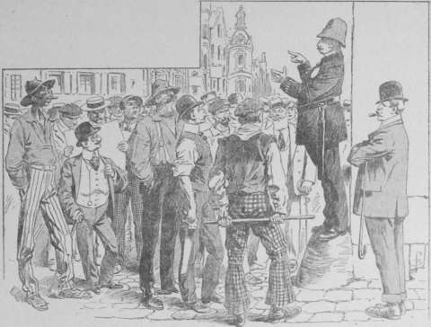
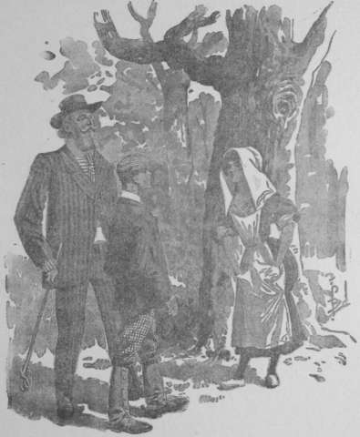

## L’affaire des barres d’or

_Audacieux pilleurs de trains. – Cinq millions d’or en barres enlevés. – Deux
agents agonisent, deux autres blessés_.

Telle est la manchette sensationnelle qui s’étalait, deux jours plus tard, en
tête des grands quotidiens.

Certes, les Américains sont gens trop pratiques pour s’intéresser, ainsi que
les populations sentimentales d’Europe, aux crimes ou accidents frappant de
pauvres diables. Par contre, ils se passionnent à un degré inconnu dans
l’ancien monde pour les aventures où des millions sont en jeu.

Mais nulle part, effervescence n’atteignit celle qui régnait à Jersey‑Shore.

Le bourg figure assez bien la charpente osseuse d’un poisson, dont l’épine
dorsale serait formée par la grande rue et les arêtes par les voies latérales,
abouttissant, d’un côté, aux berges de la rivière Susquehannah, de l’autre aux
bois de Lincolt, affermés à une compagnie pharmaceutique on n’a jamais su
pourquoi.

Tous les habitants se groupaient dans la rue principale, lisant à haute voix
les journaux, les commentant.

Un inspecteur de la police, ayant pris part à la première enquête, avait été
reconnu, empoigné, juché sur une borne et sommé de renseigner ses concitoyens.
En Amérique, il ne fait pas bon résister à semblable invitation.

L’inspecteur parla donc.

— Honorables Gentlemen, voici ce que l’enquête a établi. Le train 323 P.C. de
  Pittsburg à la Côte, est un mixte, c’est‑à‑dire un train spécialement
  affecté au transport des marchandises, mais auquel on adjoint une voiture
  comportant des compartiments des différentes classes.

  Il s’arrêta réglementairement en gare de Jersey‑Shore à deux heures quinze du
  matin. Il y séjourna sept minutes pour procéder à des opérations de
  chargement et de déchargement.

  Or, les employés de la gare se souviennent parfaitement avoir remarqué
  trois voyageurs, couverts de manteaux de voyage, coiffés de chapeaux mous
  aux rebords retombant en cloche sur le front.

  Ces voyageurs prirent place dans le compartiment _sleeping_. Dans la
  journée, du reste, un laquais avait retenu les trois tickets, au nom de Harry
  Grandlers. Ce laquais est introuvable et m’est avis qu’on ne le retrouvera
  pas, non plus qu’aucun Grandlers.

— Mais vous parlez comme si ces voyageurs portaient la responsabilité du
  crime, clama une voix.

— Patience, Gentleman, patience… _On ne sème pas en même temps qu’on laboure_…
  Donc, ces trois personnages montèrent dans le sleeping. Ils s’y trouvaient
  seuls, attendu, vous le comprenez, que le public, en général, ne se
  précipite pas sur un train, à marche lente, que le service des marchandises
  oblige à des arrêts fréquents et prolongés.

— _All right ! Allez toujours devant_. Nous ne sommes pas nés d’hier.

Le policier s’inclina, et la voix onctueuse, le geste arrondi, il continua :

— J’en suis persuadé. Je vois parmi vous des têtes grises. Si elles avaient vu
  le jour hier seulement, elles se seraient abîmées plus vite qu’il n’est
  naturel. Mais je reprends. Le train 323 P.C. se remit en marche.

  À quinze cents mètres vers New‑York, on procède à la réfection de la voie.

  Il est donc prescrit aux mécaniciens de ralentir en ce point, et de prendre
  l’allure _d’un homme à pied_, c’est le terme propre du règlement spécial.

  Le conducteur de la machine se conforma à cette injonction.

  Donc, le mécanicien Thaws, son chauffeur Flatson vaquaient à leur service.
  Flatson ouvrit la porte du foyer pour attiser le feu.

  Thaws le regardait machinalement. Or, ils eurent soudain l’impression qu’en
  arrière d’eux on venait de lancer une boule noire.

  Celle‑ci tomba sur le foyer, et au contact du charbon rouge, se volatilisa,
  enveloppant les deux hommes d’un nuage de vapeur brûlante qui leur corroda
  fortement la peau du visage et des mains. Suffoqués par une senteur âcre,
  astringente, ils perdirent connaissance.

  Quand ils revinrent à eux, le train était arrêté en pleine voie, le
  conducteur du fourgon d’arrière les secouait… Les voyageurs, descendus sur
  la voie, s’enquéraient de la cause de l’arrêt.

  Il leur était extrêmement pénible de parler, les muqueuses du nez et de la
  bouche étant fortement brûlées. Un médecin a déclaré qu’il croyait
  reconnaître les ravages d’un composé de l’azote ou du brome.

  Entre l’instant où ils avaient perdu la conscience et celui où on les
  rappelait à eux, voici ce qui s’était passé.

— Ah ! Ah ! murmurèrent les auditeurs, impressionnés par le récit.

— Dans le fourgon de tête, accroché immédiatement après le tender, avaient été
  chargées dix‑sept barres d’or, de cent kilogs [^2-03-1] chacune, expédiées
  par l’Oil Bank à une banque de New‑York.

— Dix‑sept, cent kilogs chaque, répéta la foule avec une évidente
  admiration.

— Comme je vous le dis… Dans ce fourgon, outre le conducteur de train, se
  trouvait un garde accompagnant l’envoi de l’Oil Bank.

  Le premier a reçu une balle dans la tête et il est à l’agonie.

  Le second a eu la poitrine traversée par un couteau manié d’une main
  experte. Il ne passera pas la journée, mais voici ce qu’il a raconté.

  Graffsend, le conducteur, et lui, Felton, se trouvaient dans le fourgon,
  dont les glissoires, de chaque côté, étaient fermées à clef, –  à clef,
  remarquez ce détail qui démontre la préméditation et l’audace des voleurs.

  Ils jouaient aux cartes, pour l’honneur, histoire de ne pas succomber au
  sommeil.

  Tout à coup, il leur sembla percevoir un léger bruit le long de la paroi
  faisant face aux bois de Lincolt.

  Avant que les deux hommes eurent pu échanger une réflexion, le loquet de la
  porte glissa, évidemment actionné par une fausse clef.

  Graffsend bondit vers le frein à main, avec l’intention de l’actionner et de
  déclencher la sonnerie d’alarme. Il n’en eut pas le loisir. Une détonation
  retenti, et le malheureux roula sur le sol le crâne troué.

  Trois gaillards, coiffés de chapeaux mous rabattus en cloche, le bas du
  visage couvert par des barbes épaisses firent irruption dans le fourgon,
  renversèrent Felton. Lequel l’a poignardé, il ne saurait le dire. Tout cela
  s’est passé plus vite qu’on ne le peut raconter.

  Il ressentit un choc à la poitrine, une douleur inexprimable, et il
  s’affaissa sur le plancher. Les assaillants le crurent mort. Sans plus
  s’occuper de lui, les inconnus prirent les barres d’or l’une après l’autre,
  et les firent glisser au dehors sur la voie.

  Les traces, relevées par l’enquête, démontrent qu’ils ont opéré ainsi, et de
  plus que l’on est en présence d’une bande redoutable, car des affiliés
  stationnaient sur la ligne. Ils ont enlevé les précieux lingots, et leur
  trace a été perdue, dans les bois de Lincolt.

  Et le train stoppe de lui‑même. Quelqu’un a fait fonctionner le frein
  automatique. Qui ? Les bandits sans doute, pour descendre sans risquer une
  chute.

  À présent, Gentlemen, vous en savez autant que moi ; laissez‑moi aller à
  mes affaires, et retournez aux vôtres, si vous en avez toutefois.

Sur cette péroraison, l’inspecteur sauta à terre, sans que personne s’opposât
à son mouvement, et s’éloigna en homme pressé de regagner le temps perdu.

Le groupe dont il occupait à l’instant le centre, se disloqua, les citoyens
ainsi renseignés considérant comme un devoir d’aller renseigner leurs amis
et connaissances.

Deux personnes seulement demeurèrent près de la borne : un homme et un jeune
garçon.

L’homme portait des cheveux blonds bouclés, une barbe soyeuse, dont la coupe
impeccable trahissait des prétentions au charme, prétentions que narguaient
une épaule sensiblement plus haute que l’autre et des jambes cagneuses. Les
lunettes d’or à la fine monture, le complet loutre à rayures de nuance plus
claire, démontraient son admiration pour les snobs new‑yorkais.

Enfin, il était coiffé d’un chapeau gris, à ruban ponceau, et il brandissait
prétentieusement un jonc d’un jaune éclatant, terminé par une poignée d’or,
recourbée en lacis compliqués, élucubration maladive de quelque ciseleur en
mal d’art nouveau.

Le garçonnet, lui, apparaissait vêtu d’un veston, d’un pantalon court serré
dans des jambières, et d’une casquette de voyage, dont l’ensemble donnait
l’impression mixte d’un costume civil et d’une livrée.

— Tu as entendu, Tril ?  murmura l’élégant.

— Oui, Roi.

L’homme toussa vivement, puis avec sévérité :

— Pas ce mot, malheureux ! À quoi bon me déguiser, me rendre méconnaissable,
  si ta langue me trahit.

— Je vous demande pardon, je me souviendrai à l’avenir que vous êtes…

— Honorable Grey Assford, historiographe de l’Alabama, membre correspondant de
  diverses académies, et rien d’autre…

— Je n’oublierai plus, Master Honorable Grey Assford.

— Mais je répète, tu as entendu le récit du crime. Kan‑So a échappé à notre
  surveillance. À présent, comment le joindre ?

Tril répondit par une exclamation joyeuse :

— Voici Suzan… Elle est contente… Bien sûr, il y a du nouveau.

La mignonne fillette se montrait en effet, à vingt pas des causeurs.

Elle allait devant elle, faisant claquer les sabots qui la chaussaient, et
complétaient un costume de jeune campagnarde.

Parvenue à hauteur des causeurs, elle passa sans paraître les reconnaître en
chuchotant ce seul mot :

— Venez !

Eux se mirent en mouvement dans ses traces. Ils affectaient l’air indifférent,
en circulant à travers les groupes occupés à discuter l’affaire des barres
d’or.

Mais les groupes s’espacèrent peu à peu… les maisons se succédèrent à des
intervalles de plus en plus grands. Les trois personnages sortaient de Jersey‑
Shore.

Maintenant, ils déambulaient sur la route, bordée de champs cultivés, de
pépinières, de prairies.

Ainsi on atteignit la ligne du chemin de fer.

A deux ou trois cents mètres au delà, les promeneurs, traversant la voie,
distinguèrent les équipes de travailleurs occupés à la réfection de la plate‑
forme ; mais cette vision fut aussitôt masquée par un rideau d’arbres.

Ils venaient de pénétrer dans les bois de Lincolt.

Sans doute, Suzan avait décidé qu’elle ne s’arrêterait qu’à l’abri de la
forêt, car elle fit halte au pied d’un frêne centenaire, et se laissant
rattraper par Jud et le boy Tril, elle les salua cérémonieusement de ces
paroles :

— Je suis l’humble servante de l’honorable Grey Assford et de son jeune
  secrétaire James.

— Kan‑So ? murmura Allan.

— Retrouvé… et gardé par les lads d’Ottawa, que Top et Fall n’ont pu mener
  qu’après le crime, vu la distance à parcourir.

Jud s’était approché, il avait posé les mains sur les épaules de la mignonne,
et ses regards plongeaient dans ceux de la gentille messagère.

— Des détails ? prononça‑t‑il.

— Volontiers ! C’est à mon brave dogue que revient l’honneur d’avoir éventé la
  piste. Nous, nous n’avons eu qu’à la lire.

Et lentement, en personne qui veut être bien comprise, elle expliqua :

— Kan‑So, en arrivant, s’est abouché avec deux _tueurs de campagne_ (bandits
  opérant contre les fermes et les habitations isolées), récemment évadés des
  mines de l’Oklahoma. Strig et Clock sont leurs noms.

— Je les note, grommela Tril jetant une inscription rapide sur son calepin.

— Grâce à ces forçats en rupture de ban, il réunit, en seize heures, une bande
  de dix‑huit malandrins. Ils devaient s’échelonner sur la voie, s’emparer des
  barres d’or à mesure qu’elles y seraient précipitées, et les porter à un
  endroit déterminé de ce bois de Lincolt, où une charrette stationnerait et
  recevrait le produit du vol ; chacun a reçu pour cela mille dollars. À ce
  prix, ils n’ont demandé ni le nom de qui les employait, ni la valeur réelle
  des lingots enveloppés selon l’usage dans des étuis de forte toile.

Kan‑So, Strig et Clock se réservèrent d’opérer dans le train.

Tout se passa comme il était convenu. Au rendez‑vous fixé, les trois chefs de
l’expédition trouvèrent la charrette chargée des dix‑sept barres d’or. Ils
soldèrent les services de leurs acolytes, lesquels se dispersèrent dans toutes
les directions.

— Mais ce camion lourdement chargé, comment personne ne l’a‑t‑il rencontré ?

— Les inspecteurs de police eux‑mêmes l’ont rencontré et ne lui ont accordé
  aucune attention, par la raison toute simple qu’au moment où cela se
  produisit le chariot roulait à vide, Kan‑So et ses deux lieutenants ayant eu
  le temps de le décharger et de cacher les lingots dans les carrières de
  plâtre abandonnées au nord du bois de Lincolt. Strig en personne, devenu
  charretier, conduisait le tombereau vers la Susquehannah, où il l’a
  précipité avec le cheval.

Jud Allan hocha la tête, comme pour approuver les mesures prises par les
bandits.

— Bien raisonné, fit‑il à mi‑voix. On va poursuivre les lingots dans toutes
  les directions. Il ne se présentera à l’esprit de personne qu’ils sont là, à
  deux pas du théâtre du crime.

— Oh ! riposta la fillette. En eût‑on la pensée, qu’on ne les tiendrait pas
  encore, attendu que l’accès des carrières est très difficile. Des
  éboulements encombrent plusieurs galeries. Puis il existe un assez grand
  nombre d’issues, et sans les indications de deux boys, qui naguère ont un
  peu travaillé dans le plâtre, je n’affirmerais pas que les coupables y sont
  toujours terrés.

Storm, du reste, se promène aux environs. Je l’ai laissé libre de veiller
selon instinct de chien de berger.

Elle reprit :

— Autre chose. Un télégramme arrivé de Washington, à l’adresse de William
  Starnegie.

— Qu’est William Starnegie ?

— Le nom sous lequel Kan‑So s’était fait inscrire à l’hôtel de Jersey‑Shore.
  Le porteur a compris le subterfuge. Il a trouvé le moyen de différer la
  remise assez longtemps pour prendre cette copie.

En proie à une angoisse extraordinaire, Jud lui arracha presque le papier des
mains. Et il lut :

> Achats terminés, rendez‑vous n° 5. Extrêmement important. Affaires
  embrouillées nécessitent réunion conseil administration.

Il leva les yeux, interrogeant la fillette du regard. Elle lui tendit un
second papier, celui‑ci reconnaissable pour un télégramme officiel, ainsi
conçu :

> À Miss Suzan. Cleaver bouse. Jersey‑Shore.

> Pensylvania désert. Départ précipité, nuit réunion lads. Impossible retrouver
  traces…

Il ne continua pas.

— Tu as raison, Suzan. Jemkins a dépisté nos amis. J’ai perdu sa trace, comme
  il a perdu la mienne. Mais Kan‑So connaît le rendez‑vous. Il faut qu’il nous
  y conduise !

Le rapport de Suzan était exact de tout point.

A cette heure, le Chinois Kan‑So se tenait dans une « salle de la carrière ».
Une _salle_ est un endroit où aboutissent plusieurs galeries d’exploitation.
Généralement, le _ciel_ en est plus élevé, et des piliers de maçonnerie en
assurent la solidité.

Au pied d’un de ces piliers s’amoncelaient les barres d’or toujours enfermées
dans leurs enveloppes de toile.

Sur des blocs crayeux, abandonnés naguère par les derniers carriers, le
lieutenant du milliardaire Jemkins, ainsi que les forçats Strig et Clock,
s’étaient assis le plus confortablement possible.

Au milieu d’eux un cube de pierre, figurant une table, supportait une
bouteille de gin, des verres, et sur un papier, des tranches de jambon.

— Heureusement j’ai trouvé du gin ! gronda Strig d’une voix rauque.

— Ah ! plaisante son camarade Clock, ne me parlez pas de travailler dans les
  petits pays. Les gens y marquent une ignorance du confortable.

Les deux bandits offraient les mêmes faces ignobles, sur lesquelles le vice et
les passions mauvaises avaient tracé leurs hideux stigmates.

— Bon, intervint Kan‑So. Quelques jours sont bientôt passés. Après, chacun de
  vous emportant une barre d’or de cent kilogrammes, pourra, je pense, se
  procurer de l’agrément.

Les yeux des forçats évadés lancèrent des éclairs.

— Cent kilos, balbutia Clock d’un accent que la convoitise faisait trembler,
  cent kilos à trois mille francs le kilog…

— Trois mille quatre cents au cours actuel, rectifia son camarade.

— Bah ! je dis trois mille, pour faciliter le calcul… Ça ne nous enlève rien.

— Heureusement…; le calcul qui m’enlèverait un dollar ferait connaissance avec mon couteau.

Clock accueillit la rodomontade par un bruyant éclat de rire.

— Laisse ton couteau, l’acier est un métal sans valeur, et moi, je parle d’or…
  de cent kilos d’or, de plus de trois cent mille francs en monnaie courante…
  Trois cent mille, tu entends… jamais je n’avais rêvé pareille somme dans la
  poche du fils de mon père.

Kan‑So les écoutait distraitement. Il semblait que sa pensée fût absente. À ce
moment cependant, il étendit le bras vers la bouteille de gin et en versa une
copieuse rasade à ses complices.

— À ta santé ! clama Strig saisissant son verre, imité en cela par Clock.

— Mais vous ne buvez pas, remarqua ce dernier… Répugneriez‑vous à porter nos
  santés ? Eh ! Eh ! Prenez‑y garde, je suis susceptible comme un homme de
  valeur… depuis que je vaux trois cent mille francs !

Le Chinois grimaça un sourire.

— Non, non, ne vous logez pas telle idée en tête. Hélas ! mon estomac fatigué
  m’interdit à présent le gin. Je suis condamné à l’eau. Un malade porte un
  toast avec la tisane qui lui est seule permise.

L’explication suffit aux forçats. Les verres se choquèrent, et les complices
les vidèrent en conscience, qu’ils fussent emplis d’eau ou de gin.

Un ricanement distendit une seconde les lèvres du Chinois, puis sa face reprit
son impassibilité. Il sembla se replonger dans ses réflexions, laissant ses
complices deviser tout à leur aise.

Ils exprimaient leur satisfaction d’avoir coopéré à un vol aussi important.
Ces misérables ressentaient, de la quantité d’or dérobée, une fierté vaniteuse
aussi sincère que celle que leur eût procurée une action d’éclat.

— C’est égal, clamait l’un ; ce qu’ils seraient effarés, les camarades du
  bagne, s’ils savaient qu’on mène de l’ouvrage pareil !

— Dix‑sept cents kilogs d’or pur, sans mélange !

— Dix‑sept fois trois cent quarante mille francs ; dix‑sept fois soixante‑huit
  mille dollars !

Leurs yeux, que l’alcool faisait flamber, se fixaient sur l’amoncellement de lingots.

Ils remplirent leurs verres, replaçant sur la pierre la bouteille vide.

— Qu’il soit heureux, l’homme de cœur qui a rendu justice à nos talents…

— Qui nous a choisis entre tous comme faucheurs d’or !

Les verres s’appliquèrent aux lèvres des bandits. Ceux‑ci burent, mais on eût
cru qu’ils avalaient le liquide avec effort.

— C’est du fameux gin, bredouilla Strig d’une voix soudainement devenue
  pâteuse.

— Sûr, appuya son complice. Ça vous couche un homme comme une balle blindée.

— Heureusement, on a le temps de dormir dans ce souterrain.

— Parbleu ! C’est une proposition géniale… Dormir, et rêver qu’on va bientôt
  prendre la clef des champs avec une sacoche de trusteur.

Ils branlaient la tête, leurs corps obéissaient à un balancement involontaire.
Les drôles étaient, selon toute apparence, abominablement ivres.

Puis leurs mouvements diminuèrent d’amplitude. Peu à peu ils se figèrent en
une inquiétante immobilité.

On eût cru assister à la pétrification d’êtres animés. Leurs traits se
durcissaient avant de se figer. Leurs regards vacillants devinrent fixes… et en
même temps les couleurs de leurs faces se décomposaient, remplacées par une
teinte violacée.

Strig et Clock sont endormis. Ils demeurent assis dans une attitude raide, les
mains crispées sur le cube de pierre servant de table.

Mais que fait donc le Chinois ?

Il compte à mi‑voix de un à cent. À ce dernier nombre, il s’arrête et murmure :

— C’est fait !

Il se lève, va vers les dormeurs, prend leurs poignets…, tâte le pouls.
Quelques secondes, il demeure ainsi. Et son sourire s’accentue.

— Eh ! Eh ! ricane‑t‑il, une économie de six cent mille francs…, et leur
  discrétion assurée.

Il hoche la tête à la façon des « magots » de porcelaine de son pays,
seulement l’oscillation burlesque prend chez lui une apparence terrifiante.

— Le cyanure de potassium bien dosé est un allié fidèle.

Le cyanure de potassium, l’acide prussique, comme on le nomme communément. Il
semble que ce vocable chimique fait passer un gémissement dans l’obscurité des
galeries adjacentes.

La flamme de la bougie qui éclaire la scène, tremblote. Est‑ce le souffle de
la mort qui parcourt les galeries de l’exploitation abandonnée ?

Cela peut être. Les paroles de Kan‑So sont claires. Il a supprimé ses
complices.

Maintenant, il rit silencieusement, sa face safranée se plissant ainsi que le
mufle d’un animal sauvage, ses yeux bridés se fermant presque sous l’empire de
cette formidable et sinistre hilarité.

Il s’approche du monceau de métal précieux voilé par les enveloppes de toile.
Ses mains, longues et maigres, en caressent amoureusement les contours.

— Bonne journée grommelle‑t‑il. Excellente journée ! Joli dividende pour
  l’association… Eh ! Eh ! Jemkins a beau dire : L’or n’est qu’une arme ! Il
  se trompe, l’or est autre chose… Et si la grande entreprise tournait mal, je
  ne serais pas fâché de connaître cette petite réserve… Avec cinq millions,
  un homme habile se retourne toujours…

Ses mains semblent ne pouvoir se séparer du métal, dont le froid est
perceptible à travers la trame des enveloppes.

— Eh ! Eh ! reprends le Chinois, riant toujours. Qu’est‑ce que veut Jemkins ?
  Distraire l’opinion… Elle a de quoi s’occuper, l’opinion. Un vol audacieux,
  dans un train en marche…, dix‑sept cents kilogrammes d’or disparus comme la
  légère muscade dans le gobelet de l’escamoteur. Qu’importe que les cinq
  millions ne se retrouvent pas ?

Les bandits que j’ai réunis les ont emportés… Où ? Je n’en sais rien…

Et si, à un moment donné, je suis quelque peu lésé dans les partages futurs,
j’aurai en réserve de quoi me consoler de l’injustice des hommes.

A présent, il s’agit de quitter le pays, et de joindre Jemkins au rendez‑vous
n° 5, ainsi que l’ordonne sa dépêche. Marquons de l’empressement.

S’il reste tout puissant, inutile de me brouiller avec lui… J’ai pris mes
précautions au cas où il succomberait.

Il se décide alors à abandonner le monceau de lingots. Il revient à la table
de pierre, prend la bougie, ricane aux faces immobiles des cadavres.

— Que le repos vous soit doux, camarades. De longtemps vous ne serez pas
  dérangés.

Puis il s’engage dans l’une des galeries aboutissant à la « salle » où vient
de se dérouler le drame que les hommes ne soupçonneront jamais, du moins le
criminel en juge ainsi.

Il suit le couloir. Sans doute, le sol qui recouvre les anciennes galeries est
perméable, car des flaques boueuses s’étalent par places, scandant la marche
du Chinois de clapotis sinistres.

Et puis des blocs se sont détachés de la voûte ; des éboulements barrent le
chemin, obligeant Kan‑So à d’incessants détours. Tantôt, il se jette dans des
voies latérales si étroites qu’à peine il s’y peut glisser ; tantôt, il se
coule à travers des fissures produites par les tassements du terrain.

Bientôt, Kan‑So déboucha dans une galerie plus large. Les restes d’une ligne
ferrée d’exploitation à voie étroite se distinguaient sur le sol.

Les rails disjoints, tordus, arrachés par endroits, rappelaient que naguère
les wagonnets circulaient, emportant au dehors le calcaire extrait.

En avant de lui, le Chinois apercevait une faible lueur.

— La sortie, murmura‑t‑il. Dans cinq minutes, je me promènerai sur la route
  comme un bon bourgeois.

Il souffla sa bougie, accéléra son allure. Peut‑être, en dépit de son âme
cuirassée contre le remords, éprouvait‑il une satisfaction à quitter les
ténèbres de la carrière.

Soudain, il s’arrêta net, les pieds rivés au sol, les jarrets subitement
amollis par l’angoisse. Une voix légère venait de jeter cette question :

— Qui va là ?

Kan‑So chercha à voir celui qui avait parlé. Impossible.

La régularité des parois avait disparu sous l’action modificatrice du temps et
des intempéries.

Des fissures, des éboulis avaient créé une série de rentrants et de pointes, entre lesquels il était facile de se dissimuler, Kan‑So ne vit personne.

Et cependant la voix reprit, sur un ton plus élevé :

— Qui va là ?

Le claquement d’un revolver donna à l’interrogation une tournure menaçante.
Kan‑So sentit la peur frissonner le long de son échine.

— Qui va là ? cria‑t‑on pour la troisième fois.

Les mots, résonnant lugubrement sous la voûte, rendirent au Chinois toute son
agilité. Aussi vite que possible il s’enfonça dans l’obscurité, croyant
entendre derrière lui les pas de poursuivants.

Il ne s’arrêta qu’après s’être introduit dans une fissure, qui lui permit de
mettre entre sa personne et l’ennemi inconnu l’épaisseur d’un massif calcaire.
Là, il écouta. Rien. Aucun bruit. On ne le poursuivait donc pas.

Il se rassura. Après tout, des vagabonds occupaient peut‑être l’entrée
principale de la carrière. Ils avaient sans doute été aussi effrayés que lui‑
même.

Rassuré par le raisonnement, il ralluma sa bougie et se remit en marche. Un
quart d’heure se passa en détours, en escalades d’éboulements. Derechef, il
éteignit sa lumière.

A l’extrémité d’un corridor étroit, il apercevait un jour verdâtre.

— Ici, on sort en plein fourré, se confia‑t‑il. C’est un vrai terrier de
  renard. Pas de danger que l’on s’y soit installé.

Il achevait à peine, qu’une silhouette se découpa sur l’ouverture.

— Qui va là ?

Kan‑So discerna vaguement le geste menaçant d’un bras qu’il jugea armé d’un
revolver. Aussi ne prolongea‑t‑il pas son examen et se replongea‑t‑il dans
l’obscurité de toute la vitesse de ses jambes.

Cette fois, une angoisse terrible le tenait.

— Deux issues gardées ! Est‑ce que ce serait une opération de police ?

Toutefois il se raidit contre son trouble. Il tenta de réagir.

— Il faut voir, murmura‑t‑il… Il faut voir… Deux sorties sur cinq, reste à
  trois.

Sa course dans la nuit recommença. Bientôt Kan‑So parvint à une nouvelle
ouverture.

Mais rendu circonspect, il étouffa le bruit de ses pas, s’approcha de
l’orifice en rampant. Malédiction ! L’issue était encore gardée.

A quelques pas de l’ouverture, des jeunes gens, le revolver au poing se
tenaient en faction.

Sortir sans être vu. Il n’y fallait pas songer. Quant à échapper à la course
à si nombreux chasseurs, un homme plus entraîné aux sports que le Chinois
y eût renoncé, d’autant plus sûrement que les adversaires, barrant le passage
au fugitif, apparaissaient tous jeunes.

Et sentant le désespoir monter en lui, il reprit sa marche souterraine.

La quatrième issue se trouva gardée comme les précédentes.

Ici, Kan‑So fut près de succomber au découragement. Plus de doute ! Sa
présence dans les carrières était connue. Le soin de lui couper toute ligne
de retraite le démontrait. Est‑ce qu’il allait échouer au port ? Comment ! Il
avait combiné avec une adresse infernale les moindres incidents du drame ;
il s’était défait des complices dangereux, et une inexplicable fatalité lui
ferait perdre le bénéfice de ses combinaisons !

Et sa pensée surexcitée lui retraçant les diverses étapes du drame, il
grondait avec rage :

— Rien à critiquer ! Jemkins lui‑même approuverait. Alors, d’où vient
  l’intervention de la police ? Strig et Clock sont morts. Eux seuls savaient
  le gîte… Strig a conduit le tombereau à la rivière, c’est vrai…; il a
  rapporté le gin ; mais il n’avait pas bu… Non, non, il n’était point ivre ;
  il n’a donc pas parlé… Clock, lui, est resté avec moi… Les autres, des
  coquins vulgaires, ignoraient mes projets, la retraite que j’avais en vue.
  Alors qui accuser ?

L’audace d’un bandit est rarement doublée d’un courage équivalent.

C’est que l’audace suppose l’espoir de vaincre, et disparaît avec la défaite,
tandis que le courage subsiste jusqu’au _bien mourir_.

Kan‑So dut appeler à lui toute son énergie pour se rendre à la cinquième et
dernière issue des carrières. Comme les autres, celle‑ci était surveillée.

Ses dents claquant sous l’empire d’une terreur incœrcible, ses genoux pliant
sous lui, le Chinois regagna la salle où il avait laissé ses complices.

La vue des cadavres immobiles redoubla ses transes.

— Oh ! gronda‑t‑il d’une voix affolée. Ils me narguent.

Il se dressa, hagard, apostrophant les morts :

— Oh ! ne riez pas ! Ne riez pas…! Ou craignez ma colère… On ne se moque pas
  impunément de Kan‑So.

Il se campait en face des cadavres, les bravant du geste. Une teinte rouge
montait à sa face safranée, ses yeux avaient des lueurs étranges.

— Malgré vous, j’aurai l’or, tout l’or de l’Oil Bank… Vous dites ? On va me
  prendre ? Non… J’échapperai… ; mes mesures sont trop bien prises… ;
  j’échapperai… Oh ! Strig, ton ricanement m’agace… Prends garde… Tant pis
  pour toi !

Et affolé, hors de lui, le Chinois se rua sur le mort. Ses poings fermés
s’abattirent sur le visage livide. Sous la poussée brutale, le corps bascula
et roula sur le sol avec un bruit mat.

— Assommé ! hurla Kan‑So en proie à un délire soudain… Rien ne me résiste… Je
  suis fort ! Je suis le plus fort des hommes… Tout se courbe devant moi… J’ai
  de l’or, de l’or, de l’or… Quoi ? Clock, tu veux ta part ! Arrière, chien,
  tout est à moi, à moi seul… Tiens ! Tiens ! Tiens !

Des pieds, des poings, le lieutenant de Frey frappa le bandit immobile pour
toujours et le jeta à côté de son compagnon.

Alors, il se prit à danser, à sauter, clamant d’une voix qui s’essoufflait de
plus en plus :

— Tous vaincus ! Je reste seul. Victoire ! Victoire ! Gloire à Kan‑So !…
  Salue, peuple, salue mon or.

Il saluait à la ronde gravement, puis reprenait sa danse macabre. Cela dura de
longues minutes. Enfin, hors d’haleine, à bout de forces, le Chinois tournoya
sur lui‑même et s’affala tout de son long sur la terre, où il demeura inerte,
comme privé de sentiment.

La bougie répandait sa lueur tremblotante surles trois corps étendus.

Elle diminua lentement… Enfin, elle grésilla, la mèche carbonisée se renversa
dans les dernières parcelles de cire fondue, et s’éteignit.

Longtemps après, des lueurs rougeâtres emplirent les galeries circon‑voisines.
Des pas furtifs troublèrent le silence de la carrière. Et enfin, des êtres
bondirent dans la « salle », brandissant des torches.

— Les voilà ! Les voilà ! Ils sont morts !

— Non, pas celui‑ci, il dort.

— Kan‑So, prononça une voix grave.

Jud Allan, toujours sous son déguisement, venait de parler.

— Nous tenons celui‑ci, enfants. Il nous indiquera ce que je veux savoir.

L’espoir d’Allan ne devait pas se réaliser. Le surlendemain, les journaux publiaient l’entrefilet suivant :

> Notre région semble destinée a occuper la plume des chroniqueurs.

> Hier, deux jeunes gens d’0ttawa, au cours d’une partie de canot,
  rencontrèrent, sur le rivage de la Susquehannah, un homme qui se livrait
  à des manifestations si hétéroclites, qu’ils le jugèrent privé de raison.
  Ils parvinrent à le prendre dans leur embarcation et le remirent aux mains
  du premier policier qu’ils purent joindre.

> Or, le fou, car le personnage est bien réellement fou, ne serait autre que
  le très honorable Kan‑So, bien connu dans le monde des business‑men, parmi
  lesquels il occupait une situation enviée.

> Par quelle suite de circonstances l’infortuné gentleman est‑il venu échouer
  dans notre région ? Comment sa raison a‑t‑elle sombré ?

> C’est et ce restera probablement un mystère ; car sa folie, du genre
  incurable dit des grandeurs, ne permet point d’espérer le réveil de cette 
  brillante intelligence.

Les feuilles continuaient ainsi, paraphrasant la note qui, par ordre de Jud
Allan, avait été remise aux journaux.

Jud n’avait pas jugé opportun de faire établir la participation de Kan‑So à
l’attaque du train de nuit. Toutefois, une dépêche chiffrée avait été expédiée
au Syndicat des Lads de Washington, pour être communiquée au Président
Loosevelt.

Ce soin pris, le professeur, autour de qui s’étaient rassemblés Tril, Top et
Fall, flanqués de Suzan, escortée de ses compagnons à quatre pattes Storm et
Zinka, avait dit mélancoliquement :

— Jemkins joue de bonheur. Kan‑So ne nous apprendra point sa retraite. Il faut
  que Van Reek nous rende ce service.

Les quatre petits avaient enveloppé leur chef d’un regard de surhumaine
affection, et ils avaient répondu d’une seule voix :

— En route pour New‑York !

[^2-03-1]: Orthographe utilisée dans l’édition de 1932 qui a servi pour la
           présente  édition (Note de l’Editeur)
