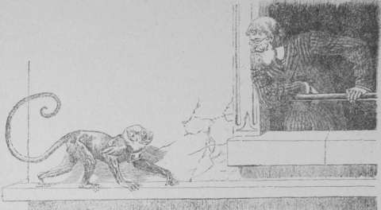
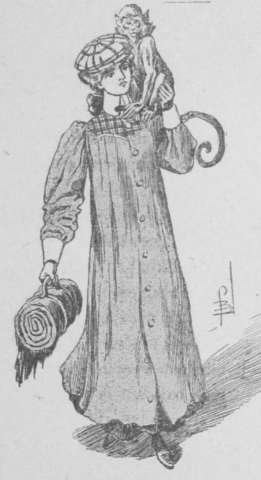

## La chasse à l’homme

Allan s’aperçut à peine qu’il restait seul. En face du nouveau mystère se
présentant devant lui, il ressentait une sorte de vertige.

Abasourdi, les idées confuses, nul raisonnement ne lui paraissait capable
d’expliquer logiquement les faits. Soudain, on gratta à la porte.

Avant qu’il eût répondu, le battant tourna légèrement sur ses gonds, et le
petit chasseur Tril parut.

Le gamin mit un doigt sur ses lèvres, s’approcha de son interlocuteur, et si
bas que celui-ci l’entendit à peine, il murmura :

— Il doit y avoir du nouveau. Suzan se promène sur le quai et elle a fait le
  signe convenu. Or, les _roundsmen_ gardent toutes les sorties.

— Alors, qu’elle entre.

— Ce serait attirer l’attention sur elle, la mettre en danger peut-être…

Instinctivement, le pseudo Grey Assford se dirigea vers la fenêtre.

Juste en face de la Troisième rue, bornant la façade de l’hôtel, une fillette,
avec sur l’épaule un petit singe à la fourrure olivâtre, regardait dans la
direction du Meyer’s. C’était Suzan.

À l’apparition du professeur de West-Point, elle eut un geste satisfait, puis
ses mains décrivirent plusieurs signes dans l’air.

— Quelque chose à nous communiquer, traduisit Tril. Vous voyez.

— Sans doute… et même une chose importante, mon pauvre Tril.

— Quel drôle d’exercice fait Suzan ! Regardez-la donc, Master.

En effet, la fillette avait élevé son singe à bout de bras. Elle semblait lui
adresser un discours, lui désignant la croisée. Brusquement, Suzan traversa la
chaussée pavée et disparut dans la Troisième rue.

Allan restait pensif. Selon toute probabilité, la mignonne avait à lui dire ce
qu’était devenu Van Reek, qu’elle était chargée de surveiller avec Top et
Fall. Une légère exclamation de Tril le fit sursauter.

— Zinka ! là ! là !

Le gamin désignait le rebord courant à hauteur des fenêtres de l’étage. Le
zaïmziri s’avançait sur l’étroite corniche, ayant au cou, suspendu par une
ficelle, un objet garni d’ornements métalliques, car le soleil y piquait des
points brillants. Le petit animal parvint à la croisée, et sautant sur la
table, sembla inviter le pseudo Assford à le débarrasser de son fardeau.

Celui-ci ne se méprit pas à la mimique du zaïmziri. Il détacha la ficelle.
L’objet qu’elle soutenait, était un élégant carnet à fermoir d’or.

À peine le professeur l’eut-il pris, que Zinka bondit sur la barre d’appui et
disparut à l’extérieur. Jud avait ouvert le carnet. Sur la première feuille,
quelques lignes au crayon :

> Van Reek a quitté l’hôtel vers quatre heures et demie, ce matin, toujours
  avec son uniforme de serveur.

Tril et le professeur échangèrent un regard.

— Où a-t-il pu se cacher ? murmura le premier. J’ai fureté partout.

— Un complice probablement, répliqua son interlocuteur…

Et reprenant sa lecture :

> Il s’est rendu à la maison de la Troisième rue.

> Là, il a changé de vêtements et a repris son apparence habituelle.

> Il est parti à pied, chargé seulement d’une petite valise, qui doit contenir
  une chose de grand prix, car il la surveille avec un soin jaloux.

> Top et Fall, emmenant Storm, se sont mis à sa poursuite ; moi, j’ai regagné
  mon logement, où ils télégraphieront. Ce carnet appartient à Van Reek.
  Zinka, cette nuit, s’était glissé dans son logis et l’a rapporté. Il doit y
  avoir des notes importantes, mais je ne puis pas lire le chiffre.

Le jeune homme tourna les pages. Des notes chiffrées appelèrent son attention.
Elles affectaient cette disposition :

> — 85-<u>10</u>1-85. — 85-4-<u>11</u> <u>12</u>-45-8 . 19-8 . 3-110-10-8905 : <u>11</u>-<u>10</u>-10.
  5<u>12</u>53-6-8-<u>11</u> . 1901-<u>12</u>-6 . — 7<u>12</u>5-3 : 50.

D’autres encore s’étalaient sur divers feuillets ; mais celles-ci,
relativement courtes, furent l’objet d’un examen plus approfondi de la part de
Jud.

Après tout, il était condamné à attendre le bon plaisir des magistrats
enquêteurs… Autant occuper ce loisir à chercher la clef du chiffre mystérieux.

Cette décision prise, Allan s’installa devant la table, prit une feuille de
papier et reproduisit consciencieusement les deux lignes chiffrées.

De toute évidence, chaque chiffre désignait une lettre. Il s’agissait de
trouver suivant quelle loi on avait procédé à la numérotation.

— Et vous pensez deviner la signification de cela ? dit Tril.

— Non pas deviner, mais démontrer par le raisonnement.

— Je ne vois pas quel raisonnement vous pouvez faire, Roi.

— Tu n’as jamais étudié les _grilles_ ni les _chiffres_, Tril. Pour moi au
  contraire, à l’école militaire, cette étude a tenu une place importante.
  Quiconque désire correspondre sans être à la merci d’une indiscrétion banale,
  adopte un alphabet illisible pour les non initiés. Tu conçois cela ?

— Sûrement ! Puisque les lads ont aussi leur écriture chiffrée.

— Les combinaisons sont indéfiniment variées, mon enfant. Apprends-le.

Tantôt on possède une grille découpée, divisée en petits carrés réguliers
ainsi qu’une table de Pythagore ; certains carrés déterminés sont affectés aux
_seules lettres utiles_, les autres sont remplis par des lettres inutiles, que
la grille réceptrice supprime automatiquement.

D’autres fois, la grille est remplacée par un livre choisi à l’avance. Des
nombres, disposés de façon convenue, désignent des pages, des lignes, des
lettres du volume.

— Alors, si l’on n’a pas le livre, il est impossible de lire.

— Rien n’est impossible. C’est plus ou moins difficile, voilà tout.

— Alors, à quoi bon la précaution ?

— À ceci. Le secret ne peut être violé que par des hommes exceptionnels.

Puis doucement :

— Mais occupons-nous du chiffre que j’ai sous les yeux… Je sais que les notes
  ont été tracées par Van Reek, soit donc dans une des trois langues qui lui
  sont familières. Ceci est du français, de l’anglais ou du flamand.

— Tant mieux, bougonna le gamin, seulement cela ne m’avance pas.

— Erreur. Un premier point est acquis. L’alphabet usité est le _latin_ de
  vingt-cinq lettres. Nous éliminons les alphabets russe, grec et autres.

— Ah ! s’exclama Tril. Je commence à comprendre le raisonnement.

Seulement après cela, je serais incapable d’aller plus loin.

— Et pourtant je crois pouvoir affirmer que Van Reek a écrit ses notes en
  français.

— En français !… Celle-là est forte… À quoi reconnaissez-vous cela ?

— Toujours le raisonnement, Tril. Van Reek parle anglais, flamand, français.
  Mais l’anglais est l’idiome général aux États-Unis, il l’a écarté comme
  augmentant la facilité de traduction pour le plus grand nombre.

Le petit chasseur eut un cri de joie.

— Sa préférence instinctive irait au flamand, moins répandu que le français.

— Alors, vous concluez que ce vilain personnage a employé cette langue.

— Petit Tril, quand on prend des notes sur un carnet aussi élégant, c’est non
  seulement pour soi, mais encore pour un ou plusieurs autres. Dans l’espèce,
  Van Reek songeait sûrement à Frey Jemkins.

— Oui, eh bien ?

— Eh bien, Frey Jemkins ignore le flamand. C’est donc la langue française qu’a
  adoptée notre homme.

Du coup, le chasseur battit des mains.

— Seulement le grimoire ne m’en paraît pas plus clair…

— Un peu de patience, Tril, et nous arriverons peut-être à te satisfaire. Tout
  d’abord, en français, certaines lettres sont beaucoup plus employées que les
  autres. Parmi les consonnes, celles de la première moitié de l’alphabet,
  parmi les voyelles _a_ et _e_. D’autre part, la phonétique française
  n’admettant le son que sur la voyelle, on peut affirmer qu’il en existe une
  au moins sur trois signes… Cette constatation nous permet presque de
  décomposer les mots en syllabes. De plus, les six voyelles :
  _a, e, i, o, u, y,_ doivent se rencontrer avec une fréquence plus grande.

Et pensif, le professeur continua :

— Dans les deux lignes que j’ai sous les yeux, je constate que le nombre le
  plus fréquent est 5. Je le retrouve huit fois. 5 est évidemment une voyelle.

Et comme la lettre la plus abondante en français est l’_e_, je n’hésite pas à
tenir pour certain que 5 et _e_ sont une même notation.

— Hourra ! souligna Tril transporté par cette déduction.

— Et je continuerais ainsi, si je ne faisais des constatations capitales qui
  rétrécissent aussitôt le champ d’exploration. Sur la première ligne, je
  remarque les nombres 12 et 3, et sur la seconde les mêmes nombres mais
  précédés du signe -, qui peut se traduire par _moins_ ; c’est le signe
  mathématique qui s’oppose au signe + ou _plus_.

— Et vous concluez ?

— Que l’alphabet est numéroté, dans sa première partie par des chiffres
  positifs, et en sa partie suivante, par des chiffres négatifs, de sorte qu’un
  même chiffre avec ou sans signe _moins_, représente deux lettres ayant des
  positions similaires dans les deux fractions de l’alphabet.

Si à côté de cela, je relève le chiffre le plus élevé des inscriptions, je
trouve 12 et 12. Or deux fois douze font vingt-quatre… la vingt-cinquième
lettre est donc figurée par O, que tu aperçois, petit Tril, à la ligne
supérieure. Je tiens compte de ce que Van Reek, Jemkins ont souvent à
correspondre avec des agents subalternes d’une intelligence médiocre ; la
combinaison doit être simple, et je pense qu’elle pourrait s’établir ainsi.

Ce disant, Allan dressait sur la feuille le tableau suivant :

    a…..  1     m…..0       n….. - 12
    b…..  2                 o….. - 11
    c…..  3                 p….. - 10
    d…..  4                 q….. -  9
    e…..  5                 r….. -  8
    f…..  6                 s….. -  7
    g…..  7                 t….. -  6
    h…..  8                 u….. -  5
    i…..  9                 v….. -  4
    j….. 10                 x….. -  3
    k….. 11                 y….. -  2
    l….. 12                 z….. -  1

Le petit chasseur regardait bouche bée. Du ton de la prière, il demanda :

— Oh ! laissez-moi remplacer les lettres, pour voir si j’ai compris.

Pour toute réponse, Jud lui tendit la plume ; et alla s’accouder à la fenêtre.
Cinq minutes plus tard, Tril triomphant se précipitait vers lui, agitant le
papier, sur lequel, au-dessous des lignes chiffrées, il avait tracé :

> Réparé revolver air comprimé : 10 dollars probablement ?

> Electro-aimant Slex : 50.

Mais il fut surpris par l’effet produit sur Allan.

— Je comprends ! Je comprends tout ! La mort du capitaine Anoru. Celle des
  malheureux marchands de diamants.

Et Tril, ahuri, balbutiant :

— Comment ? Avec ces quelques mots ?

— Ah ! Tril ! Le revolver, qui n’a produit aucune détonation…

— Le revolver à air comprimé. Mais l’électro-aimant ? Qu’est-ce ?

— L’art d’ouvrir et de refermer serrures et verrous sans laisser de traces.
  Tu as dû entendre parler des « _Dompteurs de portes_ » ?

— Ah ! oui, ces voleurs qui pillaient les maisons, refermant les portes, les
  fenêtres derrière eux.

— C’était avec des électro-aimants qu’ils opéraient.

— Alors, ils attirent du dehors les pênes des serrures, les targettes des
  verrous. Seulement, après cela, il n’y a plus qu’à supprimer les serrures
  inutiles.

— Non pas les supprimer, petit Tril, mais les remplacer par une fermeture en
  cuivre, l’aimantation n’ayant aucune action sur ce métal.

Et les feuillets tournent sous la main impatiente du jeune homme.

Maintenant toutes les annotations sont claires pour lui. C’étaient, pour la
plupart, des notes relatives soit au voyage récent de Van Reek, dépenses,
itinéraires, heures de trains, soit aux terrains expropriés d’East-River.

Sur l’une des dernières pages, deux paragraphes firent bouillonner le sang du
faux Assford. Ils étaient ainsi conçus :

> Great Trunk (gare de New-York) ; train de 5h45.

> Télégraphier Vaning. Prendre tige chez Airnalt. La fixer sur terrasse, dalle
  6/4. Appeler F. C. pour direction définitive.

Évidemment, le second était le corollaire du premier, indiquant nettement à
quel moment, par quelle gare, Van Reek avait quitté New-York ; mais le second
demeurait intraduisible.

Qu’était cette tige à dresser sur une terrasse, à l’appui d’une dalle 6/4… ?
Une antenne de téléphone sans fil vraisemblablement, le membre de phrase
suivant incitait à le supposer… Appeler F.C.

Puis, où chercher la terrasse dans l’étendue des Etats-Unis ?

Et Allan commençait à s’impatienter, quand un garçon d’étage vint annoncer que
le juge enquêteur attendait les voyageurs.

Un quart d’heure plus tard, Grey Assford, dont les déclarations concordèrent
avec celles des occupants des chambres voisines du 115, quittait le Meyer’s.

Il déambulait sur le quai, suivi à peu de distance par Tril.

Ainsi, ils gagnèrent Hoboken et la ruelle, où, la veille, Jud avait parlé à
Suzan, à travers une fenêtre ouverte. Quand Allan et Tril s’arrêtèrent en face
de l’ouverture, la petite Suzan se pencha à la croisée.

— Reçu télégramme Top et Fall. Même train que Van Reek. Great Trunk. Tickets
  directs pour San-Francisco.

— Pour Frisco ! s’exclama Jud… terrasse, dalle, seraient donc là ?

Quel train pourrons-nous prendre pour les suivre ?

— Le premier à voitures directes part à 4 heures du soir.

Ce disant, la petite passait à son interlocuteur un feuillet d’indicateur.

Jud y jeta les yeux, puis doucement :

— Rendez-vous à 3h45 à la gare. Trois tickets pulmann [^2-05-1] pour Frisco.
  As-tu de l’argent ?

— Oh ! la réserve du syndicat est loin d’être épuisée.

— Alors à tantôt, chère petite mignonne.

Et Allan se remit en marche.

— Tril, dit-il, cours au télégraph-office ; adresse une dépêche, chiffre des
  lads, au syndicat de San-Francisco.

— Pour leur dire ?

— De découvrir Vaning, Airnalt, la terrasse et la dalle dont parle la note du
  carnet ; puis charger une équipe de lads des exploitations électriques
  d’accorder un récepteur identique à celui de notre adversaire au syndicat
  même. Que l’on monte la garde auprès de l’appareil, afin de noter la moindre
  communication. Il faut à Van Reek, comme à nous-mêmes, environ six jours pour
  effectuer le parcours New-York-Frisco. Tout doit être prêt lors de son
  arrivée.

Son jeune compagnon lui saisit la main, la porta à ses lèvres, murmura avec
une expression impossible à rendre :

— Les lads feront tout pour que leur roi soit content d’eux.

Et à toutes jambes, il s’élança dans une rue transversale, au bout de laquelle
se distinguait le réseau compliqué de fils d’un bureau télégraphique.

À quatre heures moins un quart, Allan se rencontrait avec Tril et Suzan,
cette dernière chargée du fantasque zaïmziri Zinka, sur les quais de la gare
monumentale du Great Trunk, littéralement du Grand Tronc, la formule
abrégée sous laquelle les Américains désignent la voie ferrée qui traverse
de part en part les États-Unis, de l’Atlantique au Pacifique.

Parcourir le Grand Tronc est un voyage moins terrifiant qu’il n’apparaît aux
voyageurs européens. Les wagons spacieux, où les couchettes de nuit se transforment de jour en mœlleux fauteuils, le restaurant roulant, la bibliothèque, les lavabos confortables, les coiffeurs attachés au convoi, donnent au touriste l’impression de vivre dans un hôtel qui marche, voilà tout.

La correspondance avec l’extérieur est assurée. Les lettres déposées dans des
sacs _ad hoc_, sont remises aux gares d’arrêt, et de son compartiment le
_traveller_ peut télégraphier où bon lui semble.

Les compagnies américaines ont, en effet, adopté récemment l’appareil d’un inventeur français qui permet d’utiliser les rails pour la transmission des communications électriques.

Jud Allan dans un pulmann, où avaient également pris place Tril, Suzan et le zaïmziri, roulèrent durant six jours, lurent, prirent leurs repas, dormirent, reçurent diverses dépêches chiffrées, tant de Top et de Fall emportés à quelques heures d’intervalle par le même train que Van Reek, que des lads de San-Francisco, mettant Tril au courant de leurs recherches.

Et le train filait, passant d’un État dans un autre, traversant des plaines
fertiles, des collines boisées, franchissant des rivières larges comme des
fleuves, des fleuves imposants comme des bras de mer.

La limite de l’État de Californie était marquée par l’écran dentelé des
Montagnes Rocheuses barrant l’horizon oriental. La voie se déroulait en des
sites grandioses, côtoyait des ravins sauvages, sautait sur des passerelles
métalliques des abîmes à l’apparence chaotique. Puis les hautes cimes étaient
dépassées. Les riches vignobles californiens se développaient à perte de vue.

La végétation devenait étrange, mêlant les flores des zones tempérées et
torride. Enfin, la ligne ferrée touchait Oakland, faubourg de la cité
californienne, situé sur la rive ouest de la baie de San-Francisco.

Jud Allan et ses compagnons durent traverser la baie en ferry-boat.

Une heure après, ils débarquaient dans l’agglomération bruyante de San-
Francisco à l’_Union Ferry Dépôt_.

Et comme ils se tenaient sur le quai, bousculés par les voyageurs, étourdis
par les hurlements des cochers des voitures, des omnibus d’hôtels, par les
cloches des tramways funiculaires, électriques ou à traction animale, un
jeune ouvrier en veste de toile bleue les aborda :

— Connaissez-vous un roi ? fit-il à mi-voix.

Jud sursauta. C’était le mot d’ordre convenu avec les lads.

— J’en connais un seul, répliqua-t-il, roi sans couronne.

L’ouvrier s’inclina.

— Je suis un lad, dit-il, employé aux usines électriques de la ville.

— Un électricien ! Il y a donc du nouveau ?

L’adolescent affirma du geste.

— Vaning est sous-directeur à l’usine où je travaille. Il s’est rendu chez
  Airnalt, fabricant d’appareils de physique de Market-Street. Airnalt a fait
  porter une antenne de sans fil et ses accessoires dans la rue Montgomery, au
  domicile de Frey Jemkins, sénateur de l’État et propriétaire du Bazar géant…

Puis baissant la voix, le jeune ouvrier continua :

— L’antenne a été dressée sur la terrasse supérieure du bazar entre la
  quatrième dalle en longueur et la sixième en largeur.

— Je vois… Je vois !

Nous avons relevé le numéro de catalogue du récepteur disposé par Airnalt,
acheté et mis en place au Syndicat un récepteur semblable. Nous possédons
l’antenne du sans fil et sommes heureux qu’elle puisse servir au « roi ».

Comme à Washington, comme à Ottawa, le délégué des Lads de San-Francisco
exprimait la reconnaissance des petits pour le chef généreux qui les avait
naguère groupés.

— Ton nom ? fit Jud après un silence.

— Mon nom est Lally. Au Syndicat, on compte héberger le roi.

— Et le roi accepte, s’écria le professeur en secouant cordialement la main de
  l’envoyé.

L’une des curiosités de San-Francisco est sans contredit son quartier
chinois. C’est un quadrilatère, borné par les rues Stockton, Sacramento,
Pacific et Kearny, où s’entassent de hautes maisons séparées par d’étroites et
malpropres ruelles. Au sortir de la ville saxonne, on se croirait brusquement
transporté en pays jaune. Boutiques, théâtres, bonzeries, restaurants,
lanternes en papier, habitants, sont chinois, et la nuit venue, le blanc est
imprudent qui s’aventure en ce quartier, sans être accompagné par un détective.

Or, à l’angle des rues Kearny et Pacific, s’élevait une maison haute de deux
étages, dominée par une terrasse bordée de balustrades de bois.

C’est dans cette maison que Jud Allan et ses jeunes compagnons avaient été
conduits. Ils y avaient retrouvé Top, Fall, et le vigoureux mâtin Storm,
arrivés quelques heures auparavant.

En quelques répliques, le professeur avait été mis au courant.

— Van Reek ?

— Descendu dans Montgomery Street, Jemkins-House.

— L’hôtel accolé au bazar, n’est-ce pas ?

— Oui, avec communication intérieure.

— A-t-il usé du sans fil ?

— Non. Au surplus, nous le saurons de suite, puisque l’on a installé ici, sur
  la terrasse, un récepteur accordé avec le sien.

Jud s’est fait conduire sur la terrasse. Un petit électricien y veille.

— Rien entendu, boy ?

— Rien, Roi.

Allan s’étonne du mutisme de Van Reek.

Tril, Suzan, Top, Fall, vont s’établir autour de la résidence du lieutenant de
Jemkins. Ils le suivront partout, leurs facultés doublées par le merveilleux
instinct de Storm.

Les lads, employés dans les rayons de l’immense bazar fondé par Frey,
guetteront sans trêve.

Allan demeure au Syndicat, prêt à poursuivre son adversaire au premier signal.
Chaque heure, Lally introduit auprès d’Allan un gamin qui revient du bazar
Jemkins, et le dialogue suivant sengage :

— On n’a pas téléphoné sans fil du cabinet du sous-directeur ?

— Non. Jokel, la petite chargée du téléphone pour le magasin, n’a pas quitté
  le cabinet un seul instant. On a téléphoné pour des commandes, des
  expéditions ; mais le récepteur Airnalt n’a aucunement fonctionné.

— C’est bien, merci.

Puis, tantôt Suzan, tantôt Top ou Fall, font une apparition au Syndicat. Ils
tiennent Jud Allan au courant des faits et gestes de Van Reek. Le Belge a
quitté la maison, il s’est promené, a rencontré plusieurs personnages du haut
commerce, avec lesquels il s’est entretenu amicalement. Il s’est rendu ensuite
au commissariat central de police. Un jeune secrétaire a mis l’oreille au trou
de la serrure et l’a entendu s’enquérir auprès du _Central officer_ du crime
de New-York dont tout le monde parle.

— J’ai quitté New-York le matin même de la découverte de ce meurtre étrange ;
  les récits des journaux m’apparaissent tellement fantastiques.

Et le _central policer_, avec une amabilité en rapport avec l’importance de
l’ami de Jemkins, s’est répandu en explications prolixes.

— Et aucun indice faisant espérer l’arrestation du coupable ?

— Aucun, cher Monsieur, aucun en vérité.

Jud comprend le but de cette visite. Van Reek a voulu s’assurer qu’aucun
danger ne le menaçait de ce côté. Tranquillisé, il est allé déjeuner dans
Mason street, au restaurant dit Terrace Garden.

La journée s’avance. Les rapports se succèdent, sans perdre leur banalité.

Van Reek a pris une voiture, s’est fait conduire au parc de la porte d’Or.

Près du kiosque à musique, il s’est rencontré avec un gentleman. Les deux
hommes se sont serré la main en manifestant une surprise joyeuse de se voir.
Ils ont échangé quelques paroles.

Van Reek rend ensuite diverses visites et soupe avec un de ses amis, président
du Tribunal au Criminel.

La nuit est venue. Van Reek se rend à l’_Orpheum_, le théâtre français de
Fanell street. Il y séjourne une heure, puis rentre à pied à Jemkins-house. La
lumière s’éteint bientôt dans la chambre qu’il occupe. Les guetteurs en
concluent qu’il s’est couché.

Minuit a sonné depuis longtemps aux horloges à carillons, dont les riches
habitants de Frisco ont la manie d’orner leurs demeures.

De loin en loin, un roulement de voiture, un aboi de chien, le pas cadencé des
_roundsmen_ en tournée, troublent un instant le silence ; puis ces bruits
s’éteignent, semblent absorbés par la nuit.

Deux heures tintent aux carillons, quand la porte de la chambre est
brusquement poussée.

— Qui va là ?

— Le gardien du sans fil, Roi.

C’est un gamin qui, dans cette nuit silencieuse, alors que tout repose à
Frisco, était attentif et éveillé auprès du récepteur Airnalt.

Avec la rapidité de l’éclair, le professeur devine le fait important.

— Une communication ? dit-il.

— Oui.

Le jeune homme regarde le papier que son interlocuteur lui remet.

Plusieurs lignes. Va-t-il connaître la prison de Lilian ? Et il lit, son cœur
frappant à grands coups les parois :

— Il fait froid à Chicago, mais le soleil réchauffe Frisco, a dit le Belge.

— Le soleil est un brave boy ; mais la lune n’est point méprisable, a-t-on
  répondu.

Sans hésiter, le jeune homme s’explique ces phrases.

— Sans doute, des paroles de reconnaissance convenues.

Et il poursuit, prononçant à mi-voix le dialogue surpris :

— Allo ! Allo ! C’est moi, Van Reek.

— Cela ne fait pas ombre d’hésitation… Votre voix est reconnaissable
  comme un clairon.

— Clairon si vous voulez ; j’attends vos ordres, vous savez.

— Vous n’attendrez pas longtemps. Au plus tôt, partez pour San-Diego. On
  vous y attendra pour vous guider vers ma résidence. Défiez-vous de tout, ne
  téléphonez plus, ce serait inutile.

Un instant, Jud demeura pensif. La communication lui apprenait le point où des
affiliés attendraient Van Reek. Au matin, Jud se rendra à la gare du Southern
Pacific Railroad, tête de la ligne qui prolonge la côte du Pacifique de San-
Francisco à la frontière mexicaine. Il attendrait Van Reek au débarqué, et le
guide du criminel conduirait aussi le justicier.

Sur ce, avec la tranquillité des hommes d’action, Jud s’endormit.

Il goûta longuement les douceurs du repos, car il faisait grand jour quand une
voix haletante, des secousses répétées le rappelèrent au sentiment.

On criait à son oreille, on le bousculait avec acharnement.

Tril était auprès du lit, clamant avec de grands gestes :

— Van Reek quitte Frisco en ce moment !

D'un coup, Jud fut debout.

— Raconte.

— Voilà. Je m’étais établi pour la nuit en face de la maison Jemkins. Il y a
  une demi-heure, la porte de service s’est ouverte sans bruit. Un homme est
  sorti. Je n’ai pas eu de peine à reconnaître l’individu. Il regarde à droite
  et à gauche, ne m’aperçoit pas naturellement, et se met en route à grandes
  enjambées. Dans une rue adjacente, il arrête une voiture et se fait conduire à
  Southern Pacific Railroad. Pour ne pas me fatiguer, je m’accroche derrière
  le véhicule. Nous arrivons. Un chef de gare est là.

— Monsieur Van Reek, s’écrie le fonctionnaire en saluant, je vous connais de
  réputation, je sais que vous valez des millions de dollars. Aussi le train
  spécial, que vous avez envoyé commander hier, est sous pression depuis
  minuit.

— Parfait ! Alors, je puis partir de suite ?

— Dans vingt minutes, Monsieur. Le temps d’avertir télégraphiquement les
  gares, pour assurer la voie libre. Mais vous pouvez prendre place.

Remerciements. Le chef court au télégraphe. Van Reek gagne les quais et
disparaît dans son train spécial : Une machine, son tender et un wagon-salon
stationnant sur la voie 9.

Jud avait pris son chapeau, son pardessus, une valise peu volumineuse.

— Courons !

— Inutile. Votre train spécial ne pourra partir qu’une demi-heure après celui
  de Van Reek.

— Mon train spécial ?

— Bien sûr. Je l’ai commandé et payé séance tenante, avant de venir vous
  prévenir…

D’un geste brusque, Allan saisit son petit allié dans ses bras et le pressa
sur sa poitrine.

— Attendez donc, acheva le gamin. J’ai fait un saut au dépôt, vu le mécanicien
  et le chauffeur qui vous conduiront. Je leur ai dit qu’il s’agissait d’un
  pari, que vous deviez arriver à San-Diego en même temps que le train Van
  Reek et qu’il y avait mille dollars de gratification si M. Grey Assford
  était satisfait.

— Décidément, Tril, tu as le génie des mesures utiles. En route, mon enfant,
  et mon train parti, télégraphie aux lads de San-Diego et des environs. La
  bataille est proche, j’aurai besoin de mes petits soldats.

— Et moi, et Suzan, Top, Fall, Storm, Zinka ?

— Vous me rejoindrez par le prochain train régulier. Là-bas, on vous
  renseignera sur le chemin à suivre, chemin que je ne connais pas encore.

[^2-05-1]: Les voitures pulmann sont des véhicules à couchettes mobiles.
