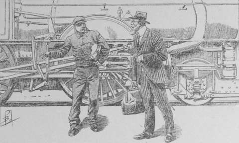

## La course des « chevaux de feu »

Comme Jud Allan et Tril pénétraient sur les quais de la gare du Southern
Pacifique, un train composé seulement d’une locomotive, de son tender et d’un
wagon-salon, s’ébranlait lentement sur la voie.

— Il part, fit le gamin d’une voix légère comme un souffle.

— Le rattraperai-je ? dit en écho le professeur d’un accent étranglé.

Et comme son compagnon le regardait, surpris de sa soudaine émotion.

— Je suis nerveux, reprit Jud… C’est qu’aussi je souffre pour une autre, une
  autre que j’ai employé ma vie à protéger, et qu’un retard de quelques
  minutes peut perdre à jamais.

Le train qui emportait Van Reek sortait du vaste hall vitré, et il attaquait
la voie qui, en dix-sept heures, l’amènerait à San-Diego.

Presque aussitôt, sur une voie de raccordement, un train de même composition
fut refoulé par sa puissante locomotive le long du quai que Van Reek venait de
quitter.

— C’est le vôtre, expliqua Tril. Répétez mes promesses au mécanicien.

— Oui, et toi, petit, au télégraphe, comme je te l’ai dit.

Tril inclina la tête, enveloppa son interlocuteur d’un regard d’indicible
affection puis pivotant sur ses talons, il s’élança en courant vers la sortie
de la gare.

Allan, lui, s’approcha de la machine.

— Vous allez conduire le train spécial Grey Assford ? demanda-t-il au
  mécanicien prêt à monter sur la plate-forme de chauffe.

— Oui, oui, Gentleman, je vois. C’est du moins le nom qui est indiqué.

— Bon. Voici le certificat de commande et de paiement.

Le mécanicien considéra le reçu remis par Tril au roi des petits.

Puis clignant de l’œil avec malice, chuchota :

— Oh ! pour ce qui est de l’administration, vous êtes en règle. Seulement le
  boy nous avait parlé d’une condition supplémentaire…

— Mille dollars, si nous rattrapons le spécial parti à l’instant.

Le mécanicien se prit à rire.

— Rien de tel pour chauffer une machine, Gentleman… On rattrapera, soyez
  tranquille. J’ai choisi la meilleure locomotive du dépôt, et puis…

Il baissa la voix :

— J’ai deux sacs d’étoupe imbibée d’alcool… Dans le foyer, ça vous donne dix
  tours de roues de plus par minute… Eh ! Eh ! l’alcool produit le même effet
  sur les moteurs que sur les hommes, ça excite ! ça excite !

Mais se calmant, il désigna le wagon-salon réservé au voyageur.

— Prenez place, Gentleman ! Comme cela je saurai que vous êtes installé, et à
  la minute même qui m’a été indiquée, j’actionnerai le levier de marche.
  C’est une demi-minute de gagnée.

Pour toute réponse, Allan gagna la portière du salon, et se hissa à
l’intérieur. Sa courte conversation avec le mécanicien lui avait rendu
confiance dans l’issue de la poursuite.

Cet homme semblait posséder sérieusement son métier. Il se rendait compte que
le gain d’une course semblable provenait de l’addition de gains partiels
assurés en cours de route : exactitude au démarrage, accélération de vitesse
par l’emploi d’un combustible énergique, etc.

À l’instant même où la demi-heure s’accomplissait, Jud ressentit une secousse
légère.

Le mécanicien tenait sa promesse. Le spécial se mettait en marche.

La course des _chevaux de feu_, selon la pittoresque expression californienne,
commençait.

Le train sortit de la gare, fila à une vitesse moyenne durant les premiers
kilomètres, où les bifurcations nombreuses interdisent les allures trop
rapides, puis sa marche s’accéléra, et sous son panache de fumée blanche, la
locomotive traversa, ainsi qu’un météore, la campagne ensoleillée.

Arbres, maisons, poteaux télégraphiques disparaissaient en sens inverse avec
la vélocité d’éclairs.

À ces signes, Jud reconnaissait que l’on marchait à plus de cent kilomètres
à l’heure.

Soudain, le tapotement de l’enregistreur télégraphique disposé dans un angle
du salon attira son attention.

Qui pouvait lui télégraphier à ce moment ? Ses petits alliés de San-Francisco
seuls savaient où il se trouvait. C’était donc l’un d’eux.

La bande mobile se déroula un moment, puis les taquets demeurèrent immobiles.
Allan coupa la bande et la considéra attentivement.

— Oh ! murmura-t-il, c’est le chiffre du carnet de Van Reek.

En effet, sur le papier s’alignaient les signes suivants :

> — 4 — 819 — 12. — 7 — 10539112. — 7 — 59 — 6.
      1 — 6 — 65 — 12 — 69 — 11 — 12.

Mais il avait la clef de cette écriture chiffrée, aussi lut-il sans hésiter.

> Train spécial suit. Attention.

— Van Reek est avisé que l’on est à sa poursuite, s’écria le jeune homme.
  C’est l’avis d’un de ses agents, sans doute.

Durant quelques minutes, il demeura immobile, comme absorbé par ses
réflexions, puis il haussa brusquement les épaules :

— Après tout, qu’importe ! Grey Assford est méconnaissable. Là-bas, il aura
  son escorte, moi j’aurai les lads prévenus par Tril… Laissons courir.

Et il se jeta sur le siège capitonné qu’il avait quitté un instant plus tôt.

--

Cependant, Van Reek ressentait, à vingt kilomètres en avant, une émotion
violente. Lui aussi venait de lire la dépêche laconique et sa lecture
déterminait un accès de rage d’autant plus violent, qu’étant seul dans son
wagon-salon, il pouvait s’y abandonner en toute liberté.

— La peste de l’idiot ! grondait-il. Train spécial suit. Attention ! Attention
  à quoi, à qui ? Ce stupide individu ne pouvait-il inscrire un nom, une
  indication qui me mît sur la voie ?

La question amena une pâleur à ses joues.

— La police, fit-il enfin, d’une voix sourdes.

Et ses lèvres blémies, les dents serrées, il gronda :

— Parbleu oui ! La police que le ciel confonde. Ce brave Jehann n’a pas cru
  devoir insister. Oui, c’est cela. Jehann, rencontré hier au parc de la Porte
  d’Or, a commandé mon « spécial » et surveillant mon départ, il a découvert…

Il marchait de long en large dans le wagon.

— Seulement la police… Là-bas, je n’ai pas laissé de traces. Ce ne sont donc
  point les diamants qui attirent l’ennemi sur ma piste.

Mais en cherchant, il constata que si la justice avait exploré sa vie, elle
n’eût eu que l’embarras du choix pour justifier son arrestation.

— Tonnerre ! grommela-t-il. Est-ce pour les squatters d’Oklahoma…? ou pour les
  deux mormons du Grand Lac Salé ? Laquelle de ces affaires ?… Il est vrai
  qu’il y a encore celle du tabacado de Virginie… Et puis celle de la señora
  d’Arizona…

Il s’interrompit brusquement :

— Au diable ! Que me fait la cause ? Un ennemi me court après, il s’agit de le
  distancer, voilà tout.

Au premier _point d’eau_, c’est ainsi que l’on désigne les gares où les trains
stationnent pour renouveler leur provision d’eau ou changer de machine, Van
Reek se précipita au télégraphe, expédia, réponse payée, à la gare la plus
proche, une dépêche ainsi conçue :

> Train spécial annoncé. Faire savoir l’heure du passage à votre gare.

La réponse ne se fit pas attendre. Le train suivait le sien à l5 minutes
d’intervalle seulement.

L’ennemi l’avait gagné de vitesse. Or, en mécanique, comme partout ailleurs,
l’or produit des accélérations étonnantes.

Au point d’eau de San-Miguel, le complice de Jemkins eut une courte conférence
avec son mécanicien, courte mais précise.

— Il faut forcer la marche, mon vieux garçon.

— Je le veux bien, Gentleman, si la machine le veut aussi.

— Elle le voudra, si tu le lui demandes poliment. Voici pour la politesse.

Quelques pièces passèrent de la main du bandit dans celle de l’employé.

— Si tu réussis, il y en a autant à ton service à San-Diego.

Influence des médailles frappées par la Monnaie d’un gouvernement quelconque !
Le spécial repartit à une vitesse endiablée.

Il filait avec une rapidité vertigineuse, franchissant les stations dans un
grondement de tonnerre, donnant à peine le temps au voyageur d’apercevoir les
bâtiments, les employés médusés par la disparition de ce bolide sur rails. Il
n’y avait pas à s’y méprendre, la machine marchait à son maximum de rendement.

Et cependant, au point d’eau de Los Angeles, Van Reek apprit avec stupeur que
l’ennemi l’avait encore gagné. Il était à cinq minutes, limite extrême permise
par les signaux de sectionnement de la voie.

Le Belge courut à la locomotive, interpella les chauffeurs.

— Accélérez encore.

— Çà ! Gentleman, pas possible… Nous portons déjà à peine sur les rails ; un
  caillou comme une noisette nous ferait dérailler. Je charge la soupape une
  fois en route, je ne peux faire davantage.

— Fais ton prix, je l’accepte.

Mais le mécanicien secoua la tête avec vigueur.

— Il n’y a pas de prix. La chaudière éclaterait. Et si cher que vous payiez,
  ça ne serait pas assez pour m’expédier dans les nuages.

Van Reek eut beau insister, menacer. L’employé avait obtenu le possible de sa
machine. Il ne pouvait aller au delà.

— En wagon, Gentleman, en wagon… Un train qui vous suit siffle pour demander
  l’entrée en gare.

Le Belge laissa échapper un blasphème… Ce train qui le suivait, était là, à
l’entrée de la station, quand lui-même n’en était pas encore sorti.

Mais il n’y avait point à récriminer. Le complice de Jemkins sauta dans son
wagon-salon, tandis qu’en arrière, à cinq cents mètres à peine, il distinguait
l’avant de la machine remorquant le spécial qu’il fuyait.

Peindre sa rage ne saurait être entrepris. Par quels moyens la police
obtenait-elle une vitesse de marche qui lui était interdite ? Certaines
locomotives rendent plus que d’autres, mais trois fois on avait changé de
machine ! Il était étrange que ses ennemis eussent toujours la meilleure !

Le misérable ne pouvait se douter que le mécanicien de Jud Allan, un vieux
routier de la Southern Pacific Line, qui connaissait toutes les machines,
avait télégraphié de la première station à tous les dépôts, pour qu’on lui
réservât les locomotives dont il indiquait les numéros.

Rien ne rend ingénieux comme la volonté de gagner mille dollars.

Van Reek, ignorant de la manœuvre, accusait la fatalité.

Et cependant il devait reconnaître que les agents de son train ne négligeaient
rien pour distancer le _spécial_ chasseur.

L’allure était terrifiante. Quand des buissons bordaient la voie, l’œil ne les
distinguait que sous la forme de raies vertes filant comme les traits de la
foudre. La vitesse était donc anormale, excessive, folle. Le train semblait
emballé. On pouvait presque considérer comme un miracle qu’une catastrophe ne
se fût pas encore produite.

Mais malgré les efforts du mécanicien, que le chauffeur secondait en chargeant
le foyer, la distance entre les deux spéciaux n’augmentait pas.

Le poursuivant restait, si l’on peut exprimer ainsi la situation, sur les
talons du poursuivi.

Tout le jour s’écoula, dans cette chasse passionnante pour l’un, effroyable
pour l’autre. La nuit fut annoncée par le crépuscule.

La voie pénétrait alors dans la région montagneuse et tourmentée que
parcourent le rio Gila et ses affluents. Ce nétaient plus que tranchées
rocheuses, paliers en corniche, viaducs franchissant à grande hauteur des
ravins, où bondissaient en écumant des cours d’eaux torrentueux.

Dans une heure et demie on arriverait à San-Diego.

Là-bas, au terminus, des policiers attendraient sur le quai et inviteraient
poliment Van Reek à les suivre là où il ne se souciait pas d’aller.

Oh ! maudite idée de prendre un train spécial, qui, par son caractère même,
est signalé sur toute la ligne, et transforme le voyageur en véritable,
prisonnier.

Dans un convoi ordinaire, on est perdu au milieu de la foule. On peut, avec de
l’adresse, disparaître à une station quelconque, glisser entre les doigts des
gens de police.

Mais ici… Aucun moyen d’échapper à son sort.

Et Van Reek se penchait à la portière, cherchant à apercevoir dans la nuit ce
train fantôme qui le pourchassait.

Soudain, il se rejeta en arrière, avec un cri d’épouvante.

On franchissait un viaduc, auquel les nécessités de la construction avaient
contraint à donner la forme sinueuse d’un S très ouvert.

Et à quelques centaines de mètres, trouant l’obscurité comme les yeux d’un
fauve gigantesque, le complice de Jemkins avait vu les fanaux d’avant de la
machine adverse.

Oh ! ces yeux de lumière ouverts dans les ténèbres !

Un instant, le criminel demeura comme hébété, en proie à l’hallucination qui
fait grelotter tout l’être, qui précipite les pensées dans une panique de
troupeau éperdu. Ces fanaux étaient pour lui les regards de la justice
acharnée à la capture de l’assassin.

Mais cet état d’affaissement moral ne pouvait durer longtemps.

Van Reek n’était point un coquin vulgaire. Ce titre, encore que peu enviable,
suppose des qualités de hardiesse, de volonté, dont est dépourvu le commun des
criminels.

À la prostration succéda le désir de vaincre la police, cette ennemie contre
laquelle il avait lutté toute sa vie.

Il était seul dans un train mené par deux agents.

— Deux agents, murmura-t-il, peu de chose !

Et avec un ricanement.

— Décidément ! J’étais injuste pour le « spécial ». Deux employés seulement,
  voilà qui le rend préférable à tous les convois ordinaires.

Le terrible lieutenant de Frey Jemkins parut réfléchir une seconde. Mais il
eut un geste brusque.

— Inutile de leur adresser la question. Ils refuseraient net. Les agents de
  chemins de fer ont des idées absolument étroites. Ils trouveraient
  inimaginable que j’aie l’intention de m’arrêter en pleine voie. Donc, ce
  soin me regarde. Une fois arrêté, je me perds dans la campagne et…

Il s’interrompit net, une expression de triomphe dans ses yeux.

— Mais si j’arrête en pleine voie… En choisissant bien l’endroit. non
  seulement, je dépiste la police , mais je me venge.

Tout en monologuant, il avait saisi sa valise, cette valise remarquée naguère
au Meyer’s Hôtel. À l’aide de courroies, il la fixait sur ses épaules ainsi
qu’un sac militaire.

D’un second colis, d’un étui-écrin, il tira l’objet bizarre qu’il avait eu en
mains la nuit du meurtre des joailliers.

— Le revolver à vent est chargé de quatre projectiles ; cela suffit.

À la partie du revolver correspondant à la crosse se trouvait une sorte de
crochet que le Belge fixa dans l’une des boutonnières de son vêtement.

— Comme ceci, murmura-t-il, je porte tout mon bien avec moi et je conserve les
  mains libres, circonstance très favorable au travail.

Il considèra un instant l’étui dont il avait extrait l’arme perfide, puis par
la vitre d’une portière il projeta la gaine au loin, et avec des précautions
extrêmes, se glissa hors du wagon-salon ; une fois sur le marche-pied, les
doigts crispés sur la main courante de cuivre, il referma la portière.

Lentement, il se mit à progresser vers l’avant du train. Bientôt, il atteignit
le tender.

Là, il parut redoubler de précautions… Cependant il avança encore.

À présent, en tendant un peu le cou, il apercevait le mécanicien debout devant
la roue de réglage, le chauffeur activant la combustion à l’aide du lourd
tisonnier de fer.

Le foyer projetait sur les deux agents une teinte rouge, sanglante, d’un effet
sinistre au milieu des ténèbres.

— Ils ont hâte d’arriver à San-Diego… Moi je n’y tiens plus du tout. Voilà
  comment les gens tombent en mésintelligence.

La main de Van Reek armée du revolver à air comprimé, se lève.

— À tout seigneur, tout honneur, dit-il encore.

Un sifflement ponctue sa phrase. Le mécanicien, atteint en plein crâne,
s’affaisse sur la plate-forme.

Et comme le chauffeur, surpris par cette chute soudaine, demande :

— Eh ! Vieux ! Qu’est-ce qu’il te prend ?

Un second sifflement retentit dans la nuit, et le malheureux roule sur le
corps de son camarade.

Le train roule avec un fracas étourdissant dans une tranchée rocheuse aux
courbes incessantes. À cent mètres en avant ou en arrière, la voie est masquée
par les sinuosités du remblai.

Lentement Van Reek actionne les freins. Les roues patinent sur les rails, la
vitesse décroît. Quelques tours de roues et la locomotive s’arrête.

Sans perdre une seconde, le lieutenant de Frey Jemkins saute sur le ballast.
Il court aussi vite qu’il le peut en avant de la locomotive. Il a un cri de
joie.

Une rampe raide escalade le remblai. Sans doute cet accès a été ménagé pour le
personnel d’inspection de la voie. Il la gravit haletant. Du sommet, il domine
de huit ou dix mètres le train immobile au fond de la tranchée.

Autour de lui, des buissons épais, quelques arbres clairsemés.

— Parfait ! ricane-t-il avec on accent trivial, c’est l’observatoire rêvé.

Un grondement lointain arrive jusqu’à lui.

— Le spécial de dame police, dit-il… Voilà des gens qui ne s’attendent pas à
  la surprise que je leur ai ménagée…

Et un rire silencieux contracte son visage.

Le bruit grandit. On distingue maintenant le halètement de la machine, le
froufrou gémissant des bielles, le cliquetis des chaînes d’attelage.

Et tout à coup, à un coude tout proche, la voie s’éclaire, les rails polis
par le frottement reflètent en lignes brillantes les fanaux encore invisibles.

— Les fanaux !

Le Belge n’a pu retenir ce cri, une subite terreur de ce qui va se produire
faisant vasciller son cynisme.

Le train arrive à toute vapeur, la machine auréolée par le rougoiement du
foyer. Les agents aperçoivent l’obstacle qui barre la route.

Il y a des cris, des appels ; ils vibrent encore dans l’air, quand un tracas
épouvantable les couvre, les absorbe. La faible distance a été parcourue en
une seconde…, le choc a eu lieu terrible, indescriptible. Le train spécial de
Jud, celui que vient de quitter Van Reek ne forment plus qu’un monceau de
ruines.

C’est un tintamarre de cataclysme, des craquements de bois, cliquetis de
vitres brisées, brusques éclatements de métal, explosions, jets de vapeur.

Et comme Van Reek, rendu stupide par l’horreur de la catastrophe qu’il a
préparée, regarde, les buissons qui l’entourent vomissent des ombres qui
bondissent vers la tranchée avec une inconcevable agilité.

— Des Indiens sauvages ! balbutie le Belge terrifié.

Il veut se jeter à terre, pour échapper aux yeux des terribles ennemis que la
nuit jette sur son chemin.

Il n’en a pas le loisir. L’une des ombres est déjà sur lui. Un coup violent
lui brise le crâne, et l’Indien court rejoindre ses compagnons, sans
s’inquiéter davantage du bandit qui râle, expirant auprès de la valise où
sont enfermés les diamants du Consortium des joailliers d’Amsterdam.
