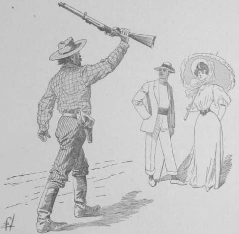
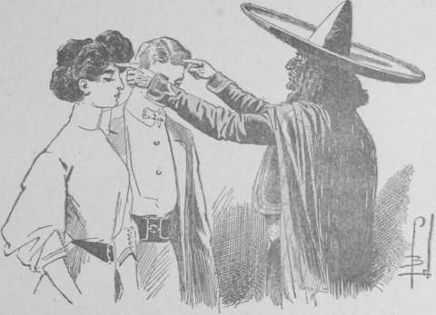

## Le sorcier El Dieblo

— Votre existence, mon honneur sont en jeu, Linérès.

— Mais pourquoi ? pourquoi ?

— Je ne le sais pas. Allan m’a dit ces seules paroles. D’où vient ma confiance
  en cet homme que j’ai rencontré trois fois ? Mystère de l’âme… ; mais je
  crois à ce qu’il a affirmé.

Le marquis et la jeune fille se tenaient le long d’une haie épaisse de plantes
épineuses : _cactus_ figurant des colonnes cannelées, _pisahayas_ ou cierges
barbelés de pointes, _agavés_, véritables hérissons du règne végétal,
_organos_, arbustes aux branches verticales accolées ainsi que des tuyaux
d’orgue.

Devant cette muraille d’un vert grisâtre, dont la cime s’élevait à plus de
quatre mètres, les fiancés s’étaient immobilisés.

— Oh ! gronda Pierre avec une rage soudaine. Comprendre, comprendre enfin
  quelle fatalité s’acharne contre nous !

Sept semaines se sont écoulées depuis leur départ de Washington. Linérès
s’était endormie, un soir, dans sa chambre de la maison Jemkins. Elle avait
rouvert les yeux dans la cabine d’un _steam yacht_ en pleine mer.

Le marquis de Chazelet contait une aventure toute semblable.

Mais vainement les fiancés avaient mis en commun leurs souvenirs, le mot de
l’énigme n’était point apparu à leur esprit.

Sur le yacht qui l’emportait, Linérès avait rencontré trois passagères. Cette
autre Lilian, entrevue par tous deux au Sénat, revue par le marquis
dans la chambre de sa fiancée. Seulement, Lilian n’était plus la jeune fille
aux clairs regards, à l’attitude courageuse ; elle semblait hébétée, plongée
dans un invincible engourdissement du vouloir et de la pensée.

Auprès d’elle s’empressait, le premier jour de traversée, une gentille et
pétulante Américaine, répondant au nom de Grace Paterson, elle aussi élève
à l’institution Deffling… et, chose incroyable, elle contait que son amie et
elle-même avaient été enlevées nuitamment par des _chloroformistes_.

Linérès avait remarqué certaines hésitations, dans ses réponses… Au soir,
elle était rentrée dans sa cabine, se promettant de reprendre l’entretien le
lendemain.

Hélas ! le lendemain, Grace Paterson lui apparaissait stupéfiée,
incompréhensive, annihilée à l’égal de sa compagne Lilian.

Cela dura pendant toute la traversée. Linérès n’avait d’autre ressource que
la conversation avec une jeune et charmante Chinoise, qui semblait bien
étrangère à toutes ces aventures. Rouge-Fleur était son nom.

On signala les phares du mouillage de la Vera-Cruz, sur la côte mexicaine de
la mer des Antilles.

Ici, une lacune dans les souvenirs de la jeune fille. Ceux qui l’entraînent
ont-ils voulu qu’elle dorme, qu’elle n’ait pas conscience de débarquer ? Le
certain est qu’elle ne se rappelle pas avoir quitté le steamer.

Cependant, elle revient à elle dans un train qui la transporte sur la côte du
Pacifique par la voie de la Vera-Cruz à San-Blas.

Là, une chaloupe à vapeur la reçoit, ainsi que ses compagnes, toujours
plongées dans une sorte d’hébétude.

Mais la Chinoise Rouge-Fleur aussi se trouve là. Elle semble commander à
l’équipage. Et cet équipage se compose d’hommes petits, trapus, à la large
face safranée. Ce sont des Japonais.

Pourquoi cette escorte japonaise ? Ainsi, on est arrivé au milieu des
plantations de l’hacienda de Agua Frida.

Alors les passagères ont été séparées.

Lilian Allan et Grace Paterson ont été enfermées dans une habitation perdue au
milieu d’un jardin touffu, où les araucarias mêlent leurs branches résineuses
aux panachés des cocotiers.

Linérès, conduite à l’autre extrémité du vaste parc d’agrément, est libre,
elle. Bientôt, Frey Jemkins et Chazelet l’y rejoignent.

Son… cousin… Elle hésite à présent à le désigner ainsi ; car un doute affreux
l’a pénétrée… Son cousin donc lui a affirmé que le voyage n’avait pour but que
de dépister un ennemi acharné et de hâter son mariage. Mais l’épouvante du
doute s’est appesantie sur les fiancés.

Dans une de leurs promenades, ils ont atteint la haie épineuse où ils
stationnent en ce moment.

Une brèche existait, pratiquée par quelque bande de rongeurs de la prairie.
Ils l’ont franchie.

Et de l’autre côté, dans le jardin, devant la maison peinte en bleu pâle [^2-07-1],
avec ses persiennes d’un vert tendre, sa vérandah aux colonnettes graciles,
sa balustrade de bois capricieusement ajourée, ils ont vu deux femmes, aux
visages inconscients, mais aux mains enlacées avec tendresse, comme si le cœur
se trahissait, survivant à l’esprit endormi.

Ces femmes étaient Lilian Allan et la pauvre Lily Pariset, en qui Linérès
avait espéré retrouver sa mère !

Un serviteur armé, japonais d’aspect, avait couru sus aux visiteurs. Sous la
menace d’un revolver, ceux-ci durent regagner la brèche.

Le lendemain, l’ouverture avait disparu, aveuglée par des cactus épineux si
serrés que le passage ne pouvait plus être tenté.

Des factionnaires veillaient maintenant aux angles de la haie.

_On ne voulait donc pas qu’ils pussent entretenir les recluses !_

Une curiosité allant jusqu’à l’angoisse les avait alors étreints.

Dans une heure d’exaspération impuissante, le marquis s’était écrié :

— Ah ! J’aurais dû demeurer à Washington coûte que coûte. Agir autrement
  _que l’on ne nous y poussait_ eût été le moyen le plus sûr de savoir.  
  Ne croyez pas à une critique de ma part, ma chère Linérès, mais ne
  regrettez-vous pas de m’avoir écrit ?

— Je vous ai écrit, dites-vous ?… Où ?… Quand ?

Il lui mit sous les yeux le billet qui lui était parvenu à Washington, ce
billet remis à Jemkins par la jolie Chinoise Rouge-Fleur.

Linérès considéra le papier, le retourna en tous sens, avec un effarement
grandissant. Enfin, elle murmura cette phrase affolante :

— C’est mon écriture… et cependant, jamais je n’ai _voulu_ écrire cela.

La lettre était donc fausse…

Une terreur mêlée de colère avait envahi les fiancés.

Le lugubre avertissement, jeté par Allan dans la nuit de fête de Jemkins
House, n’avait plus cessé de sonner aux oreilles des infortunés.

Soudain, tous deux se figèrent dans des attitudes surprises. À travers les
tiges pressées de la haie, des voix parvenaient à leurs oreilles.

Ces voix, ils les reconnaissaient, sans doute possible. Lilian Allan et Lily
Pariset parlaient de l’autre côté de la barrière végétale.

— J’ai rêvé longtemps, ma Lilian ! Autour de moi, en moi régnait un
  brouillard, dans lequel s’agitaient des ombres imprécises…

— Mère ! répondait-on d’un ton si doux que l’on eût dit une palpitation
  d’ailes.

Haletants, Pierre et Linérès échangèrent un regard.

Ce n’étaient plus les voix hésitantes de la folie qu’ils percevaient à cette
heure. Non, les deux femmes qui s’entretenaient ainsi étaient conscientes.

Lilian était reconnue, acceptée par la mère martyre !

Linérès lui devenait étrangère ; Frey Jemkins avait menti… L’avertissement
jeté naguère par Allan prenait une terrible signification.

_On avait voulu que Linérès occupât la place de l’héritière Lilian Pariset !_

Alors, le marquis a un grand geste de résolution, de volonté.

Le factionnaire, immobile à cinquante mètres environ, ne saurait percevoir le
bruit de sa voix. Et il prononce d’un ton prudent :

— Miss Lilian !

Un silence craintif succède. Il répète :

— Miss Lilian, ne craignez rien. Le marquis Pierre de Chazelet, Miss Linérès
  sont ici, séparés de vous par la palissade… Victimes comme vous de
  l’inconnu, ils souhaitent vous aider si possible.

Il a un soupir de joie, auquel Linérès fait écho. La sœur d’Allan répond :

— Oui, oui, nous pouvons peut-être vaincre Jemkins l’assassin, Jemkins le
  fourbe… Le défenseur s’est manifesté. . 

— Le défenseur ?

— Ne questionnez pas, je vous en prie. Il m’est interdit de parler.

— Mais vous, votre mère êtes sorties de cet état d’engourdissement…

— Ma mère, répéta Lilian d’une voix profonde, comment savez-vous !

— Tout à l’heure, nous avons entendu votre entretien.

Comme un soupir, ces mots jaillirent de la haie :

— Pauvre Linérès… c’est son rêve brisé.

Mais impétueusement la compagne du Parisien s’écria :

— Non, non, ne croyez pas, Lilian… Ah ! certes, j’aurais aimé follement la
  mère retrouvée… Mais nous saurons lutter avec vous.

— Sœur de douleur, sachez donc que celui qui a dissipé l’obscurité jetée sur
  notre esprit…

— L’obscurité jetée, je ne comprends pas ?…

— À notre boisson, on mêlait une certaine proportion de haschich, d’extrait
  fermenté de chanvre ; de là, la somnolence, l’inconscience…

— Quoi, cette folie était un crime encore ?

Avec une angoisse frissonnante, la jeune fille ajouta :

— Vite ! Le factionnaire va nous enjoindre de nous éloigner.

— Le défenseur a trouvé le moyen de neutraliser le poison, et ce matin il m’a
  fait tenir une lettre… Une boulette de papier qui, par-dessus les
  feuillages, a pénétré dans ma chambre par la fenêtre ouverte…

— Il vous disait d’espérer ?

— Je puis vous le dire. La lettre portait ceci :

> « C’est l’extrait de chanvre qui cause la folie apparente de Mistress Lily
  Pariset… Je neutraliserai désormais le poison par une adjonction d’_ésérine_,
  alcaloïde de la fève de calabar. Cependant, buvez peu d’eau. Puis simulez la
  pensée absente. Il faut tromper l’ennemi. Je veille, je vis pour vous
  sauver. »

Un ordre rugi ponctua la dernière phrase :

— Au large !

La longue station des fiancés avait ainsi fait naître la méfiance chez le
factionnaire. Et comme il brandissait sa carabine d’un air menaçant, Chazelet
et Linérès se penchèrent vers la haie.

— Adieu ! Nous reviendrons…

Et ils s’éloignèrent, suivis par le regard malveillant du factionnaire.

Leurs derniers doutes s’étaient évanouis. Un abîme d’épouvante les
environnait. Et dans le désordre de leurs pensées, une idée se dessinait avec
une précision absolue :

— Résister à Frey Jemkins serait aller à l’encontre de ses plans.

Un _peone_ de l’hacienda parut à l’angle d’une allée. Il vint à eux, les salua
du large _sombrero_ qui abritait son crâne.

— Le señor et la señorita sont suppliés par le rico hombre Frey Jemkins, de
  daigner le rejoindre sans délai au salon de l’hacienda.

Sur ce, il s’éloigna dans la direction du bâtiment principal de l’hacienda,
que les massifs d’arbres cachaient encore.

Le peone disparu, Pierre et Linérès s’acheminèrent vers la maison.

Il y avait nombreuse compagnie dans le salon de l’hacienda.

La spacieuse salle, aux murs recouverts d’une peinture blanche bleutée, aux
fenêtres abritées par des stores de pourpre, voyait se tenir un conseil.

Assis ou vautrés sur les sièges de bois recourbé, Jetty, Tom, Frey Jemkins,
faisaient face à Van Foorberg, Todero, Elisalt et Zirini.

Comment, pourquoi ces derniers, chargés de diriger en Europe les opérations de
la bande internationale, se trouvaient-ils au Mexique ?

Tous quatre avaient répondu à la question inquiète de leur chef, en produisant
des câblogrammes les invitant à gagner, toute affaire cessante, Agua Frida,
_afin de procéder au partage._

Et le matin même, ils étaient tombés à Agua Frida, tels des aérolithes.

Or, la reconnaissance de Linérès comme héritière n’était point encore décrétée
par le gouvernement mexicain. Et la Chinoise Rouge-Fleur se trouvait
actuellement à Mexico, mettant en jeu des influences inconnues, pour activer
la décision si impatiemment attendue.

Qui donc alors avait expédié les câblogrammes ?

Soucieux, sentant planer sur eux un danger, d’autant plus à redouter qu’ils ne
le pouvaient préciser, les bandits entouraient leur chef, sollicitant de lui
un avis.

Mais Jemkins ne trouvait pas à les rassurer.

Bien plus, chacune de ses paroles faisait se dresser une anxiété nouvelle.

— Je ne vois pas Kan-So, avait murmuré l’un des assistants.

Et le Crane avait dû répondre :

— Kan-So est fou, enfermé dans une maison de santé.

— Fou ? De quelle façon cela s’est-il produit ? À quelle occasion ?

— Je l’ignore. Chargé d’enlever un convoi d’or en barres, il a obéi.
  Seulement, l’or a disparu, et lui-même a été arrêté, errant dans la
  campagne, sa raison envolée.

— Van Reek, lui, n’a pas perdu l’esprit, certainement. C’est un homme trop
  bien équilibré. Pourquoi n’est-il point parmi nous ?

Et Frey Jemkins avait laissé tomber cette phrase sinistre :

— Je ne sais. Je l’attends.

Tout à coup, Jetty, qui regardait au dehors, s’écria :

— Qu’est-ce que c’est que cet olibrius-là ?

Un cavalier entrait au pas dans la haute cour ménagée en avant du bâtiment
principal. Il était coiffé d’un large sombrero, mi partie blanc, mi partie
noir, sous lequel flottaient d’épais cheveux en broussailles, de ce ton
_marron_, que les indigènes obtiennent au moyen de la décoction dans le mezcal
de la noix d’orfidano.

Son _zarapé_ (manteau) portait des signes cabalistiques : triangles, profils
d’animaux, cercles sécants, de couleurs variées.

Sa veste, son pantalon mexicain apparaissaient entièrement noirs, une broderie
d’or les bordant. Ses pieds étaient chaussés de brodequins rouges.

— Qu’est cet individu ? grommela Frey Jemkins.

— Humph ! riposta Jetty ; m’est avis que c’est un sorcier rouge. Et parbleu !
  il tient à la main la baguette-médecine.

En effet, l’inconnu était armé d’une baguette longue de quarante centimètres
environ, sur laquelle des bandes alternées jaune et noir s’enroulaient en
spirale.

Légèrement il sauta à terre, attacha son cheval à l’un des anneaux destinés à
cet usage, puis d’un pas délibéré, il pénétra dans le logis.

Un instant après, la porte du salon s’ouvrait, et l’homme se montrait sur le
seuil, disant avec un flegme imperturbable :

— Que la madone vous protège, _caballeros_… J’ai fait un long trajet pour vous
  joindre. Souffrez que je prenne un siège.

Tous se regardèrent.

La voix du singulier personnage leur avait causé une impression désagréable.
Sèche, grinçante, elle sonnait en inflexions ironiques.

Quant au visage du visiteur, il offrait la teinte rouge-brun caractéristique
de la race indienne, mais les lignes peintes en bleu sur les joues, le front,
autour des lèvres, selon l’usage des « Sorciers indigènes », le rendaient
effrayant.

— Ne regardez pas ainsi l’homme qui vient à vous, reprit-il du même ton
  railleur. Vous êtes des blancs et ne sauriez être effrayés par un pauvre
  sorcier rouge, encore que ses congénères l’appellent El Dieblo.

— El Dieblo ! répéta Frey Jemkins.

— Eh oui… Le diable, comme vous dites, vous, les hommes du Nord, un nom qui
  fait trembler les huttes indiennes, qui vous fera sourire, vous autres. En
  votre présence, c’est le diable qui doit être effrayé.

Jemkins s’impatiente.

— Dis donc, l’homme, fit-il rudement, tu es entré sans en être prié. Si tu
  n’as pas de bonnes raisons à faire valoir, tout diable que tu es, sortir te
  paraîtra moins facile.

Mais l’interpellé ne s’émut point de la menace.

— Je n’ai pas l’intention de sortir. Mon maître est mort. J ’ai décidé d’en
  reprendre un autre, et c’est toi, Señor Frey Jemkins, que j’ai choisi.

L’aplomb du sorcier rendit le milliardaire muet.

— Ne me demandes-tu pas quel était le maître que tu remplaceras ?

— Par Satan, je te le demande en effet.

L’homme se dressa tout droit, et d’un accent lugubre prononça :

— Il s’appelait Van Reek.

Les assistants sursautèrent. Le nom de leur complice, brusquement jeté par cet
individu d’apparence fantastique, pénétra dans leurs cerveaux comme une
douleur.

Jemkins s’avança lentement vers le sorcier, et lui appuyant le doigt sur la
poitrine :

— On meurt de braver Jemkins, gronda-t-il sourdement.

L’homme étendit sa baguette aux spires jaunes et noires, toucha la poitrine de
son interlocuteur, et lentement :

— On vit à servir Jemkins, qui sent le besoin d’un serviteur exceptionnel.

— Prétends-tu être celui-là ?

— Je le prétends.

— Eh bien, prouve : car tu n’espères pas me convaincre par des paroles en
  l’air.

L’Indien s’inclina avec aisance.

— Je prouverai donc. Près de San-Diego, Van Reek, qui se rapprochait de toi
  par train spécial, intercepta un télégramme expédié par les rails à un
  second train qui le poursuivait.

— Qui le poursuivait ? rugirent les assistants devenus livides.

— Oui. Il avait la police sur ses traces. Il crut qu’à l’arrivée, des agents
  l’appréhenderaient. Alors, il se glissa avec moi, le long des wagons, surprit
  chauffeur et mécanicien, les tua, puis arrêta le spécial en pleine voie, pour
  le quitter d’abord et pour provoquer une catastrophe dont la police
  conserverait le cuisant souvenir.

Tous avaient les yeux fixés sur le narrateur. Tous frissonnaient d’angoisse.

— La police le soupçonnait donc ? demanda Jemkins avec une évidente hésitation.

— Non, non… Elle ne le soupçonnait pas encore… Le poursuivant n’était autre
  que votre ennemi Jud Allan.

— Jud Allan ! hurla le milliardaire, que la foudre l’écrase !

— C’est fait, murmura Dieblo en souriant.

— Que signifient ces paroles ?

— Qu’il fut écrasé, non par la foudre, Señor, mais par le plus beau
  télescopage de trains qu’il soit possible de voir. Son spécial vint se
  réduire en miettes sur le nôtre arrêté en pleine voie.

Un silence suivit. Si gangrenés que fussent les bandits, ils n’échappaient
point à l’horreur de la vision évoquée par le lugubre messager.

— Mais Van Reek n’est pas mort, lui ?

— Hélas, si ! Nous sommes tombés dans un parti d’Indiens non soumis. Le casse-
  tête d’un guerrier a brisé le crane de mon compagnon. Moi-même j’ai été
  blessé dans l’obscurité, les assaillants n’ayant point reconnu mon
  caractère… Un mois durant, ils m’ont soigné…

— Mais les diamants ?

L’indien haussa les épaules.

— Aux mains des policiers de San-Diego, ainsi que le
  _revolver que l’on n’entend pas_.

— Le revolver à air comprimé ! Alors, nous sommes menacés ?

— Non, Señor. J’ai voulu te donner un échantillon de mon savoir faire. Par mes
  soins, une dépêche, en provenance du Brésil, signala ton débarquement à Rio
  de Janeiro. Un de tes associés dans certaines affaires est un voleur, un
  assassin… Cela arrive tous les jours. Tu l’ignores, toi qui prépares une
  opération à trois ou quatre mille lieues de là.

Un soupir de soulagement s’échappa des lèvres du terrible chef de
l’association des bandits. Les visages consternés de ses lieutenants se
rassérénèrent.

— En effet, tu as raison, El Dieblo ; tu as paré au plus pressé de façon
  simple…

— Suis-je ton serviteur ? interrompit l’indien.

— Oh ! Oh ! s’exclama Frey avec un rire bruyant, tu vas trop vite en besogne.

— Tant pis ! riposta flegmatiquement son interlocuteur.

Et se penchant vers lui, il murmura de façon à n’être pas entendu du reste de
l’assistance :

— Jud Allan n’était point le seul dont les intérêts fussent opposés aux tiens.
  Les Japonais. Eh ! Eh !… Tes compagnons. Eh ! Eh !… Agir avec réflexion est
  bien, mais, à de certaines heures, agir vite est mieux.

— Tu sais d’autres choses ? interrogea Jemkins sur le même ton.

— Oui, mais pour toi seul.

— Qu’il en soit donc comme tu le désires. De ce moment, je prends le Diable à
  mon service.

Des cris joyeux interrompirent l’entretien des deux hommes.

— Rouge-Fleur ! Voici Rouge-Fleur !

Les lieutenants du milliardaire s’étaient précipités aux fenêtres, saluant de
leurs vivats la gracieuse Chinoise qui venait d’apparaître dans la cour.

— Celle qui parle au nom du Japon, glissa Frey à l’oreille de l’Indien.

Cependant, Rouge-Fleur, précédée par un peone respectueux, pénétrait dans le
salon. Toutes les mains se tendirent vers elle ; toutes les voix lancèrent des
questions anxieuses :

— De retour de Mexico ?

— L’héritage Pariset ?

Elle s’éventa coquettement avec un de ces écrans de plumes fabriqués par les
riverains de la mer Vermeille, et se blottissant avec grâce dans un fauteuil
de bois courbé.

— Je suis bonne, heureusement pour vous. J’ai pitié de votre curiosité. Le
  décret est signé… Les biens des Pariset ont une héritière.

Une tempête de clameurs enthousiastes salua l’affirmation.

— Je passe sous silence les pourboires, gratifications et autres pots de vin…
  Les Mexicains sont des hommes, c’est tout dire. Bref, j’ai obtenu le décret
  et, comprenant votre impatience, mon cher sénateur Jemkins, j’ai su me faire
  accompagner d’un représentant du gouvernement, chargé d’instaurer
  officiellement votre cousine en possession de son héritage.

— Un représentant ! Que l’on mande sur-le-champ Miss Linérès..

La Chinoise arrêta l’ordre qui jaillissait des lèvres de Frey Jemkins.

— Un instant, mon cher Sénateur, je n’ai pas fini.

— Excusez-moi, je pensais…

— Vous ne pensez pas de moi tout le bien que je mérite, minauda la mutine
  Chinoise. J ’ai songé… remarquez combien je tiens compte du caractère même
  de mes amis… Le décret, signé, scellé, estampillé, contient une ligne en
  blanc.

— En blanc, pourquoi ?

— Pour recevoir, de la main même du délégué, le nom que l’héritière doit
  troquer contre celui de Pariset.

Et tous se regardant interdits, la railleuse créature acheva :

— Une simple précaution, au cas où, en mon absence, mon cher Sénateur, un
  supplément d’information vous aurait conduit à vous supposer cousin d’une
  autre que la jolie Linérès.

— Comment pouvez-vous croire ? s’écria le milliardaire…

Elle l’interrompit sans façon.

— Je ne crois rien… J’ai eu simplement en vue d’écarter toute cause de retard
  pour une affaire qui nous tient tous au cœur. Si donc Linérès vous paraît
  toujours votre cousine, c’est son nom qui remplira le blanc du décret, le
  soir même où elle signera le contrat de mariage lui assurant l’époux… aussi
  cher à nous qu’à elle-même.

Les auditeurs ricanèrent à la plaisanterie. Elle poursuivit :

— En ce cas, c’est Linérès et son fiancé que vous présenterez demain à don
  Porfirio Raëz, envoyé extraordinaire du gouvernement.

— Demain, dites-vous. Il viendra donc ici ?

— Pas de suite… Vous irez d’abord vers lui. À tout seigneur tout honneur. La
  goëlette qui nous a amenés est dans le petit port de Presios, à vingt milles
  d’Agua Frida. Une ravissante promenade à cheval pour demain…; qu’en dites-
  vous ?

— Que rien n’est plus doux qu’obéir à une charmante femme.

Rouge-Fleur eut un petit rire minaudier.

— Vous préviendrez donc les… principaux intéressés : votre cousine, son
  fiancé, cette noble comtesse de Armencita, Lily.

Jemkins agitait déjà une petite sonnette d’argent, dont le tintement fit
apparaître un peone empressé.

— Que l’on prie la señorita Linérès et le marquis de Chazelet de venir de
  suite.

Et l’homme sorti, tandis que ses lieutenants se livraient à des commentaires
réjouis, Jemkins se pencha vers Rouge-Fleur.

— Ce Porfirio Raëz… quel homme est-ce ?

— C’est le plus parfait des caballeros… Il a perdu trois millions de piastres
  dans les tripots de Mexico.

— En un mot, ruiné.

Elle affirma d’un gentil mouvement de tête.

— Un personnage à vendre, fit-il avec gaieté.

Rouge-fleur le menaça du doigt.

— Comme vous parlez en termes rudes, vous autres, Américains du nord… Porfirio
  est un homme bienveillant, disposé à toute complaisance. Plus la
  complaisance est grande, plus fort est le salaire mérité.

Juste à ce moment, la porte du salon s’ouvrit, livrant passage au marquis
Pierre de Chazelet au bras de qui s’appuyait Linérès.

Un profond silence succéda à leur apparition. Puis des clameurs s’élevèrent :

— Hourrah ! pour l’héritière des Pariset !

Les jeunes gens s’étaient arrêtés. Pierre regardait les assistants, une
expression hautaine dans les yeux.

— Je vous ai fait appeler, mon cher Pierre, et vous aussi, ma petite cousine,
  afin de vous communiquer des nouvelles qui vous réjouiront.

Et avec une bonhomie feinte :

— Vous ne dites mot… Pauvres fiancés éprouvés par le destin cruel, rassurez-
  vous, vous avez fini de souffrir.

— Un hourrah pour Jemkins, s’écria Jetty enthousiasmé.

— Pas d’interruptions intempestives, lança la voix grinçante d’El Dieblo.

— Quel est cet Indien ? murmura Rouge-Fleur entre haut et bas.

— Un serviteur de Jemkins, répondit sans hésiter le singulier personnage. Un
  serviteur dévoué… eh ! eh ! eh ! qui blâme les paroles inutiles… Les fiancés
  attendent l’explication qui chassera la pâleur de leurs joues. Vous louerez
  l’orateur quand il aura terminé.

— Et que tout sera réglé, appuya Frey. By God, tu as raison, garçon.

Il eut un geste amical vers Pierre et Linérès.

— Il a vu juste, le digne Indien… Tout comme une piste de chasse ou de guerre,
  El Dieblo sait lire une piste de sentiment.

El Dieblo ! Le nom provoqua un tressaillement chez les fiancés. Le Diable ne
cesserait donc jamais de les poursuivre.

— Donc, prononça Jemkins, ma chère et mignonne cousine, sachez que le
  gouvernement du Mexique a délégué vers vous un représentant, le noble don
  Porfirio Raëz, à seule fin de vous mettre ès mains le décret vous
  reconnaissant comme l’héritière des Pariset.

— Ah ! soupira la jeune fille.

— Don Porfirio est arrivé ce matin. Son navire est amarré aux quais du port de
  Presios. Demain, une simple promenade à cheval et plus rien ne pourra
  reculer votre mariage.

— All right ! Bien dit et bien pensé !

Rouge-Fleur mêlait sa voix à celle des complices de Frey.

Du geste, le marquis de Chazelet réclama le silence.

— Cher Monsieur Jemkins, commença le jeune homme, je tiens avant tout à rendre
  hommage à la courtoisie, dont vous avez fait preuve à l’égard de deux
  infortunés en butte à d’inexplicables et terribles inimitiés.

— Cela n’est point matière à occuper l’esprit…

— Le vôtre peut-être, cher Monsieur Jemkins ; mais pour le mien, il en va
  autrement… J’ai une mentalité française, moi ; une mentalité des Vieux pays,
  comme disent vos compatriotes… Et il n’est pas en mon pouvoir de me défaire
  de mes souvenirs comme d’un vieil habit.

— Enfin, où voulez-vous en venir ? grommela le milliardaire avec impatience.

— À bien établir que je vous suis obligé, cher Monsieur Jemkins… Au surplus,
  vous avez fait tous vos efforts pour m’assurer une fortune considérable, ce
  qui est fort gracieux, et ce qui l’est davantage encore, pour me donner une
  épouse accomplie… Il faudrait être un monstre pour répondre à de tels
  procédés par de l’ingratitude. C’est l’invraisemblance même de la
  supposition qui me met à l’aise pour vous avouer aujourd’hui mon état d’âme,
  excusez la locution parisienne, elle rend excellemment ma pensée.

Les mains de Jemkins s’étaient crispées sur les bras de son fauteuil.

D’une voix sifflante, il demanda :

— Peut-on connaître cet état d’âme ?

— Comment donc ! Linérès et moi avons beaucoup réfléchi, depuis que nous
  sommes arrivés à Agua Frida ; nous avons mis en commun nos esprits et nos
  âmes. Si j’insiste sur ce point, c’est afin de vous démontrer que notre
  franchise nous cause une mortelle tristesse.

Tous écoutaient, une surprise épandue sur leurs traits.

— Or, acheva le marquis, nous estimons de probité élémentaire de ne pas
  accepter une fortune sans la certitude d’y avoir droit.

Un murmure violent accueillit cette péroraison. Jemkins ouvrit la bouche, mais
aucun son n’en jaillit. L’excès de la colère étranglait sa voix. Mais le
flamboiement de son regard disait sa fureur. Cependant il se domina. De la
main il rappela ses complices au silence. Puis il demanda :

— Pouvez-vous préciser davantage ?

Sous le calme voulu, on sentait l’orage. Le marquis ne s’en émut pas.

— Volontiers. Car, je vous _dois_ – il appuya sur le mot – toutes les
  explications que vous jugerez utiles.

— Eh bien ! Je souhaite savoir d’où vous vient le doute.

— D’un ensemble de circonstances… Les attaques dont nous sommes l’objet ; la
  fuite, je ne vois pas d’autre nom à donner à notre voyage précipité, la
  fuite inquiète qui nous a amenés ici…

— Si bien, gronda le milliardaire laissant enfin éclater son courroux, si bien
  que vous vous dites : Frey Jemkins a des ennemis puissants. Il s’est mis en
  danger pour nous. Nous nous refusons à l’appuyer.

— Nous ne nous entendons pas. Je souhaite ardemment travailler avec vous à
  faire la lumière, quelque danger que puisse présenter l’aventure.

— Alors, laissez-vous conduire.

— Pardon ! Pardon ! rechercher la vérité est une chose ; accepter une fortune
  en est une autre. Je tiens à honneur de faire la première ; mon honneur me
  défend de souscrire à la seconde.

— Votre honneur…

— Il est chatouilleux, cher Monsieur Frey Jemkins… Dans les pays neufs comme
  l’Amérique, on pense que _la fin justifie les moyens_ ; le vieil honneur
  traditionnaliste d’Europe estime, au contraire, que 
  _les moyens doivent justifier la fin_. Donc je suis prêt à jouer ma vie pour
  arriver à la vérité ; et je suis prêt à la donner plutôt que de recevoir une
  fortune à laquelle les droits de Miss Linérès me paraissent contestables.

C’en était trop. Dans un tourbillonnement d’idées, Jemkins entrevit son œuvre
détruite. Un brouillard passa devant ses yeux. Il hurla :

— Vous pensez que l’on se joue ainsi de moi. Erreur ! Vous m’avez connu
  bienveillant. Mais l’ingratitude est trop grande ! Prenez garde de vous
  heurter à une volonté qui ne sait pas plier

Froidement, Chazelet répondit :

— Oh ! toute menace est superflue. Ne vous ai-je pas affirmé que j’offrais ma
  vie pour refuser une fortune que je ne sens pas mienne ?

— Offrez-vous aussi la vie de cette jeune fille ?

La question tomba brutale, soulignée par le geste menaçant pointé vers
Linérès. Mais plus prompte que Chazelet, angoissé par le danger soudainement
révélé, celle-ci prononça :

— Dans les ruines d’Armencita, j’ai appris à être brave. J’offre ma vie pour
  ce que je crois être l’honneur.

— Eh bien ! mais… on pourrait l’accepter…

Sifflante, aiguë, plus terrible mille fois que les éclats de la voix du
milliardaire, la phrase jaillit des lèvres roses de Rouge-Fleur.

Cela était sinistre et déconcertant. Cela disait la volonté impitoyable…
C’était la cruauté atavique de l’Asie jetant sa menace dans ce conseil de
blancs.

Mais El Dieblo se dressa ; un éclat de rire aigrelet fusa de ses lèvres,
faisant grimacer les lignes bleues de sa peinture rituelle de sorcier.

— La vie, ricana-t-il d’une voix acide, douloureuse aux oreilles, le Grand
  Esprit seul la donne ou la reprend… Eh ! Eh ! Eh ! les Hommes Rouges
  comptent des sages. Ils se transmettent les mystères de la Pensée. Un sage
  ami vaut mieux qu’une armée de maladroits.

— Eh ! Qui appelles-tu maladroits ?… Je ne suis pas d’humeur à me prêter à tes
  jongleries.

L’interpellation de Jemkins parut redoubler l’hilarité du sorcier.

— Hommes-Rouges, Hommes-Blancs, fit-il. Tous les mêmes. Tous incrédules,
  jusqu’à l’heure où ils tremblent devant ce qu’ils ne comprennent pas.

— Par le pied fourchu de Satan ! rugit Jemkins exaspéré…

Mais El Dieblo trancha sans façon la fin de la phrase commencée.

— Tais-toi. L’Esprit parle… Vous êtes dans les ténèbres… J’apporte le
  flambeau.

Tout en parlant, il pivotait sur lui-même, saluant de grands gestes les quatre
points cardinaux.

— Ils sont là, les Esprits du Soleil, les Esprits qui se croisent. Ils sont
  tous là. Ils inspirent El Dieblo, le magicien de la prairie.

Jemkins ébranla le plancher d’un formidable coup de talon.

— Trève de parade… ! Crois-tu nous en imposer par ces mômeries transmises de
  génération en génération parmi les anciens des tribus ? Les Aztèques, il y a
  cinq siècles, évoquaient déjà les esprits de lumière… Le Soleil les a-t-il
  sauvés de la destruction ?

— Les guerriers ne croyaient plus aux paroles des sages. Ils sont morts de
  leur ignorance négatrice… Si tu veux triompher, sois plus prudent.

Quoiqu’ils en eussent, les bandits garderont le silence. L’accent prophétique
du singulier personnage les impressionnait.

— Mais enfin, que prétends-tu faire ? murmura Frey Jemkins.

— T’aider avec l’appui du grand Esprit et de Veacatl, le génie à tête de hibou
(mythologie Aztèque) qui trouble ou éclaire le cerveau des hommes. Ces enfants
résistent à ta volonté ; El Dieblo va les rendre obéissants.

Une stupeur accueillit l’audacieuse affirmation du sorcier. Chazelet et
Linerès haussèrent les épaules, Jemkins les montra à son interlocuteur. Sans
se déconcerter, l’Indien ricana.

— Les oiseaux moqueurs se vantent d’être en sûreté sur les plus hautes
  branches. Il en descendent néanmoins pour se jeter entre les mâchoires du
  serpent qui les fascine. Ceux-ci sont les oiseaux moqueurs. Tu veux que
  demain ils paraissent devant Don Porfiria Raëz.

— Jamais ! jetèrent comme un défi les deux fiancés.

Le sorcier ne les regarda même pas.

— Maître, tes désirs vont recevoir satisfaction, si tu permets à ton fidèle
  d’agir à sa guise.

Il y avait chez le Peau-Rouge une telle conviction que Frey murmura :

— Fais comme il te plaira.

Alors, l’étrange personnage parcourut le cercle d’un regard dominateur.

— Écartez-vous tous… Que ces jeunes gens demeurent isolés.

Et Jemkins appuyant l’ordre d’un geste vague, tous, Rouge-Fleur elle-même,
allèrent s’adosser au mur. Les fiancés restèrent au milieu de la pièce.

El Dieblo bondit auprès d’eux, étendait les mains sur leurs têtes, il les
toucha légèrement au front de l’index. Il prononçait à voix basse des paroles
que nul n’entendait.

Incantations indiennes sans doute, dont l’effet fut du prodige.

Les sourcils froncés des jeunes gens, leurs traits contractés se détendirent.
Un sourire éclaira leurs physionomies.

Brusquement, le sorcier se rejeta en arrière, lança un cri strident dont
l’assistance sursauta. Puis, venant à Frey Jemkins :

— Ordonne, Maître. Maintenant ces enfants t’obéiront.

Avant que Frey, véritablement troublé par l’étrange scène, eût pu répondre,
Pierre prit la parole.

— Demain, nous vous accompagnerons à la rencontre du délégué mexicain, car, la
  reconnaissance, comme fille de Pariset, de ma chère Linérès, mettra fin à
  nos tribulations.

Elle affirma de la tête. Elle aussi obéirait.

Et personne ne songeant à les retenir, ils gagnèrent la porte, sortirent. Un
instant plus tard, on les vit traverser la cour, penchés l’un vers l’autre.

Alors les langues se délièrent. Un concert d’exclamations, de questions,
d’éloges bourdonna autour du sorcier.

Rouge-Fleur, plus impressionnée que les autres, répétait :

— Mais comment avez-vous pu modifier leur pensée ?

Derechef, le sorcier se livra à cette gaieté grinçante qui se vrillait de
façon presque douloureuse dans l’ouïe de ses auditeurs.

— Eh ! Eh ! Eh ! El Dieblo arrache l’âme des jeunes gens et met la sienne à sa
  place… Vous autres, blancs, vous nommez cela magnétisme, un mot qui ne
  signifie que la présomption de l’ignorance. Magnétisme, non pas… mais
  mystère des esprits… À cette heure, je lis en vos cerveaux ainsi qu’en des
  livres ouverts devant moi. S’il me plaisait de prononcer un nom, vous
  frissonneriez comme le daim timide, alors que le crépuscule s’emplit des
  rauquements du jaguar.

L’Indien dominait l’assistance. Les regards se concentraient sur lui décelant
l’inquiétude.

Pourtant les bandits tentèrent de réagir. Ils ricanèrent, leur rire sonnant
faux, s’échappant avec effort de leurs gosiers contractés.

— Avec un nom… Parbleu ! nous voudrions bien le connaître.

— L’esprit dont je parle est là, errant autour de nous.

Sa voix gutturale vibra dans le silence ainsi qu’un claquement de fouet :

— Jud Allan, lança-t-il. Jud Allan.

Tous eurent un sursaut. Rouge-Fleur répéta comme malgré elle :

— Jud Allan !

Tandis que Tom et Jetty, avec un accent intraduisible disaient :

— Mort, le pauvre vieux garçon !

Et dans le silence qui suivit, l’organe musical de Rouge-Fleur s’éleva :

— Alors, demain, à quelle heure le départ ?

— Huit heures, afin d’arriver au port de Presios avant la grande chaleur.

— Bien. Je serai prête et Mistress Lily également. La pauvre mère démente
  impressionnera favorablement Porfirio Raëz.

Elle eut un sourire et quitta la salle, suivie des yeux par le sorcier indien,
qui avait eu un geste de surprise en entendant ses dernières paroles.

Un à un, les associés de Jemkins prirent congé de lui. Le milliardaire demeura
seul avec El Dieblo. Alors celui-ci lui toucha l’épaule du doigt.

— Je n’ai pas tout dit en me présentant à toi, tes oreilles seules doivent
  connaître les nouvelles sombres.

— Que veux-tu dire ?

— Près du cadavre de Van Reek, la police a ramassé les diamants volés à New-
  York et un revolver à air comprimé.

— Pourquoi me rappeler ces choses ?

El Dieblo darda son regard perçant sur son interlocuteur.

— Parce que _El Quotidian_, le journal de San-Diego, reproduit ensuite par les
  grandes feuilles de l’Union, a rappelé qu’à Paris, lors de ton dernier
  voyage en Europe, le capitaine japonais Anoru fut assassiné à l’aide d’une 
  arme semblable.

Il achevait à peine que Jemkins se dressait tout droit.

— Alors on me soupçonne ? prononca-t-il d’un ton rauque.

El dieblo haussa les épaules, jeta ses mains sur les bras du milliardaire, et
sans effort apparent, le força à se rasseoir.

— Tu peux gagner de vitesse tes ennemis en m’apprenant tes projets.

— À toi que je connais depuis une heure à peine ?

Un ricanement de l’Indien ponctua la phrase.

— Pour te servir, je dois savoir. Il faut que ta pensée s’ouvre devant moi
  comme devant un ami.

Puis avec un ricanement aigri :

— Les États-Unis vont hésiter, se consulter. T’accuser est une chose
  formidable. Un mois s’écoulera avant que les esprits s’habituent à l’idée. Et
  un mois vaut un siècle pour un guerrier.

Chacune de ses paroles pénétrait dans le cerveau de Jemkins ainsi qu’une
pointe acérée.

— Écoute donc, El Dieblo… Si tu es aussi habile que tu le prétends, jamais
  diable n’aura placé sa diablerie à un taux aussi avantageux !

[^2-07-1]: C’est un usage général, dans le centre et le sud Amérique, de
           badigeonner les maisons de couleurs tendres et variées.
