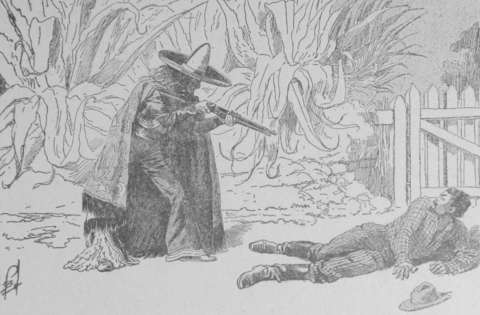
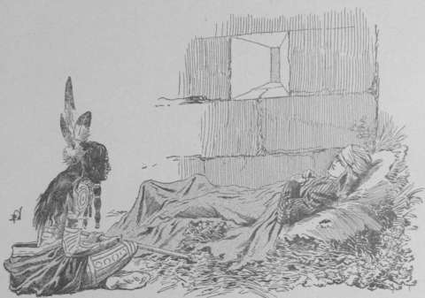

## Le mort vivant

Une heure plus tard, El Dieblo sortait par la petite porte s’ouvrant derrière
l’hacienda, la même qui, seize ans auparavant, avait livré passage à la
servante Trina portant au Crâne l’enfant de ses maîtres.

Bientôt, un massif d’arbres le masqua du côté de la maison.

L’homme rouge s’arrêta. Il tira de sa poche un carnet, traça quelques mots sur
un feuillet, le déchira, puis fit entendre un léger sifflement.

Aussitôt les branches des buissons voisins s’agitèrent. Au milieu des
feuillages une forme imprécise se devina, deux yeux noirs brillèrent, et une
petite main velue se tendit au dehors.

Sans manifester la moindre surprise, l’Indien tendit le papier, la petite main
le saisit et disparut dans la feuillée.

El Dieblo se remit en mouvement.

A sa droite s’étendait la pulqueria où Pariset avait trouvé la mort.

El Dieblo va toujours. Il dépasse la pulqueria, prolonge un taillis, se
rejette dans le parc d’agrément, qui s’étend autour de l’hacienda.

Il est maintenant à près de deux kilomètres des bâtiments.

Il suit un sentier sablé de cette poudre rougeâtre que la mer Vermeille jette
sur ses plages. Des arbres se joignent au‑dessus de sa tête.

Une plaine herbeuse succède au terrain boisé. À cent mètres en avant,
l’homme rouge aperçoit l’alignement revêche d’une clôture de plantes épineuses.
Au centre, une porte à claire voie, badigeonnée de blanc, permet aux regards
de plonger dans un jardin ombreux, dans une avenue soigneusement entretenue,
que borde une haie de _ongatl_ aux fleurs de pourpre. Entre le bois et la
barrière, un homme se promène, le fusil sur l’épaule.

— Un de ces satanés Japonais, grommela l’Indien. Bah ! C’est Jemkins qui
  m’envoie vers Rouge‑Fleur, je n’ai point à me cacher.

Sur ce, il sort du couvert.

— Halte ! crie le factionnaire.

— Frey Jemkins m’envoie vers Rouge‑Fleur.

— Pas d’ordres, riposte laconiquement le Japonais. Tu n’avanceras pas.

— Alors, préviens de mon arrivée.

Son interlocuteur secoue la tête.

— Oruki ne saurait quitter son poste. Pour prévenir, il peut seulement faire
  feu sur quiconque essaiera de forcer le passage.

Et Oruki épaula son arme. L’Indien, lui, haussa philosophiquement les épaules.

— Ochs ! Je retourne auprès de Frey Jemkins. Je lui rendrai compte de la
  situation.

Satisfait, le factionnaire abaisse son arme, mais brusquement il sursaute, se
retourne. Une voix ironique vient de clamer derrière lui :

— Les Japonais sont des ânes.

Il demeure stupéfait. Il a entendu et il ne voit personne.

Puis le bruit d’une course furieuse résonne. Il refait face au sorcier rouge.
Trop tard. Celui‑ci est déjà sur lui. Avec une mæstria remarquable, il envoie
le garde rouler à trois pas, non sans lui avoir au passage enlevé son arme.

Et à présent, il tient en joue le pauvre diable, ne concevant pas de quel
soudain cataclysme il est victime.

— Avertis la señora que je désire lui parler, à moins que tu préfères que je
  donne le signal dont tu me menaçais tout à l’heure.

Le canon de la carabine prête aux mots une terrible éloquence.

— J’irai, j’irai, soupire le vaincu. Après tout, je puis avouer ma défaite,
  puisque les voix invisibles combattent pour toi.

Et il va vers la barrière blanche. Il a l’effroi de ce qu’il ne s’explique
point. Le sorcier ricane, la face crispée par un rire muet:

— Inutile de dévoiler mes talents de _ventriloque_. Ils peuvent servir une
  autre fois.

Mais la barrière blanche de l’enclos épineux s’ouvrit, et la jolie Rouge‑Fleur
parut, un revolver incrusté d’argent à la main.

Oruki voulut parler. L’Indien ne lui en laissa pas le loisir. Il courut à la
Chinoise et, déposant à terre la carabine enlevée au factionnaire.

— L’homme de garde m’empêchait de passer, commença‑t‑il.

Elle dit sèchement :

— Voilà un Peau‑Rouge qui se croit tout _permis_.

Avec une inclination pleine de noblesse, il répondit:

— Jemkins m’a _permis_ beaucoup déjà, et je viens à vous pour que vous me
  _permettiez_ davantage.

La jeune femme ne put se tenir de sourire légèrement.

— Qu’espères‑tu de moi, homme rouge ?

— Ta confiance.

— C’est beaucoup demander.

— Ce serait beaucoup si ton visage était blanc. Mais ta peau fine est teintée
  d’or pâle, et tu sais que les guerriers rouges souhaitent la réussite de tes
  projets.

— Mes projets… Les connais‑tu donc ?

— Frey Jemkins me les a révélés

— Le bavard !…

Un ricanement tremblota entre les lèvres du sorcier.

— Bénis son bavardage, ô femme. Lorsque le soleil se lèvera pour la dixième
  fois, tu pourras être propriétaire de Agua Frida.

Du coup, Rouge‑Fleur fit un pas en avant, ses yeux interrogèrent avidement le
messager.

Celui‑ci montra Oruki debout à quelques pas.

— Ma _consigne_ est de te parler, mais de parler à toi seule.

— Suis‑moi, fit‑elle, aussi bien tu as raison. Tes paroles prouvent au moins
  que ta prudence justifie la confiance de ton maître.

— El Dieblo n’a point de maître, rectifia emphatiquement le sorcier. Il sert
  qui lui plaît… Et tu me plais, ô vierge aux joues ambrées, car tu veux
  frapper les Américains qui nous ont décimés, nous, les guerriers rouges…
  Eh ! Eh ! tu es ma sœur de colère… Comme moi, tu t’appelles la Haine.

Les dernières défiances de la Chinoise s’effacèrent à ces paroles.

Elle franchit la barrière, suivie par l’Indien, tandis que le factionnaire
Oruki, enchanté d’en être quiite à si bon marché, rammassait sa carabine et
reprenait son monotone va et vient.

Quelques minutes après, Rouge‑Fleur et le messager se trouvaient dans une
salle de la maison d’Azur. Alors, la Chinoise rompit le silence.

— Tu peux t’exprimer sans crainte, dit‑elle doucement.

— Ainsi ferai‑je. J’ai apporté des nouvelles graves. Frey Jemkins est
  soupçonné aux États‑Unis… Dans quelques jours peut‑être, il sera accusé, et
  dès lors toute transaction sera entachée de nullité. Il faut donc se hâter de
  conclure. Tout acte antérieur à l’accusation pourra être discuté par ces
  _coyotes_ bavards que les hommes blancs appellent légistes. Avec leurs lois
  compliquées, un procès dure des années. On a le temps de construire ce que
  l’on veut, et quand le procès est jugé, le point d’appui des Japonais se
  trouve si formidablement armé que la guerre peut être commencée.

Un sourire se joua sur les lèvres fines de Rouge‑Fleur.

— Oh ! Oh ! El Dieblo, tu es un profond politique.

— El Dieblo est un guerrier sage au conseil. Il ne prononce pas les paroles
  que la réflexion ne lui a pas démontrées utiles.

— Alors, que proposes‑tu ?

— Il faut que l’or promis à Jemkins lui soit versé le plus tôt possible.

— Les premiers termes lui peuvent être remis dès demain.

— Et l’engagement, _quoi qu’il arrive_, serait pris pour les autres ?

— Oui. 

— En ce cas, le contrat sera signé sous huit jours, le mariage célébré le
  lendemain.

— Vrai !

Une joie débordante illumina les traits de la jeune femme.

— N’avez‑vous pas vu que mon pouvoir magique a décidé les fiancés à se laisser
  présenter au Mexicain Porfirio Raëz ?

— Si… Je n’ai pas compris même…

— Le secret des sages n’a pas besoin d’être compris… La jeune fille sera
  reconnue héritière dès demain, ou tout au moins au jour du contrat, à moins
  que…

— À moins que… ? répéta Rouge‑Fleur secouée par un frisson d’inquiétude.

— À moins que l’une des femmes qui la présenteront, l’une _de ses mères_, ne
  formule une opposition.

La Chinoise respira.

— Oh ! pas de danger de ce côté.
— En êtes‑vous certaine ?

— M^me de Armencita s’est trop compromise pour reculer.

— Celle‑là, je l’admets ; mais l’autre, l’autre ?

— Elle est hors d’état de nuire. Les propos d’une démente ne sauraient
  influencer don Porfirio Raëz.

Elle ne continua pas. El Dieblo secouait pensivement la tête.

— Quel obstacle prévois‑tu encore ? questionna la jeune femme d’une voix
  anxieuse.

— El Dieblo ne prévoit rien, mais il voudrait pouvoir assurer le succès à Frey
  Jemkins.

— Eh bien, qui t’en empêche ?

— Le sorcier rouge n’affirme que ce qu’il croit réellement. Il n’a point la
  langue menteuse. Ses yeux seuls le conduisent à la certitude, et ses yeux
  n’ont point vu la folle.

Un éclat de rire fusa entre les lèvres de son interlocutrice.

— Qu’à cela ne tienne, digne Dieblo… Tu vas être mis en sa présence.

Ils gagnèrent le jardin, parcoururent des allées sinueuses. Chose étrange,
l’homme rouge qui à l’ordinaire foulait le sol avec la légèreté d’un félin,
marchait pesamment, faisant crier le gravier sous ses pieds.

Tout un peuple de volatiles s’agite, caquette, dans l’enceinte d’une volière.
Les faisans d’or ou d’argent frolent de leurs ailes les flocons roses des
flamants, les plumages bleus des _diachekas_. Canards bariolés _kiwis_ du
Pacifique, pintades vertes de l’Ecuador, perruches babillardes, chantent,
cancanent, jacassent.

Tout près du treillage, comme absorbées dans la contemplation de la gent
emplumée, deux femmes sont assises sur un banc rustique.

El Dieblo a subi une commotion. Dans un mouvement machinal ses mains se sont
crispées sur sa poitrine. Et Rouge‑Fleur, se tournant vers lui, lui désigne
les recluses.

— Mistress Lily Pariset ! Miss Lilian Allan ! Les folles ! Celle que tu
désirais voir.

Le sorcier incline la tête… Il s’approche des recluses toujours immobiles,
dont les regards vagues sont rivés sur les oiseaux qui piaillent effrayés par
les nouveaux venus.

Soudain, un vacarme effroyable retentit dans la volière. Des oiseaux se
battent sans doute. Rouge‑Fleur regarde dans la direction du son.

Elle s’étonne, les volatiles sont calmes, semblent surprises des caquets
furieux qui viennent de retentir.

Et la Chinoise reporte les yeux sur les captives, sur l’Indien.

Ce dernier a conservé la même impassibilité. Mais le visage des deux Insensées
s’est couvert d’une teinte rosée. Deux répliques ont été échangées à l’insu de
celle qui représente le Japon.

— Demain, pauvre mère, direz‑vous toute la vérité ?

Et la veuve a répondu sans hésiter :

— Je dirai tout mon cœur.

Rouge‑Fleur ne peut soupçonner cela ; mais elle s’inquiète vaguement de
l’animation soudaine des traits des recluses. L’Indien la rassure aussitôt :

— Je reporterai au señor Jemkins que ses accusateurs arriveront trop tard pour
  rien empêcher.

Cela fait refleurir le sourire sur les lèvres de la Chinoise.

— Va donc rassurer Jemkins. L’or est prêt, le délégué mexicain également et
  nos captives sont des esclaves soumises.

Sur ce, le guerrier rouge s’éloigne avec la maîtresse du logis.

Les folles restent inertes, retombées déjà en apparence dans la stupide
contemplation des hôtes emplumés de la volière.

Cependant quiconque les examinerait de près ressentirait une surprise.

Leurs yeux sont humides, des larmes mouillent leurs cils. Et soudain, les
lèvres de Lilian s’ouvrent :

— C’est lui, mère, c’est lui, lui qui nous a ramenées à la raison, lui qui,
  une fois de plus, joue sa vie pour nous protéger contre Frey Jemkins !

‑‑

Au même instant, à huit ou neuf cents mètres de là, le marquis de Chazelet et
Linérès erraient à travers le parc.

A l’extrémité d’une branche inclinée sur l’allée, un petit singe, de l’espèce
zaïmziri, se balançait, les observant de ses yeux vifs.

— Oh ! le joli animal, s’écria la jeune fille…

Elle avait fait un pas en avant. Le zaïmziri continuait son jeu, sans
manifester la moindre crainte. Elle arrivait juste au‑dessous de la branche.
En allongeant le bras, elle eût pu toucher le quadrumane.

Mais brusquement, celui‑ci se pencha, laissa tomber sur la tête de la
gracieuse créature une boulette de papier, puis disparut dans le taillis.

D’instinct, sans bien se rendre compte de ce mouvement de poursuite, les
fiancés contournèrent le massif, avec l’espoir imprécis de couper la retraite
au gentil fugitif. À peine avaient‑ils dépassé la barrière de feuillage qu’ils
eurent un même cri d’étonnement. Au delà s’étendait une plaine bornée par une
haute futaie.

Or, au milieu de l’espace découvert, ils apercevaient le zaïmziri juché sur le
dos d’un grand dogue gris, lequel détalait à toute vitesse vers les arbres.

Et comme Linérès demeurait interdite, Chazelet, qui venait de ramasser le
papier si singulièrement parvenu entre ses mains, murmura :

— Linérès, dit‑il, la chaîne du mystère compte un anneau de plus. Ce singe est
  un facteur ?

Et d’une voix légèrement émue, en dépit de ses efforts pour prendre gaiement
l’aventure, Pierre lut :

> Ne résistez aucunement demain. Celle qui fut le mensonge, celle qui fut la
  douleur, s’uniront pour proclamer la vérité. Détruisez ce papier de suite ;
  la mort plane.

‑‑

A trois milles vers l’Est de l’hacienda se creuse le Cañon de Oro.

C’est une faille profonde que les eaux ont creusée dans les calcaires rouges,
et dont les défilés du Tarn donnent une idée réduite.

Entre les parois presque verticales des hauteurs partageant la presqu’île
californienne en deux versants, un torrent, à sec neuf mois de l’année, a,
durant le trimestre où il roule des ondes tumultueuses, rongé au cours des
siècles le rocher, usant peu à peu son lit, descendant de quelques millimètres
à chaque saison des pluies, coupant la masse calcaire, ainsi qu’une
gigantesque scie.

Or, à mi hauteur de la paroi orientée vers l’Est, dominant le lit asséché du
torrent, s’ouvraient une série d’ouvertures rectangulaires alternant avec de
larges dalles posées sur champ.

Une corniche étroite serpentant au flanc de la montagne, conduit jusqu’aux
singulières cavités dont il s’agit.

Celui qui, sans crainte du vertige, se décide à l’escalade, se trouve bientôt
à hauteur des _antres du Soleil_, ainsi qu’on les désigne dans le pays.

Les antres du Soleil sont un temple aztèque, édifié bien avant la découverte
de l’Amérique, alors que les tribus rouges nombreuses et indépendantes
adoraient l’astre dont les rayons vivifient la terre.

Sur les dalles séparatives des baies, des figures gravées, à demi effacées par
le temps, révèlent le labeur patient de primitifs sculpteurs.

Cercles emblématiques de la course du temps, silhouettes de prêtres au casque
conique orné de cornes pointant en visière, représentation d’animaux consacrés
aux mois, démontrent une civilisation, embryonnaire si on la compare à celles
qui fleurirent en Égypte, en Assur, dans les Indes et les autres contrées
asiates, mais remarquable néanmoins.

Ce soir là, le temple donnait asile à une assemblée nombreuse.

Une vingtaine de tout jeunes gens, des gamins presque, étaient accroupis,
assis, couchés sous la voûte basse.

Près des ouvertures, trois personnages formaient un groupe anxieux.

— Pourvu qu’il ne leur soit rien arrivé ! soupira l’un.

— Eh, Tril, grondèrent ses compagnons, ne vas‑tu pas nous faire croire que ces
  lourds coquins ont pu mettre la main sur le Roi ?

L’interpellé secoua mélancoliquement la tête :

— À mon avis, ce qu’a fait Master Allan est aussi raisonnable que de confier
  sa tête à la gueule d’un lion.

Puis une nervosité tremblant en sa voix :

— Et Suzan, qui ne revient pas non plus ?

Ses interlocuteurs se prirent à rire.

— Oh ! de Suzan, il n’y a pas à s’inquiéter. Elle est accompagnée par Storm et
  Zinka, et ceux‑là, bien malin qui les prendra.

— On vient par la corniche.

Les trois camarades furent dehors d’un seul mouvement. Dans le silence de la
nuit des pas légers glissaient sur la pente rocheuse.

Et soudain une forme noire bondit vers les gamins.

— Storm ! murmurèrent‑ils. Storm et Zinka.

Le singe et le dogue étaient là devant eux, quémandant des caresses.

— Seuls !… et Suzan ? murmura Tril d’une voix étranglée.

— Me voici, me voici ! répondit l’organe essoufflé de la fillette, qui,
  presque aussitôt, rejoignait le groupe.

Tout de suite elle fut entourée.

— Qu’a dit le roi ? que fait‑il ? l’interrogea‑t‑on d’une seule voix.

— Le roi pense que, demain, Frey Jemkins subira un formidable échec.

Une exclamation jaillit des lèvres des trois gamins :

— Enfin ! Mais à nous, quel rôle réserve‑t‑il ?

Suzan n’eut pas le temps de répondre.

Du fond du ravin un sifflement monta. On eût cru entendre la plainte du
courlis doré du Pacifique. Les causeurs s’interrompirent net.

— Le roi ! firent‑ils. Jud Allan !

‑‑

Comment Jud Allan n’avait‑il pas été broyé près de San Diego, lors de la
collision de son spécial avec celui de Van Reek ?

Un simple hasard dû à la courbure des rails au lieu de l’accident.

Le train abordeur, s’il eût circulé sur une voie rectiligne, eût pénétré dans
le convoi arrêté. Il se fût produit ce que l’on désigne sous le nom
pittoresquement sinistre de « télescopage ».

Mais les rails, imposant à la machine une marche curviligne, avaient déterminé
un glissement contre l’obstacle dans le sens centrifuge, et le spécial projeté
hors de la voie avait roulé sur le revêtement pierreux du ballast.
 
D’où amortissement du choc, bris mais non destruction du wagon‑salon.

Jud s’en était tiré sans blessure mortelle.

Toutefois il était demeuré privé de connaissance pendant de longues heures.

Quand il était revenu à lui, la tête lourde, les idées confuses, les membres
jugulés par une effroyable courbature, il avait appris avec stupeur :

1. Qu’il avait été recueilli blessé par l’indienne Marahi, surveillant avec
   ses guerriers, les peones envoyés au‑devant de Van Reek par Jemkins.

2. Que Marahi s’était éloignée, le laissant à la garde de Peaux‑Rouges, qui
   devaient le retenir prisonnier dans un fortin déclassé de la frontière, le
   fort de Varano, où il avait été transporté.

Heureusement ses petits amis, aidés par les lads de San‑Diego, l’avaient
cherché, découvert et l’avaient enlevé à ses gardiens rouges.

Voila comment Allan, persuadé que Marahi s’était ralliée à Frey, avait
pénétré, sous son déguisement de sorcier, au milieu de ses ennemis.
